# Reglas de procesamiento de canales de marketing

Las reglas de procesamiento de canales de marketing averiguan si el visitante que entra cumple los criterios asignados a un canal al procesar cada entrada del visitante en su sitio. Las reglas se procesan en el orden en el que las especifique y, cuando se cumple una regla, se detiene el procesamiento de las demás.

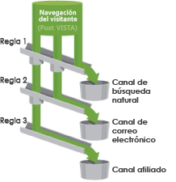

Notas adicionales sobre el procesamiento:
* Los datos recopilados con estas reglas son 100 % permanentes y las reglas alteradas tras la colección de datos no son retroactivas. Es muy importante revisar y tener en cuenta todas las circunstancias antes de guardar [!UICONTROL reglas de procesamiento de canales de marketing] a fin de evitar que los datos se recopilen en los canales equivocados.
* El informe puede procesar hasta 25 canales al mismo tiempo.
* Las reglas pueden acceder a las variables que ha establecido VISTA, pero no pueden acceder a los datos que VISTA ha eliminado.
* Dos canales de marketing nunca reciben crédito por el mismo evento (por ejemplo, compras o clics). En este sentido, los canales de marketing difieren de las eVars (ya que dos eVars pueden recibir crédito por el mismo evento).
* Si hay una ausencia de cobertura de las reglas, es posible que vea [No se identificó ningún canal](/help/components/c-marketing-channels/c-faq.md).

## Requisitos previos

* Consulte la información conceptual de [Introducción a los Canales de marketing](/help/components/c-marketing-channels/c-getting-started-mchannel.md).
* Cree uno o más canales para poder asignarles reglas. Consulte [Agregar canales de marketing.](/help/components/c-marketing-channels/c-channels.md)

## Creación de reglas de procesamiento para los canales de marketing

Cree reglas de procesamiento de canales de marketing que averigüen si la visita de un visitante cumple los criterios asignados a un canal.

Este procedimiento emplea una regla de correo electrónico como ejemplo. En este ejemplo, se presupone que ha agregado un canal de correo electrónico a su lista de canales de la página Administrador de canales de marketing.

1. Haga clic en **[!UICONTROL Analytics]** > **[!UICONTROL Administración]** > **[!UICONTROL Grupos de informes]**.
2. Selección de un grupo de informes.

   Si no se han definido canales en el grupo de informes, se abre la página [!UICONTROL Canales de marketing: configuración automática].

   Consulte [Ejecución de la configuración automática](/help/components/c-marketing-channels/c-getting-started-mchannel.md).

3. Haga clic en **[!UICONTROL Editar configuración]** > **[!UICONTROL Canales de marketing]** > **[!UICONTROL Reglas de procesamiento de canal de marketing]**.

   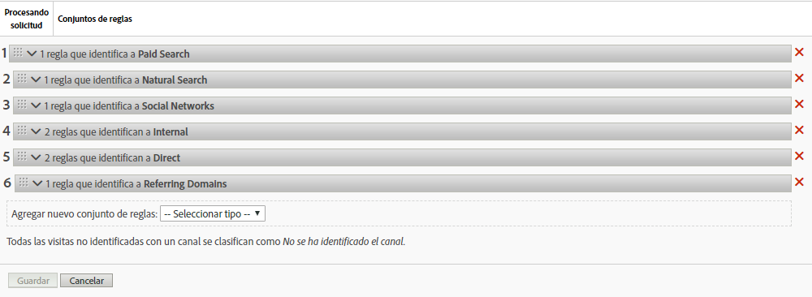

4. En el menú **[!UICONTROL Agregar nuevo conjunto de reglas]**, seleccione **[!UICONTROL correo electrónico]**.

   Al hacerlo, no selecciona el canal, sino que selecciona una plantilla que rellena la regla con algunos parámetros necesarios. Puede modificar esta plantilla según sea necesario.

   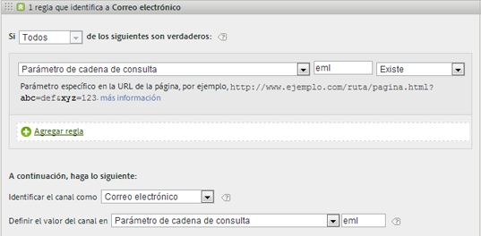

5. Para continuar creando reglas, haga clic en **[!UICONTROL Agregar regla]**.
6. Para priorizar las reglas, arrástrelas a la posición que corresponda.
7. Haga clic en **[!UICONTROL Guardar]**.

Continúe en esta página para ver las recomendaciones del orden de reglas del canal, así como ejemplos de más definiciones.

### Establecer el valor del canal de marketing

**[!UICONTROL Añadir regla]** **Establezca el valor** del canal para definir la dimensión de detalle del canal de marketing que está disponible para ese canal. Esto le permite desglosar las dimensiones del canal de marketing y conocer sus datos más en detalle.

Se recomienda que el valor del canal se defina con los mismos criterios utilizados para definir el canal en sí mismo. Por ejemplo, si se utiliza el parámetro de cadena de consulta para definir el canal, establezca también el parámetro de cadena de consulta como el valor de canal.

### Criterios de regla

Esta tabla de referencia define los campos, opciones y atributos de visita que puede utilizar para establecer Reglas de procesamiento de canal de marketing.

| Término | Definición |
|--- |--- |
| Todos | Activa este canal solamente cuando todas las reglas de la regla numerada son verdaderas. |
| Cualquiera | Activa este canal cuando cualquiera de las reglas del conjunto de reglas es verdadera. Esta opción está disponible solamente si existe más de una regla en la regla numerada. |
| ID de AMO | El código de seguimiento principal utilizado por las integraciones de Advertising Cloud y Advertising Analytics. Cuando se habilita una de estas integraciones, puede usar el prefijo del código de seguimiento para identificar canales específicos de Advertising Cloud. Utilice “AMO ID” para comenzar con “AL” para la búsqueda, “AC” para la visualización o “AO” para Social. Cuando se utiliza el ID de AMO en los canales de marketing, las métricas de clics, costes e impresiones se pueden atribuir al canal correcto (cuando no se configuren, estas métricas irán a Directas o a Ninguna). |
| AMO ED ID | Código de seguimiento secundario utilizado por Advertising Cloud. El propósito principal de este código de seguimiento es servir como clave para enviar datos de vuelta a Ad Cloud. Sin embargo, también se puede utilizar para identificar Mostrar clics respecto a Mostrar vistas si desea verlas como dos canales de marketing independientes. Esto se puede hacer configurando que la lógica del canal de marketing para “AMO EF ID” termine con “:d” para las visualizaciones de pulsaciones o que “AMO EF ID” termine con “:i” para Mostrar vistas. Si no desea dividir Mostrar en dos canales, utilice la dimensión de ID de AMO en su lugar. |
| Variables de conversión | Contiene eVars que se han habilitado para este grupo de informes y se aplica solamente cuando las variables se definen mediante el código de Adobe en la página.  Consulte la Guía de implementación . |
| Existe | Se ofrecen varias opciones, entre ellas:<ul><li>**No existe**: indica que el atributo de visita no existe en la solicitud. Por ejemplo, en un dominio referente, si el usuario escribe una dirección URL o hace clic en un marcador, el atributo de dominio referente no existe.</li><li>**Está vacío**: indica que existe un atributo de visita que, generalmente, es un parámetro de eVar o de cadena de consulta, pero que no hay ningún valor asociado al atributo de visita.</li><li>**No contiene**: permite especificar, por ejemplo, que un dominio referente no contiene un valor específico (a diferencia de la opción &quot;Contiene&quot;.)</li></ul> |
| Identificar el canal como | Asocia la regla con un canal de marketing que haya agregado a la página Administrador de canales de marketing.  Consulte Agregar canales de marketing . |
| Concuerda con las reglas de detección de búsqueda paga | Búsqueda paga detectada por Adobe. Las búsquedas pagas se dan cuando las empresas pagan una tarifa al motor de búsqueda para que las incluyan en las listas de su sitio. Por lo general, la búsqueda paga aparece en la parte superior o en el lado derecho de los resultados de búsqueda. |
| Concuerda con las reglas de detección de búsqueda natural | Búsqueda no paga detectada por los informes de Adobe. |
| El referente concuerda con los filtros de dirección URL internos | Visita cuya dirección URL de página coincide con un filtro de dirección de URL interno, tal como se define en el grupo de informes de las Herramientas de administración. |
| El referente no concuerda con los filtros de dirección URL internos | La dirección URL de referencia no coincide con un filtro de dirección de URL interno, tal como se define en el grupo de informes de las Herramientas de administración. Puede utilizar esta configuración con URL de página y Existe para definir una regla de captador global y evitar que las visitas se dirijan a la sección del informe No se ha identificado el canal. |
| Hacer caso omiso de visitas que coincidan con los filtros de direcciones de URL internas | (Para los referentes) Realiza un seguimiento, solamente, de las visitas que provienen de sitios de referencia externos. Por lo general, se deja sin activar, salvo que desee incluir el tráfico interno. |
| Es la primera página de la visita | Primera página de una visita detectada por los informes de Adobe. |
| Página | El nombre de una página web del sitio que está etiquetada con la señalización web de Adobe. Este valor equivale a  s.pageName . Algunos ejemplos son `Home Page` y `About Us`. |
| Dominio de página | El dominio de la página a la que llega el visitante, por ejemplo, `products.example.co.uk`. |
| Dominio y ruta de página | Dominio y ruta, como `products.example.co.uk/mens/pants/overview.html`. |
| Dominio raíz de página (TLD+1) | El dominio raíz de la página donde aterriza el visitante como, por ejemplo, ejemplo.es . |
| URL de la página | La dirección URL de una página web de su sitio. |
| Dominio de referencia | El dominio del que salieron los visitantes antes de visitar su sitio web, por ejemplo, los referentes de `abcsite.com` frente a `xyzsite.com`. |
| Parámetro de cadena de consulta | Si la dirección URL de una página de su sitio web es `https://example.com/?page=12345&cat=1`, pag y cat son parámetros de cadena de consulta. (Consulte `https://en.wikipedia.org/wiki/Query_string`.)  Puede especificar solamente un parámetro de cadena de consulta por cada conjunto de reglas. Para agregar más parámetros de cadena de consulta, utilice `ANY` como operador y luego agregue nuevos parámetros de cadena de consulta a la regla. |
| Referente | Ubicación de la página web (dirección URL completa) en la que se encontraban los visitantes antes de entrar en el sitio. El referente existe fuera del dominio que haya definido. |
| Dominio y ruta de referencia | Una concatenación del dominio de referencia y la ruta URL. Algunos ejemplos son: `www.example.com/products/id/12345` o `ad.example.com/foo` |
| Parámetro de referencia | Un parámetro de cadena de consulta de la dirección URL de referencia. Por ejemplo, si los visitantes provienen de `example.com/?page=12345&cat=1`, pag y cat son los parámetros de referencia. |
| Dominio raíz de referencia | El dominio raíz del referente. El referente existe fuera del dominio que haya definido. |
| Motor de búsqueda | Un motor de búsqueda, como Google o Yahoo!, que trajo visitantes al sitio. |
| Palabras clave de búsqueda | Una palabra que se utiliza para llevar a cabo una búsqueda mediante un motor de búsqueda. |
| Motor de búsqueda + Palabras clave | Una concatenación de la palabra clave de búsqueda y el motor de búsqueda que identifica de forma exclusiva el motor de búsqueda. Por ejemplo, si busca la palabra ordenador, el motor de búsqueda y la palabra clave se identifican de este modo:  `Search Tracking Code = "<search_type>:<search engine>:<search keyword>" where    search_type = "n" or "p", search_engine = "Google", and search_keyword = "computer"`**Nota:** n = natural; p = de pago |
| Definir el valor del canal en | Además de saber qué canal de marketing lleva al visitante a su sitio, puede saber también qué anuncio de banner, palabra clave de búsqueda o campaña de correo electrónico dentro del canal recibe crédito por la actividad del visitante en el sitio. Este identificador es un valor de canal que se almacena junto con el canal. A menudo, este valor es un identificador de campaña integrado en la página de aterrizaje o en la dirección URL de referencia; en otros casos es la combinación del motor de búsqueda y la palabra clave de búsqueda, o bien, la dirección URL de referencia que identifica de forma más correcta al visitante en un canal particular. |

## Orden y definiciones de reglas de canal de marketing {#channel-rules}

Las reglas de canal se procesan en el orden especificado. Un enfoque recomendado para el orden de canal es colocar primero los canales de pago o administrados (por ejemplo, búsqueda de pago, búsqueda natural, visualización, correo electrónico) para que reciban crédito, seguido de canales orgánicos (por ejemplo, dominios directos, internos y de referencia).

A continuación se muestra el orden recomendado para las reglas de canal, así como las definiciones de ejemplo:

### Búsqueda de pago {#paid-search}

La búsqueda de pago es una palabra o frase por la que se paga a un motor de búsqueda para que la coloque en los resultados de la búsqueda. Este canal se define generalmente en función del parámetro de cadena de consulta (consulte el ejemplo de canal de visualización) o de las reglas de detección de búsqueda de pago. La decisión depende del detalle del canal de marketing que desee registrar.

#### Detección de búsqueda de pago

Para buscar coincidencias con las reglas de detección de búsqueda paga, el canal de marketing usa la configuración de la página [!UICONTROL Detección de búsqueda paga]. (**[!UICONTROL Administración]** > **[!UICONTROL Grupos de informes]** > **[!UICONTROL Editar configuración]** > **[!UICONTROL General]** > **[!UICONTROL Detección de búsqueda paga]**). La dirección URL de destino coincide con la regla de detección de búsqueda paga existente para dicho motor de búsqueda.

En la regla de canal de marketing, la configuración de [!UICONTROL Búsqueda paga] es la siguiente:

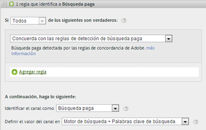

Consulte [Detección de búsqueda paga](https://docs.adobe.com/content/help/es-ES/analytics/admin/admin-tools/paid-search-detection/paid-search-detection.html) en Administración para obtener más información.

### Búsqueda natural {#natural-search}

Las búsquedas naturales tienen lugar cuando los visitantes encuentran su sitio web a través de una búsqueda en Internet en la que el motor de búsqueda clasifica su sitio sin que usted haya pagado específicamente para ello.

No hay detección de búsquedas naturales en Analytics. Después de configurar la detección de búsqueda paga, el sistema sabe que, si un referente de búsqueda no es de búsqueda paga, tiene que ser de búsqueda natural. Consulte [Detección de búsqueda paga](https://docs.adobe.com/content/help/es-ES/analytics/admin/admin-tools/paid-search-detection/paid-search-detection.html) en Administración para obtener más información.

En la regla de canal de marketing, la configuración de búsqueda natural es la siguiente:

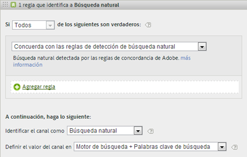

### Mostrar {#display}

Esta regla identifica a los visitantes que proceden de anuncios de banners. Se identifica con un parámetro de cadena de consulta en la dirección URL de destino, en este caso *`Ad_01`*.

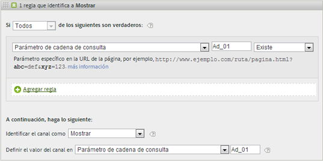

### Correo electrónico {#email}

Esta regla identifica a los visitantes que proceden de campañas de correo electrónico. Se identifica con un parámetro de cadena de consulta en la dirección URL de destino, en este caso *`eml`*:

### Afiliados {#afilliates}

Esta regla identifica a los visitantes que proceden de un conjunto específico de dominios de referencia. En la regla, se enumeran los dominios de los afiliados de los que desee hacer un seguimiento, de este modo:

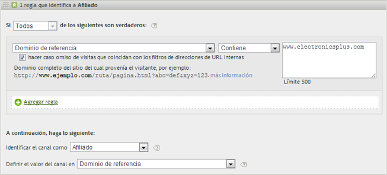

### Otras campañas {#other-campaigns}

Una práctica recomendada es incluir un canal “Otras campañas” siguiendo todas las reglas de canal de pago. Este canal actúa como captador global para el tráfico de pago sin categoría.

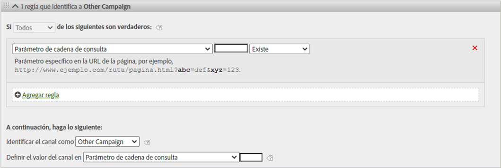

### Redes sociales {#social-networks}

Esta regla identifica a los visitantes que se originan en una red social como, por ejemplo, Facebook*. El canal suele denominarse “Social orgánico”. La configuración puede ser así:

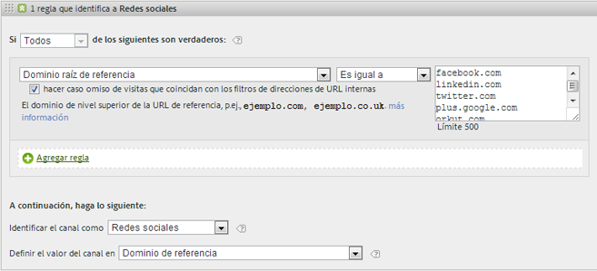

### Canal interno (Actualización de sesión) {#internal}

Esta regla identifica visitantes donde la dirección URL de referencia coincide con la configuración de filtros de URL internos en Admin Console, lo que significa que el visitante vino desde el sitio para comenzar la visita. Este canal se denomina con frecuencia Actualización de sesión.

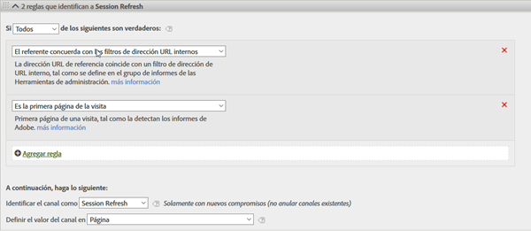

Consulte [Razones para la actualización interna (Actualización de sesión)](https://docs.adobe.com/content/help/es-ES/analytics/components/marketing-channels/c-faq.html) si quiere obtener más información sobre el motivo por el que se produce este canal.

### Directas {#direct}

Esta regla identifica a visitantes que no tienen dominio de referencia, lo que incluye a los visitantes que llegan a su sitio directamente como, por ejemplo, con un vínculo de Favoritos, o que han pegado el vínculo en el navegador. Este canal se denomina con frecuencia “Directamente escrito/Añadido como marcador”.

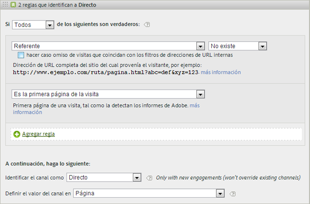

### Canal Dominios de referencia {#referring-domains}

El canal Dominios de referencia identifica visitantes que tienen un dominio de referencia. Juntos, los canales de dominios de referencia, directo e internos actúan como captador global para todas las visitas que quedan y que aún no se han clasificado en un canal.

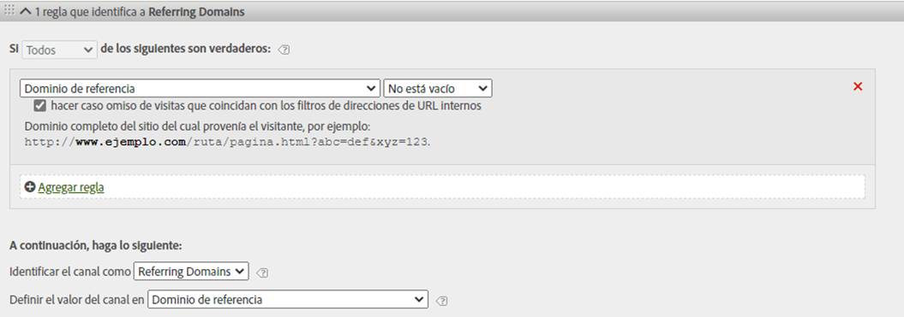