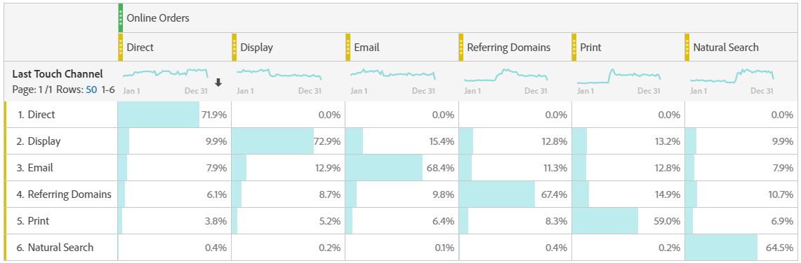

# Analizar canales de mercadotecnia

Probablemente quiera saber cuál de los canales de mercadotecnia es el más efectivo y con quién, para que pueda dirigir mejor sus esfuerzos y recibir un mejor retorno en los dólares de mercadotecnia. En Adobe Analytics, las dimensiones y métricas de los canales de marketing en Workspace son una de las herramientas que pueden ayudarle a realizar un seguimiento de la influencia de los distintos canales en sus pedidos, ingresos, etc. y le proporciona perspectivas de canal útiles. Estas son las dimensiones y métricas que puede utilizar relacionadas con los canales de mercadotecnia:

| Dimensión/Métrica | Definición |
|---|---|
| Canal de marketing | Ésta es la dimensión Canales de mercadotecnia que recomendamos utilizar. Los modelos de IQ de atribución se pueden aplicar en tiempo de ejecución. La dimensión Canales de mercadotecnia genéricos se comporta de forma idéntica a las dimensiones del Canal de último toque, pero tiene una etiqueta diferente para evitar confusiones al utilizarla con un modelo de atribución diferente. |
| Canal de último toque | Dimensión heredada, con modelo de atribución preaplicado e inmodificable. |
| Canal de primer toque | Dimensión heredada, con modelo de atribución preaplicado e inmodificable. |
| [Instancias de canal de mercadotecniaEsta métrica...] |
| Nuevos compromisos | Se trata de una métrica heredada que se incrementa únicamente cuando se le ha aplicado una asignación de &quot;primer toque&quot; a un canal. |

## Análisis básico

Esta tabla improvisada muestra las métricas Pedidos en línea, Ingresos en línea y Tasa de conversión para cada uno de los canales de mercadotecnia:

Aquí puede ver los pedidos en línea e ingresos en línea de cada canal de mercadotecnia en un gráfico circular:

Este gráfico de líneas muestra las tendencias de los pedidos en línea de varios canales a lo largo del tiempo:

## Análisis avanzado

Los detalles de los canales de mercadotecnia se insertan más profundamente en cada canal para mostrar campañas, colocaciones, etc. específicas. Puede desglosar cada canal de mercadotecnia en detalles:

## Aplicar modelos de atribución

Puede utilizar IQ [de](https://docs.adobe.com/content/help/en/analytics/analyze/analysis-workspace/panels/attribution/use-attribution.html) atribución para aplicar distintos modelos de atribución instantáneamente:

Observe cómo la misma métrica (Pedidos en línea) genera resultados diferentes al aplicar modelos de atribución diferentes.

Aquí hay algunos videos que explican el CI de atribución con más detalle: Lista de reproducción [de IQ de atribución](https://www.youtube.com/playlist?list=PL2tCx83mn7GuDzYEZ8jQlaScruZr3tBTR).

## Análisis de marketing entre fichas

Con el canal de primer toque heredado y el canal de último toque, puede obtener una vista útil de las interacciones de canal:

Obtenga más información en [este vídeo](https://www.youtube.com/watch?v=M3EOdONa-3E).