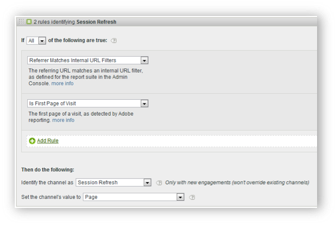

# Canal interno (actualización de sesión)

El canal interno (con frecuencia denominado “actualización de sesión”) consiste en visitas al sitio donde la dirección URL de referencia coincide con la configuración de los filtros de URL internos en Admin Console, lo que significa que el visitante vino desde dentro del sitio para iniciar la visita.

## Prácticas recomendadas sobre anulaciones

Se recomienda desactivar la opción de anulación del último contacto para los canales directos e internos, de modo que no puedan tomar crédito de otros canales de último contacto persistentes (o entre sí).

>[!NOTE]Este documento supone que la actualización directa y de sesión tienen la opción “Anular” desactivada.

## Periodo de interacción

Los canales de primer y último contacto de un visitante se restablecen tras 30 días de inactividad en ese navegador.

>[!NOTE] 30 días es el valor predeterminado y se puede modificar según sea necesario mediante la configuración de la administración.

Si el visitante utiliza el sitio con frecuencia, la ventana de participación se abrirá. Debe estar inactivo durante 30 días para que caduque el periodo y se restablezcan los canales.
Ejemplo:

* Día 1: el usuario llega al sitio y este aparece en la pantalla. Los canales de primer y último contacto se definirán como “Pantalla”.

* Día 2: el usuario entra al sitio a través de una búsqueda natural. El primer contacto permanece como “Pantalla” y el último contacto se establece como “Búsqueda natural”.

* Día 35: el usuario no ha accedido al sitio en 33 días y regresa usando la pestaña que había abierto en su navegador. Suponiendo que se trate de una ventana de participación de 30 días, la ventana se habría cerrado y las cookies del canal de marketing habrían caducado. El canal de primer contacto y último contacto se restablecerán y se configurarán en Actualización de sesión, ya que el usuario accedió con una URL interna.

## Relación entre primer y último contacto

Para comprender la interacción entre el primer y el último contacto, y confirmar que las anulaciones funcionan según lo esperado, puede extraer un informe de canal de primer contacto, subrelacionado con un informe de canal de último contacto, con la métrica de éxito clave en (ver ejemplo más abajo). En el ejemplo se muestra la interacción entre los canales de primer y último contacto.

La intersección en la que el primer contacto es igual que el último contacto se resalta en naranja. Tanto la actualización directa como la actualización de sesión solo obtienen crédito de último contacto si también son el canal de primer contacto, ya que no pueden tomar crédito de otros canales persistentes (filas resaltadas en gris).

## ¿Por qué se produce la actualización de la sesión?

Como sabemos que la actualización de sesión de último contacto solo puede producirse si también fue el primer contacto, los escenarios siguientes explican cómo la actualización de sesión puede ser un canal de primer contacto.

### Escenario 1: tiempo de espera de sesión

Un visitante llega al sitio web y luego deja la pestaña abierta en el navegador para usarla días más tarde. El periodo de interacción del visitante caduca (o elimina voluntariamente sus cookies) y utiliza la pestaña abierta para volver a visitar el sitio web. Dado que la dirección URL de referencia es un dominio interno, la visita se clasificará como “Actualización de sesión”.

### Escenario 2: no todas las páginas del sitio están etiquetadas

Un visitante llega a la página A que no está etiquetada y luego se mueve a la página B que está etiquetada. La página A se trataría como el referente interno y la visita se clasificaría como “Actualización de sesión”.

### Escenario 3: redirecciones

Si no se configura una redirección para pasar datos del referente a la nueva página de llegada, se pierden los datos del referente de entrada real y ahora la página de redirección (probablemente una página interna) aparece como el dominio de referencia. La visita se clasificará como “Actualización de sesión”.

### Escenario 4: tráfico entre dominios

Un visitante pasa de un dominio que se activa con el grupo A a un segundo dominio que se activa con el grupo B. Si en el grupo B los filtros de URL internos incluyen el primer dominio, la visita en el grupo B se registrará como interna, ya que los canales de marketing la ven como una nueva visita en el segundo grupo. La visita se clasificará como “Actualización de sesión”.

### Escenario 5: largos tiempos de carga de la página de entrada

Un visitante llega a la página A, que tiene mucho contenido, y el código de Adobe Analytics se encuentra en la parte inferior de la página. Antes de cargar todo el contenido (incluida la solicitud de imagen de Adobe Analytics), el visitante hace clic en la página B. La página B activa su solicitud de imagen de Adobe Analytics. Dado que la solicitud de imagen de la página A nunca se cargó, la segunda página aparece como la primera visita individual en Adobe Analytics, con la página A como referente. La visita se clasificará como “Actualización de sesión”.

### Escenario 6: se eliminan las cookies en el sitio intermedio

Un visitante ingresa al sitio y luego borra las cookies a mitad de la sesión. Los canales de primer y último contacto se restablecerían y la visita se clasificaría como “Actualización de sesión” (porque el referente sería interno).
