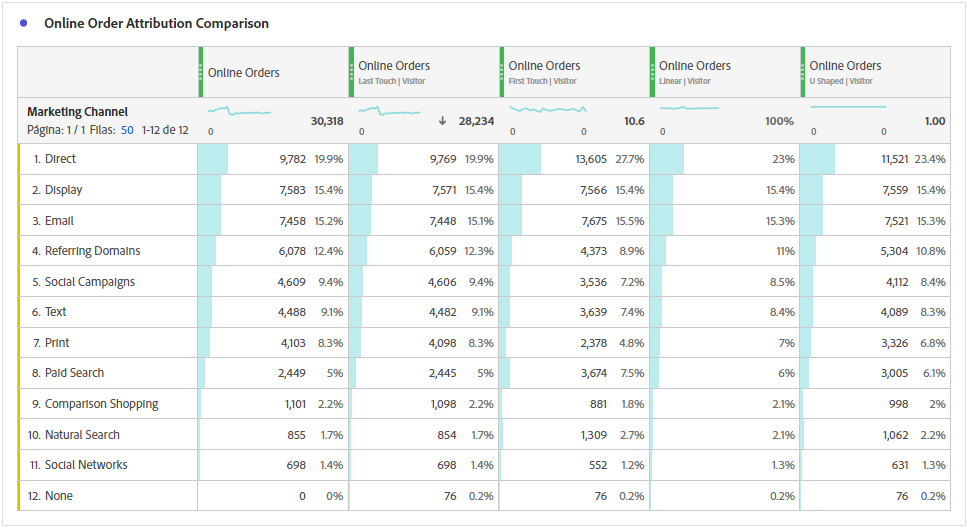
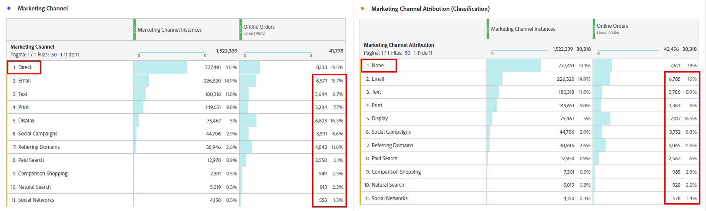
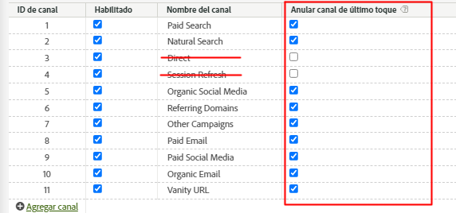
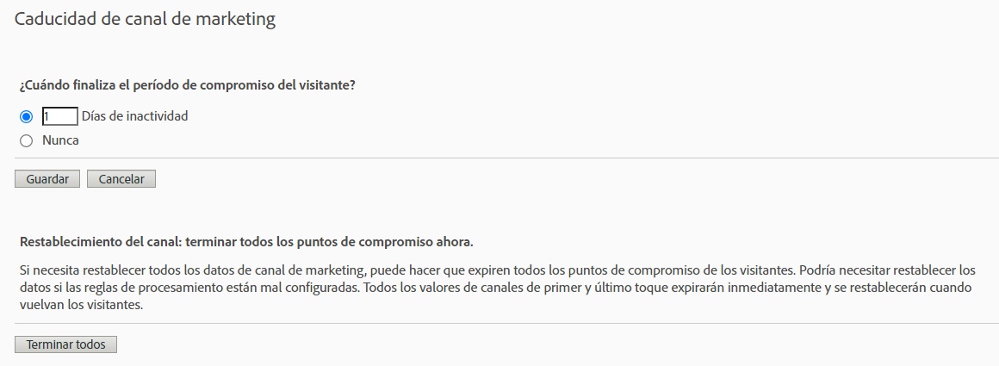

# Attribution IQ con canales de marketing: prácticas recomendadas

[Los ](/help/components/c-marketing-channels/c-getting-started-mchannel.md) canales de marketing son una valiosa y potente función de Adobe Analytics. Las directrices actuales relativas a la implementación del canal de marketing se formularon en un momento en que no existía ni [Attribution IQ](https://experienceleague.corp.adobe.com/docs/analytics/analyze/analysis-workspace/attribution/overview.html?lang=en#analysis-workspace) ni [Customer Journey Analytics](https://experienceleague.adobe.com/docs/analytics-platform/using/cja-usecases/marketing-channels.html?lang=es#cja-usecases).

Para futuras pruebas de la implementación de los canales de marketing y garantizar la coherencia de los informes con el Attribution IQ y con el Customer Journey Analytics, publicamos un conjunto de prácticas recomendadas actualizadas. Si ya está utilizando Canales de marketing, puede elegir las mejores opciones entre estas nuevas directrices. Si es nuevo en los canales de marketing, le recomendamos que se adhiera a todas las prácticas recomendadas nuevas.

Cuando se introdujeron los canales de marketing por primera vez, solo incluyeron dimensiones de primer toque y de último toque. Ya no se necesitan dimensiones explícitas de primer/último contacto con la versión actual de atribución. Adobe proporciona dimensiones genéricas de &quot;Canal de marketing&quot; y &quot;Detalle de canal de marketing&quot; para que pueda utilizarlas con el modelo de atribución deseado. Estas dimensiones genéricas se comportan de forma idéntica a las dimensiones del canal de último toque, pero tienen una etiqueta diferente para evitar confusiones al usar canales de marketing con un modelo de atribución diferente.

Dado que las dimensiones del canal de marketing dependen de una definición de visita tradicional (según lo definen sus reglas de procesamiento), su definición de visita no se puede cambiar mediante grupos de informes virtuales. Estas prácticas revisadas permiten ventanas retrospectivas claras y controladas con Attribution IQ y con CJA.

## Práctica recomendada n.º 1: Aprovechar el Attribution IQ para el análisis controlado

Se recomienda utilizar [Attribution IQ](https://experienceleague.corp.adobe.com/docs/analytics/analyze/analysis-workspace/attribution/overview.html?lang=en#analysis-workspace) en lugar de la atribución de canal de marketing existente para ajustar el análisis de canal de marketing. Siga las otras prácticas recomendadas para garantizar la coherencia y unos controles sólidos sobre el análisis con Attribution IQ.

* La configuración de las dimensiones Canal de marketing y Detalle de canal de marketing establece puntos de contacto que se deben evaluar, correspondientes a cada instancia de canal de marketing.
* Para el análisis de métricas, su organización debe alinearse en uno o más modelos de atribución. Guarde métricas personalizadas con este modelo para facilitar su reutilización.
* De forma predeterminada, los datos se asignan mediante el último toque y la configuración del periodo de compromiso del visitante. Los modelos de métricas de Attribution IQ ofrecen un bueno control sobre las ventanas retroactivas y más variedad, incluida la [atribución algorítmica](https://experienceleague.adobe.com/docs/analytics/analyze/analysis-workspace/attribution/algorithmic.html?lang=en#analysis-workspace).

## Práctica recomendada n.º 2: Sin definiciones de canal de actualización directa y de sesión

No se recomiendan los canales de actualización directa e interna/de sesión para su uso con modelos de atribución personalizados (Attribution IQ).

¿Qué sucede si su organización ya tiene configurada la actualización directa y de sesión? En este caso, le recomendamos que cree una clasificación para sus canales de marketing y que deje esos dos canales sin clasificar. La dimensión clasificada arrojará los mismos resultados de Attribution IQ que si esos canales nunca se hubieran configurado.

## Práctica recomendada n.º 3: Habilitar el canal de último toque de anulación para todos los canales

Los modelos de atribución personalizados utilizados con la dimensión Canal de marketing en Workspace funcionan mejor cuando esta configuración está habilitada. Si habilita esta configuración, la instancia de un canal de marketing se contará cuando se encuentre un nuevo canal o detalle. Debe habilitar esto para todos los canales, excepto para la actualización directa o interna/de sesión, que ya no se recomienda utilizar con modelos de atribución personalizados (Attribution IQ).

## Práctica recomendada n.º 4: Minimizar el periodo de compromiso del visitante

Si establece el periodo de compromiso del visitante como mínimo en &quot;1 día&quot;, se minimiza la probabilidad de que persistan los valores. Debido a que los modelos de atribución personalizados (AIQ) permiten ventanas retroactivas flexibles, recomendamos configurar el valor mínimo para minimizar el impacto de esta configuración.

## Práctica recomendada n.º 5: Las reglas de procesamiento de los canales de marketing solo deben existir para los canales habilitados

Asegúrese de eliminar las reglas de procesamiento de canal de mercadotecnia de los canales desactivados. Las reglas solo deben existir para los canales de marketing que están marcados como habilitados.
