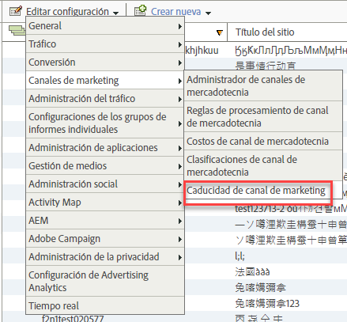

# Caducidad de compromiso del visitante

Descubra cómo especificar la caducidad de compromiso del visitante en Canales de mercadotecnia.

## Visitor engagement expiration {#topic_32ADFDB12D3A4F35843A4545AC97C49F}

Descubra cómo especificar la caducidad de compromiso del visitante en Canales de mercadotecnia.

El compromiso del visitante especifica la cantidad de tiempo que desea permitir para que la actividad previa del visitante en su sitio web se atribuya al canal de primer toque.

Por ejemplo, muchas veces los visitantes hacen clic a través de una campaña de búsqueda paga y agregan productos al carro, pero terminan la sesión antes del evento de conversión. Si el visitante regresa posteriormente para hacer una compra, puede especificar si la actividad anterior y la actual cuentan como un solo compromiso. El valor predeterminado de la caducidad es de 30 días.

| Campo | Definición |
|--- |--- |
| Días de inactividad | Cantidad de días que deben transcurrir antes de que caduque el compromiso de primer toque del visitante. El valor predeterminado es 30. |
| Nunca | El período de compromiso del visitante no caduca. |
| Restablecimiento del canal | Termina todos los periodos de compromiso de los visitantes.  Si necesita restablecer todos los datos de canal de mercadotecnia, puede hacer que expiren todos los períodos de compromiso de los visitantes. Podría necesitar restablecer los datos si las reglas de procesamiento están mal configuradas. Todos los valores de canales de primer y último toque expirarán inmediatamente y se restablecerán cuando vuelvan los visitantes. |

## Especificación de la caducidad del compromiso del visitante {#task_A8B8B5A07C5A4882BB895252A018FDED}

Especifique la caducidad del compromiso del visitante.

1. Click **[!UICONTROL Analytics]** &gt; **[!UICONTROL Admin]** &gt; **[!UICONTROL Report Suites]**.
1. In the [!UICONTROL Report Suite Manager], click **[!UICONTROL Edit Settings]** &gt; **[!UICONTROL Marketing Channels]** &gt; **[!UICONTROL Marketing Channel Expiration]**.

   

1. Configure los campos de caducidad de compromiso del visitante.
1. Haga clic en **[!UICONTROL Guardar.]**
