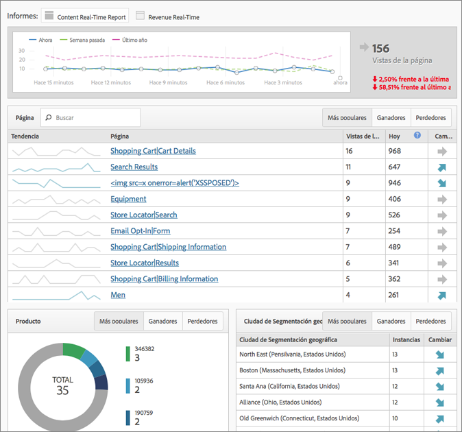

# Resumen de informes en tiempo real

Los informes en tiempo real muestran tráfico de páginas web y clasifican las vistas de página en tiempo real. Proporciona datos procesables en los que fundamentar sus decisiones comerciales.

>[!NOTE]
>
>El informe en tiempo real no requiere implementación ni etiquetado adicionales. Utiliza la implementación existente de Adobe Analytics. Para configurar informes en tiempo real, consulte [Configuración de informes en tiempo real](/help/components/c-real-time-reporting/t-realtime-admin.md).

**[!UICONTROL Métricas del sitio]** > **[!UICONTROL Tiempo real]**

Los informes en tiempo real responden a las preguntas siguientes: ¿Cuáles son las tendencias en mi sitio y por qué? Le permite, como especialista en marketing, responder rápidamente y administrar de forma activa el rendimiento de sus campañas de marketing y de su contenido. Los datos en tiempo real recibidos tienen una latencia inferior a dos minutos y se actualizan automáticamente cada minuto.

El tablero incluye métricas de alta frecuencia de Adobe Analytics y análisis de sitio para informar de forma visual sobre el tráfico y las tendencias de vistas de páginas de noticias dinámicas y sitios web comerciales. El informe en tiempo real comprende las tendencias minuto a minuto, pocos segundos después de haber recopilado los datos. Recopila y transmite datos en una interfaz que se actualiza automáticamente, con correlación en tiempo real, seguimiento de contenido y conversión.

Dos de los ejemplos de uso más importantes son editores que quieran promocionar/dar de baja historias como cambios de actividad de usuarios, y especialistas en marketing que quieran realizar el seguimiento del lanzamiento de una nueva línea de productos.

Como administrador, puede

* Crear hasta tres informes en tiempo real por grupo de informes, usar dimensiones existentes o clasificaciones y métricas. Utilice las dimensiones secundarias para establecer una correlación (o desglose) respecto a la primaria.
* Agregue tres dimensiones (o clasificaciones) por informe (uno principal y dos secundarios), además de una métrica general para todo el sitio.
* Utilice cualquier evento personalizado, evento del carro de compras o instancia.
* Vea hasta dos horas de datos históricos en tiempo real y modifique esta configuración:

   * Últimos 15 minutos: granularidad de 1 minuto
   * Últimos 30 minutos: granularidad de 1 minuto
   * Última hora: granularidad de 2 minutos
   * Últimas 2 horas: granularidad de 4 minutos

* Compare, por ejemplo, los valores de la semana pasada con los valores del año pasado (así como el total de hoy).

Tenga en cuenta que no se admiten las métricas de conversión (eVar), ya que no hay concepto de persistencia. Aunque puede seleccionar métricas de conversión, solo funcionarán si se establecen en la misma página que las dimensiones. Para obtener más información, consulte el mensaje de advertencia registrado en [Configuración de informesen tiempo real](/help/components/c-real-time-reporting/t-realtime-admin.md).

La configuración y visualización de informes en tiempo real está restringida a administradores o cualquier otro usuario de los grupos de permisos &quot;Acceso a todos los informes&quot; e &quot;Informes avanzados&quot;. Sin embargo, Tiempo real respeta los permisos. Por ejemplo, si no dispone de permisos para ver ingresos, no podrá ver un informe en tiempo real que incluya datos de ingresos.

## Latencia de datos como resultado de la configuración de A4T {#section_806CE36354FC4C539A0DED9266A5C704}

Tras activar la integración de A4T en Adobe [!DNL Target], experimentará otros 5-10 minutos de latencia en Adobe Analytics. Este aumento de la latencia permite almacenar los datos de Analytics y [!DNL Target] en la misma visita, lo que le permite desplegar las pruebas por página y por sección de sitio.

Este aumento se ve reflejado en todos los servicios y herramientas de Adobe Analytics, incluido el flujo en directo y los informes en tiempo real, y se aplica a estos escenarios:

* Para el flujo en directo, los informes en tiempo real, las solicitudes de la API y todos los datos actuales para las variables de tráfico, solo se retrasan las visitas con un ID de datos suplementario.
* Para los datos actuales en las métricas de conversión, los datos finalizados y las fuentes de datos, todas las visitas se retrasan de 5 a 7 minutos más.

Tenga en cuenta que el aumento de la latencia se da después de implementar el Servicio de identidad, incluso aunque no haya implementado correctamente esta integración.
