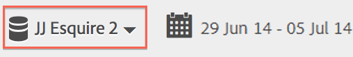
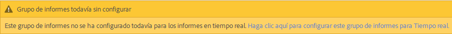
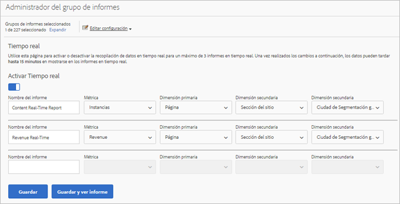
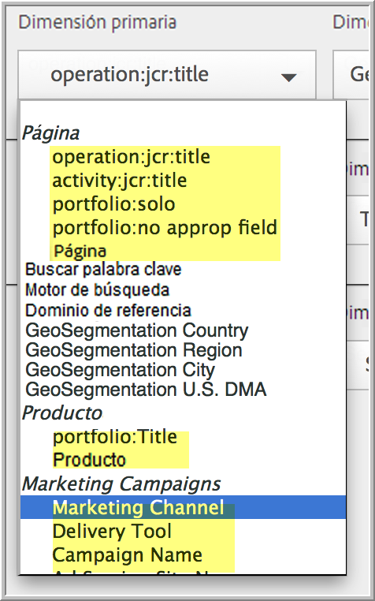
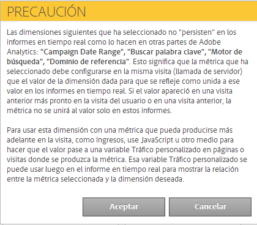

# Configurar informes en tiempo real

Pasos administrativos para configurar informes en tiempo real.

Configurar informes en tiempo real en [!UICONTROL Reports &amp; Analytics] consiste en seleccionar el grupo de informes y configurar hasta 3 informes para este.

1. Seleccione el grupo de informes para el que quiere habilitar los informes en tiempo real.

   Vaya a **[!UICONTROL Analytics]** > **[!UICONTROL Informes]** > **[!UICONTROL Ver todos los informes > Métricas del sitio]** > **[!UICONTROL Tiempo real]** y seleccione el grupo de informes en la lista desplegable de la parte superior:

   

   Si trata de ver informes en tiempo real de un grupo de informes que no se haya configurado para este tipo de informes, aparecerá un mensaje que le permitirá configurarlo.

   

1. Haga clic en **[!UICONTROL Configurar]** (icono del engranaje) para ejecutar el [!UICONTROL Administrador del grupo de informes].

   (También disponible en **[!UICONTROL Analytics]** > **[!UICONTROL Administración > Grupos de informes]** > **[!UICONTROL Editar configuración]** > **[!UICONTROL Tiempo real]**).

1. Active la configuración **[!UICONTROL Activar Tiempo real]**.
1. Configure la recopilación de datos en tiempo real para hasta tres informes, con una métrica y tres dimensiones o clasificaciones por informe.

   

   Para obtener información sobre las métricas y dimensiones compatibles en tiempo real, consulte [Métricas y dimensiones compatibles](/help/components/c-real-time-reporting/realtime-metrics.md).

   Si ha creado clasificaciones, estas aparecerán con sangría debajo de las dimensiones para las que se hayan definido:

   

   >[!NOTE]
   >
   >Actualmente no se pueden duplicar dimensiones para un solo informe en tiempo real, aunque se seleccione una clasificación distinta para cada dimensión.

   Para obtener más información sobre las clasificaciones, consulte [Acerca de las clasificaciones](/help/components/classifications/c-classifications.md).

   >[!NOTE]
   >
   >Algunas dimensiones, como “Buscar palabra clave” o “Producto”, no persisten en tiempo real como lo hacen en el resto de Adobe Analytics. Al seleccionar una métrica no persistente se mostrará la siguiente advertencia:

   

1. Haga clic en **[!UICONTROL Guardar]** o en **[!UICONTROL Guardar y ver informe]**.

   Después de esta configuración inicial del informe los datos pueden tardar hasta 20 minutos en ser transferidos. A partir de ese momento los datos estarán disponibles inmediatamente. Para obtener más información sobre la visualización de informes en tiempo real, consulte [Ejecución de un informe en tiempo real](https://docs.adobe.com/content/help/es-ES/analytics/analyze/reports-analytics/t-running-report-types.html).

1. De manera predeterminada todos los usuarios tienen acceso a los informes en tiempo real.
