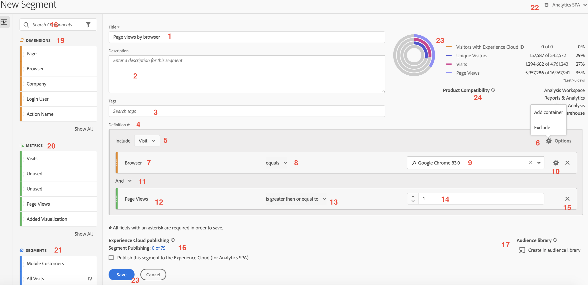
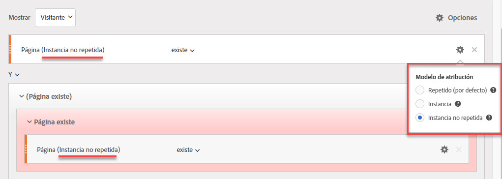
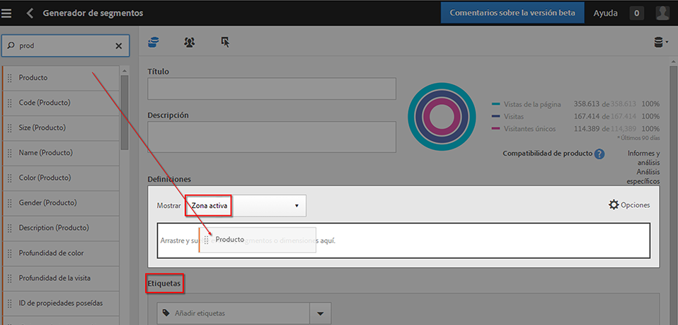
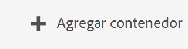
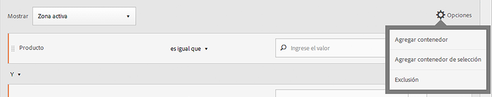
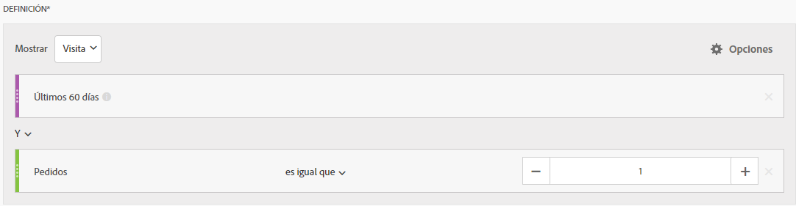
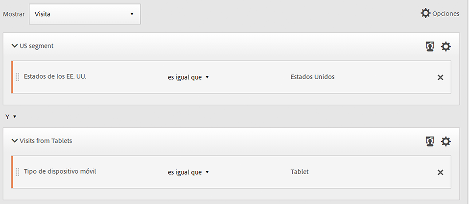

# Generador de segmentos

El [!UICONTROL Generador de segmentos] le permite generar segmentos simples o complejos que identifican atributos y acciones de visitantes en visitas y visitas individuales de páginas. Proporciona un lienzo al que arrastrar y en el que soltar las dimensiones de métricas, eventos u otros segmentos para segmentar a visitantes en función de la lógica, las reglas y los operadores de la jerarquía.

Existen varias formas de acceder al Generador de segmentos:

* **Navegación superior de Analytics**: Haga clic en **[!UICONTROL Analytics]** > **[!UICONTROL Componentes]** > **[!UICONTROL Segmentos]**.
* **[!UICONTROL Analysis Workspace]**: Haga clic en **[!UICONTROL Analytics]** > **[!UICONTROL Workspace]**, abra un proyecto y haga clic en **[!UICONTROL + Nuevo]** > **[!UICONTROL Crear segmento]**.
* **[!UICONTROL Reports &amp; Analytics]** Haga clic en **[!UICONTROL Analytics]** > **[!UICONTROL Informes]**, abra un informe existente y haga clic en el icono Segmentos  en la navegación izquierda; a continuación, haga clic en **[!UICONTROL Agregar]**.
* **[!UICONTROL Ad Hoc Analysis]**: [Generar segmentos en Ad Hoc Analysis](/help/components/c-segmentation/c-segmentation-workflow/seg-build.md#build-segments).
* **[!UICONTROL Report Builder]**: [Añadir o editar segmentos en Report Builder](https://docs.adobe.com/content/help/es-ES/analytics/analyze/report-builder/data-requests/segmentation.html).

## Criterios del Creador{#section_F61C4268A5974C788629399ADE1E6E7C}

Puede agregar definiciones y contenedores de reglas para definir los segmentos.

1. **[!UICONTROL Título]**: Asigne un nombre al segmento.
1. **[!UICONTROL Descripción]**: Proporcione una descripción para el segmento.
1. **[!UICONTROL Etiquetas]**: [Etiquete el segmento](/help/components/c-segmentation/c-segmentation-workflow/seg-workflow.md) que va a generar seleccionando las etiquetas existentes en una lista o creando una etiqueta nueva.
1. **[!UICONTROL Definiciones]**: Esta es la zona de trabajo donde [se generan y configuran segmentos](/help/components/c-segmentation/c-segmentation-workflow/seg-workflow.md), se agregan reglas y se anidan y secuencian contenedores.
1. **[!UICONTROL Mostrar]**: (Selector de contenedor superior). Le permite seleccionar el nivel de [contenedor](/help/components/c-segmentation/seg-overview.md) superior ([!UICONTROL visitante], [!UICONTROL visita] o [!UICONTROL visita individual]). El contenedor de nivel superior predeterminado es el contenedor de visita individual.
1. Icono de **[!UICONTROL opciones]** (engranaje)

   * **[!UICONTROL + Agregar contenedor]**: le permite agregar un contenedor nuevo (bajo el contenedor de nivel superior) a la definición del segmento.
   * **[!UICONTROL Excluir]**: permite definir el segmento excluyendo una o más dimensiones, segmentos o métricas.

1. **[!UICONTROL Dimension]**: Los componentes se arrastran y se sueltan desde la lista Dimension (barra lateral naranja).
1. **[!UICONTROL Operador]**: Puede comparar y restringir valores utilizando una selección de operadores.
1. **[!UICONTROL Valor]**: Valor introducido o seleccionado para la dimensión, el segmento o la métrica.
1. **[!UICONTROL Modelos de atribución]**: Disponible solo para dimensiones, estos modelos determinan qué valores de una dimensión se segmentan. Los modelos de dimensión son especialmente útiles en la segmentación secuencial.

   * **[!UICONTROL Repetido]** (por defecto): Incluye instancias y valores persistentes para la dimensión.
   * **[!UICONTROL Instancia]**: Incluye instancias para la dimensión.
   * **[!UICONTROL Instancia no repetida]**: Incluye instancias únicas (no repetitivas) para la dimensión. Este es el modelo aplicado en Flujo cuando se excluyen instancias repetidas.

   

   **Ejemplo: Segmento de visita individual donde eVar1 = A**

   | Ejemplo | A | A | A (persistió) | B | A | C |
   |---|---|---|---|---|---|---|
   | Repetido | X | X | X | - | X | - |
   | Instancia | X | X | - | - | X | - |
   | Instancia no repetida | X | - | - | - | X | - |
1. **[!UICONTROL And/Or/Then]**: Asigna los operadores [!UICONTROL AND/OR/THEN] entre contenedores o reglas. El operador THEN le permite [definir segmentos secuenciales](/help/components/c-segmentation/c-segmentation-workflow/seg-sequential-build.md).
1. **[!UICONTROL Métrica]**: Métrica arrastrada y soltada a partir de la lista Métricas.
1. Operador de **[!UICONTROL comparación]**: Puede comparar y restringir valores utilizando una selección de operadores.
1. **[!UICONTROL Valor]**: Valor introducido o seleccionado para la dimensión, el segmento o la métrica.
1. **[!UICONTROL X]**: Le permite eliminar esta parte de una definición de segmento.
1. **[!UICONTROL Publicación]** de Experience Cloud: La publicación de un segmento de Adobe Analytics en el Experience Cloud le permite utilizarlo para la actividad de marketing en [!DNL Audience Manager] y en otros canales de activación. [Más información...](/help/components/c-segmentation/c-segmentation-workflow/seg-publish.md)
1. **[!UICONTROL Biblioteca]** de audiencias: Los servicios de audiencia de Adobe administran la traducción de datos de visitante en segmentación de audiencias. De este modo, la creación y gestión de audiencias es similar a la creación y uso de segmentos, con la capacidad añadida de compartir segmentos de audiencia en Experience Cloud. [Más información...](https://docs.adobe.com/content/help/es-ES/core-services/interface/audiences/audience-library.html)
1. **[!UICONTROL Buscar]**: Permite buscar la lista de dimensiones, segmentos o métricas.
1. **[!UICONTROL Dimensiones]**: (Lista) Haga clic en el encabezado para ampliarlo.
1. **[!UICONTROL Métricas]**: Haga clic en el encabezado para ampliarlo.
1. **[!UICONTROL Segmentos]**: Haga clic en el encabezado para ampliarlo.
1. **[!UICONTROL Selector]** de grupos de informes: Permite seleccionar el grupo de informes en el que se guardará este segmento. Puede seguir utilizando el segmento en todos los grupos de informes.
1. **[!UICONTROL Previsualización de segmento]**: Le permite previsualizar las métricas clave para comprobar si tiene un segmento válido y ver su amplitud. Representa el desglose del conjunto de datos que verá si aplica este segmento. Muestra tres círculos concéntricos y una lista para indicar el número y el porcentaje de coincidencias de [!UICONTROL visitas individuales], [!UICONTROL visitas] y [!UICONTROL visitantes] de un segmento comparado con un conjunto de datos. Esta tabla se actualiza inmediatamente después de crear o cambiar la definición del segmento.
1. **[!UICONTROL Compatibilidad de producto]**: Proporciona una lista de los productos de Adobe Analytics (Analysis Workspace, [!UICONTROL Reports &amp; Analytics], Ad Hoc Analysis, Data Warehouse) con los que es compatible el segmento que ha creado. La mayoría de los segmentos son compatibles con todos los productos. Sin embargo, no todos los operadores y dimensiones son compatibles con todos los productos de Analytics, en especial  [Data Warehouse](/help/components/c-segmentation/seg-reference/seg-compatibility.md). Esta tabla se actualiza inmediatamente después de cambiar la definición del segmento.
1. **[!UICONTROL Guardar]** o **[!UICONTROL Cancelar]**: Guarda o cancela el segmento. Después de hacer clic en **[!UICONTROL Guardar]**, se le redirigirá al Administrador de segmentos, donde podrá administrar el segmento en cuestión.

Los segmentos con intervalos de fechas incorporados siguen operando en Analysis Workspace de forma distinta a como lo hacen en [!UICONTROL Reports &amp; Analytics]. En Workspace, un segmento con un intervalo de fechas integrado anula el intervalo de fechas del panel. Por su parte, en [!UICONTROL Reports &amp; Analytics] se emplea la intersección del intervalo de fechas del informe y el intervalo de fechas integrado del segmento.

## Generar segmentos {#build-segments}

1. Basta con que arrastre una dimensión, un segmento o un evento de métrica del panel izquierdo al campo [!UICONTROL Definiciones].

   

   El contenedor de [!UICONTROL visita individual] de nivel superior predeterminado se muestra tras arrastrar un elemento a [!UICONTROL Definiciones]. Puede cambiar el tipo de contenedor a visita o visitante desde el menú desplegable **[!UICONTROL Mostrar]**.

1. Establezca el [operador](/help/components/c-segmentation/seg-reference/seg-operators.md) en el menú desplegable.
1. Introduzca o seleccione un valor para el elemento seleccionado.
1. Agregue contenedores adicionales si es necesario, utilizando las reglas **[!UICONTROL Y]**, **[!UICONTROL O]** o **[!UICONTROL Entonces]**.
1. Después de colocar los contenedores y configurar las reglas, consulte los resultados del segmento en la tabla de validación, en la parte superior derecha. El validador indica el porcentaje y el número absoluto de vistas de la página, visitas y visitantes únicos que coinciden con el segmento que ha creado.
1. En **[!UICONTROL Etiquetas]**, [etiquete](/help/components/c-segmentation/c-segmentation-workflow/seg-tag.md) el contenedor seleccionando una etiqueta existente o creando una nueva.
1. Haga clic en **[!UICONTROL Guardar]** para guardar el segmento.

Ahora se le redirige al [Administrador de segmentos](/help/components/c-segmentation/c-segmentation-workflow/seg-manage.md), donde puede etiquetar, compartir y administrar el segmento de varias formas.

## Añadir contenedores {#section_1C38F15703B44474B0718CEF06639EFD}

Puede [generar un marco de contenedores](/help/components/c-segmentation/seg-overview.md) y luego colocar reglas lógicas y operadores entre medias.

1. Haga clic en **[!UICONTROL Opciones > Agregar contenedor]**.

   

   Un nuevo contenedor de [!UICONTROL visita individual] se abrirá sin una [!UICONTROL visita individual] (vista de página) identificada.

   

1. Cambie el tipo de contenedor según sea necesario.
1. Arrastre una dimensión, segmento o evento desde el panel izquierdo al contenedor.
1. Siga agregando nuevos contenedores desde el botón **[!UICONTROL Opciones]** > **[!UICONTROL Agregar contenedor]** del nivel superior situado en la parte superior de la definición, o agregue contenedores desde dentro de un contenedor para anidar la lógica.

   **OR**

   Seleccione una o más reglas y luego haga clic en **[!UICONTROL Opciones]** > **[!UICONTROL Agregar contenedor de selección]**. Esto convierte su selección en un contenedor separado.

## Usar intervalos de fechas {#concept_252A83D43B6F4A4EBAB55F08AB2A1ACE}

Puede generar segmentos que contienen intervalos de fechas móviles para responder a preguntas sobre campañas o eventos en curso.

Por ejemplo, puede crear fácilmente un segmento que incluya a “todas las personas que hayan efectuado una compra en los últimos 60 días”.

Usted crea un contenedor de visita y, dentro del mismo, agrega el intervalo temporal [!UICONTROL Últimos 60 días] y la métrica [!UICONTROL Pedidos es mayor o igual que 1], con un operador AND:

## Apilar segmentos {#task_58140F17FFD64FF1BC30DC7B0A1B0E6D}

El apilamiento de segmentos funciona mediante la combinación de criterios en cada segmento utilizando un operador “and”, y luego aplicando los criterios combinados. Esto se puede hacer directamente en un proyecto de Workspace o en el generador de segmentos.

Por ejemplo, el apilamiento de los segmentos &quot;usuarios de teléfono móvil&quot; y &quot;geografía de Estados Unidos&quot; devolverá datos relativos únicamente a los usuarios de teléfono móvil en los Estados Unidos.

Considere estos segmentos como bloques de construcción o módulos que puede incluir en una biblioteca de segmentos, para que los usuarios los utilicen como mejor les convenga. De este modo, puede reducir considerablemente el número de segmentos necesarios. Por ejemplo, ponga por caso que tiene 40 segmentos:

* 20 para usuarios de teléfonos móviles en diferentes países (EEUU_móvil, Alemania_móvil, Francia_móvil, Brasil_móvil, etc.).
* 20 para usuarios de tabletas en diferentes países (EEUU_tableta, Alemania_tableta, Francia_tableta, Brasil_tableta, etc.).

Si utiliza el apilamiento de segmentos, puede reducir el número de segmentos a 22 y apilarlos según le convenga. Tendrá que crear estos segmentos:

* Un segmento para usuarios de móviles.
* Un segmento para usuarios de tabletas.
* 20 segmentos para las diferentes zonas geográficas.

>[!NOTE]
>
>Al apilar dos segmentos, se unen de manera predeterminada con una instrucción AND. No es posible cambiarlo a una instrucción OR.

1. Vaya al Generador de segmentos.
1. Introduzca un título y una descripción para el segmento.

   Resultado (1). Haga clic en **[!UICONTROL Mostrar segmentos]** para que aparezca la lista de segmentos en el panel de navegación izquierdo.

   Resultado (1). Arrastre y suelte los segmentos que desea apilar en el lienzo de definición del segmento. A continuación se muestra un ejemplo de un segmento que apila los segmentos existentes &quot;Visitas desde tabletas&quot; y &quot;Geografía EE. UU.&quot;:

   

1. Guarde el segmento.

   Resultado de los pasos

## Plantillas de segmentos {#concept_5098446CC78D441E93B8E4D1D1EA6558}

Las plantillas de segmentos se proporcionan para casos de uso de segmentación comunes, como “Visitas por primera vez” o “Visitas desde dispositivos móviles”. Están disponibles en proyectos de Workspace y en el generador de segmentos como componentes básicos para nuevos segmentos.

Las plantillas se identifican con el logotipo “A” de Adobe. A continuación puede consultar una muestra de las plantillas:

<table id="table_98B87D807E9344C9BEBF072C65D87B1B"> 
 <thead> 
  <tr> 
   <th colname="col1" class="entry"> Nombre de plantilla </th> 
   <th colname="col2" class="entry"> Definición </th> 
  </tr> 
 </thead>
 <tbody> 
  <tr> 
   <td colname="col1"> Abandonar carro </td> 
   <td colname="col2">Ver datos de visitantes que agregaron elementos al carro pero no realizaron ningún pedido. En la definición de segmento, el contenedor es Visita. La regla de este segmento secuencial es: 
 Adiciones al carro no es nulo 
 
Entonces 
 
Pedidos es igual a 0. 
 </td> 
  </tr> 
  <tr> 
   <td colname="col1"> Visitas por primera vez </td> 
   <td colname="col2">Ver datos de visitantes que han visitado el sitio como máximo una [1] vez. En la definición de segmento, el contenedor es Visita. La regla es: 
Número de visitas es igual a 1. 
 </td> 
  </tr> 
  <tr> 
   <td colname="col1"> No compradores </td> 
   <td colname="col2">Ver datos de los visitantes que no participaron en un evento de pedido. En la definición de segmento, el contenedor es Visitante. Este segmento utiliza la lógica Excluir. La regla es: 
El pedido no es nulo. 
 </td> 
  </tr> 
  <tr> 
   <td colname="col1"> Visita de página no única (no rebotes) </td> 
   <td colname="col2">Ver datos de los visitantes que visitaron más de una vez. En la definición de segmento, el contenedor es Visitante. Este segmento utiliza la lógica Excluir. La regla es: 
El acceso único no es nulo. 
 </td> 
  </tr> 
  <tr> 
   <td colname="col1"> Búsqueda de pago </td> 
   <td colname="col2">Ver datos de visitantes procedentes de una búsqueda de pago. En la definición de segmento, el contenedor es Visita. La regla es: 
La búsqueda de pago es igual a 1. 
 </td> 
  </tr> 
  <tr> 
   <td colname="col1"> Compradores </td> 
   <td colname="col2">Ver datos de los visitantes que participaron en un evento de pedido. En la definición de segmento, el contenedor es Visitante. La regla es: 
El pedido no es nulo. 
 </td> 
  </tr> 
  <tr> 
   <td colname="col1"> Visitas de retorno </td> 
   <td colname="col2">Ver datos de los visitantes que han visitado por lo menos una vez. En la definición de segmento, el contenedor es Visita. La regla es: 
Número de visitas es mayor que 1. 
 </td> 
  </tr> 
  <tr> 
   <td colname="col1"> Visitas de página única </td> 
   <td colname="col2"> Ver datos de las visitas en las que se ve el valor de una sola página, aunque se envíen varias vistas de página durante esa visita. En el segmento se incluyen las visitas a una sola página con eventos de vínculo de salida. En la definición de segmento, el contenedor es Visita. La regla es: 
Visitas de página única es igual a 1. 
 </td> 
  </tr> 
  <tr> 
   <td colname="col1"> Producto visto no se agregó al carro </td> 
   <td colname="col2">Ver datos de los visitantes que vieron productos pero no agregaron nada al carro. En la definición de segmento, el contenedor es Visita. La regla de este segmento secuencial es: 
Vistas de producto no es nulo 
 
Entonces 
 
 Adiciones al carro es igual a 0. 
 </td> 
  </tr> 
  <tr> 
   <td colname="col1"> Visitas desde campaña </td> 
   <td colname="col2">Ver datos de visitantes remitidos desde campañas. En la definición de segmento, el contenedor es Visita. La regla es: 
El código de seguimiento no es nulo. 
 </td> 
  </tr> 
  <tr> 
   <td colname="col1"> Visitas desde dispositivos móviles </td> 
   <td colname="col2">Ver datos de visitantes que utilizan dispositivos móviles. En la definición de segmento, el contenedor es Visita. La regla es: 
El dispositivo móvil no es nulo. 
 </td> 
  </tr> 
  <tr> 
   <td colname="col1"> Visitas de búsqueda natural </td> 
   <td colname="col2">Ver datos de visitantes que no proceden de una búsqueda de pago. En la definición de segmento, el contenedor es Visita. La regla es: 
La búsqueda de pago es igual a 0. 
 </td> 
  </tr> 
  <tr> 
   <td colname="col1"> Visitas desde un dispositivo no móvil </td> 
   <td colname="col2">Ver datos de visitantes que no utilizan dispositivos móviles. En la definición de segmento, el contenedor es Visita. Este segmento utiliza la lógica Excluir. La regla es: 
El tipo de dispositivo móvil es igual a teléfono móvil 
 
O 
 
El tipo de dispositivo móvil es igual a tableta. 
 </td> 
  </tr> 
  <tr> 
   <td colname="col1"> Visitas desde teléfonos </td> 
   <td colname="col2">Ver datos de los visitantes que utilizan teléfonos. En la definición de segmento, el contenedor es Visita. La regla es: 
El tipo de dispositivo es igual a teléfono móvil. 
 </td> 
  </tr> 
  <tr> 
   <td colname="col1"> Visitas desde motores de búsqueda </td> 
   <td colname="col2">Ver datos de visitantes remitidos desde motores de búsqueda. En la definición de segmento, el contenedor es Visita. La regla es: 
El tipo de referente es igual a motores de búsqueda. 
 </td> 
  </tr> 
  <tr> 
   <td colname="col1"> Visitas provenientes de sitios sociales </td> 
   <td colname="col2">Ver datos de visitantes remitidos desde sitios sociales. En la definición de segmento, el contenedor es Visita. La regla es: 
El tipo de referente es igual a redes sociales. 
 </td> 
  </tr> 
  <tr> 
   <td colname="col1"> Visitas desde tabletas </td> 
   <td colname="col2">Ver datos de los visitantes que utilizan tabletas. En la definición de segmento, el contenedor es Visita. La regla es: 
El tipo de dispositivo es igual a tableta. 
 </td> 
  </tr> 
  <tr> 
   <td colname="col1"> Visitas con cookie de ID de visitante </td> 
   <td colname="col2">Ver datos de los visitantes del sitio con los que se requiere una cookie persistente. En la definición de segmento, el contenedor es Visita. La regla es: 
La cookie persistente es igual a 1. 
 </td> 
  </tr> 
 </tbody> 
</table>

