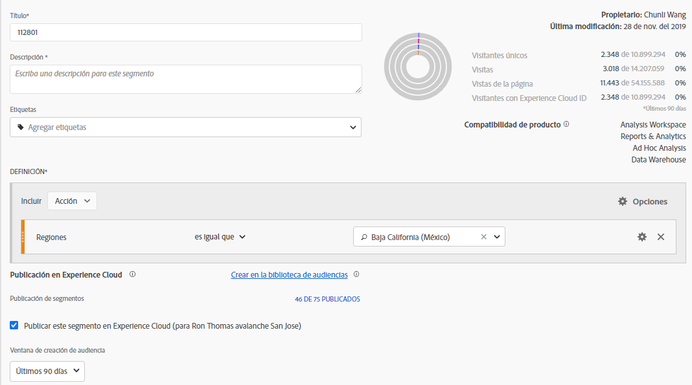

# Publicar segmentos en Experience Cloud

>[!IMPORTANT]
>
>Las mejoras de latencia relacionadas con la publicación de segmentos y la interfaz de usuario que se describen en esta página no se implementan aún a todos los clientes. The current production environment is described [here](https://docs.adobe.com/content/help/en/core-services/interface/audiences/t-publish-audience-segment.html).

Publishing a segment to the Experience Cloud lets you use the segment for marketing activity in the [!UICONTROL Audience Library], [!DNL Target], [!DNL Audience Manager], and [!DNL Advertising Cloud]. Las actualizaciones recientes han optimizado considerablemente el flujo de trabajo de publicación. Anteriormente, la publicación de un segmento utilizable tardaba unas 48 horas.

Ahora, el procesamiento puede tardar hasta 8 horas, pero en función de otros tráfico y del tamaño del segmento, el procesamiento puede ser incluso más rápido. (Sin embargo, actualmente no existe una manera de informarle cuando el segmento está disponible, por lo que tendrá que comprobarlo manualmente). También aumentó el número máximo de segmentos publicables a 75 (desde 20). Puede ver los segmentos publicados en Componentes &gt; Segmentos.

## Requisitos previos

* Ensure that the report suite that you are saving this segment to is [enabled for the Experience Cloud](https://docs.adobe.com/content/help/en/core-services/interface/audiences/t-publish-audience-segment.html). De lo contrario, no se puede publicar en Experience Cloud.
* Make sure you are working in a report suite that is [mapped to your Experience Cloud organization](https://docs.adobe.com/content/help/en/core-services/interface/about-core-services/report-suite-mapping.html).
* Before you can publish segments, your Admin needs to assign the [!UICONTROL Segment Publishing] permission to a product profile in the [Admin Console](https://docs.adobe.com/content/help/en/core-services/interface/manage-users-and-products/admin-getting-started.html), and add you to the product profile.

## Consideraciones

* **Límites del grupo de informes**: Puede publicar hasta 75 segmentos por grupo de informes. Este límite se aplica. Si ya tiene 75 segmentos publicados, no podrá publicar segmentos adicionales hasta que no publique suficientes segmentos para superar el umbral de 75 segmentos.
* **Límites de inscripción**: Las audiencias compartidas en [!DNL Experience Cloud] Analytics no pueden superar los 20 millones de miembros únicos.
* **Privacidad de datos**: Las audiencias no se filtran según el estado de autenticación de un visitante. Si un visitante puede navegar por su sitio en los estados de autenticado y no autenticado, las acciones que se dan cuando un visitante no está autenticado todavía pueden hacer que un visitante se incluya en una audiencia. Review [Adobe Experience Cloud privacy](https://www.adobe.com/privacy/experience-cloud.html) to understand the full privacy implications of audience sharing.
* For a discussion about the differences between segments in [!DNL Adobe Analytics] and [!DNL Audience Manager], go [here](https://docs.adobe.com/content/help/en/analytics/integration/audience-analytics/audience-analytics-workflow/aam-analytics-segments.html).

## Cronograma de publicación de segmentos

| Qué hay disponible | Cuando esté disponible | Donde esté disponible |
|---|---|---|
| Metadatos (título y definición de segmento) | Inmediatamente después de la publicación | [!DNL Audience Manager], [!UICONTROL Biblioteca de audiencias de Experience Cloud], [!DNL Target] |
| Segmento utilizable con membresía | ~ 8 horas después de la publicación | Visitor Profile Viewer in [!DNL Audience Manager] |
| Población de características y abono | En 24 horas | [!DNL Audience Manager] |

## Publish segments in [!UICONTROL Segment Builder]

1. Navigate to [!UICONTROL Analytics &gt; Workspace &gt; Components &gt; Segments] &gt; +
1. Create a segment in the [!UICONTROL Segment Builder].
1. Proporcione un título y una descripción para el segmento; no podrá guardarlo en caso contrario.
1. Check [!UICONTROL Publish this segment to the Experience Cloud (for *report suite*)].

| Elemento | Descripción |
|---|---|
| Publicar este segmento en Experience Cloud (para `<report suite>`) | Cuando esta opción está habilitada, el título y la definición del segmento (es decir, la audiencia de shell, según se utiliza con frecuencia en plataformas de publicidad) se comparten con Experience Cloud de forma instantánea, mientras que la pertenencia a segmentos se evalúa y se comparte cada 4 horas.   Cuando dicha audiencia está asociada con una actividad, [!DNL Target]por ejemplo [!DNL Analytics] , comienza a enviar ID para los visitantes que califican para Experience Cloud y [!DNL Target] para la audiencia. En este punto, el nombre de audiencia y los datos correspondientes empiezan a mostrarse en la página de Audiencias de Experience Cloud.   |
| Ventana de creación de audiencia | El intervalo de tiempo seleccionado se utiliza para crear la audiencia en un calendario móvil. Por ejemplo, «Últimos 30 días» (predeterminado) incluye visitantes que han calificado para la audiencia durante los últimos 30 días desde la fecha de hoy (NO desde la fecha original cuando se creó el segmento). |
| Crear en la biblioteca de audiencias | Los segmentos que crea y publique pueden estar disponibles sin latencia en la biblioteca de audiencias de Experience Cloud. No dependen de las actualizaciones de Analytics. Estos segmentos no se cuentan para el límite de 75 segmentos publicados. |
| x de 75 Publicado | Muestra el número de segmentos publicados en Experience Cloud. Haga clic en el vínculo para ver una lista de segmentos publicados y su grupo de informes y propietario asociados. |
| Guardar | Guarda este segmento. |

## Cancelar o eliminar segmentos

Para eliminar un segmento publicado en Experience Cloud, tiene que cancelarlo primero. To unpublish a segment, just **unclick** the checkbox that you used to publish it.

>[!NOTE]
>
>**No puede** cancelar la publicación de un segmento que esté actualmente en uso por ninguna de las siguientes soluciones de Adobe: [!DNL Analytics] (en [!DNL Audience Analytics]), [!DNL Campaign]( [!DNL Advertising Cloud] para [!DNL Core Service] &amp; [!DNL Audience Manager] clientes) y todos los demás socios externos (para [!DNL Audience Manager] clientes). **** Puede cancelar la publicación de un segmento en uso [!DNL Target].

## View segment publishing status in the [!UICONTROL Segment Manager]

1. Navigate to [!UICONTROL Analytics &gt; Components &gt; Segments].
1. Notice the new [!UICONTROL Published] column. Sí/No se refiere a si el segmento se ha publicado en Experience Cloud o no.

## Retrieve the [!DNL Audience Manager] UUID

Existen 2 formas de capturar el UUID de AAM asociado actualmente con el navegador:

* Adobe Experience Cloud Debugger
* Herramienta nativa para desarrolladores en navegadores (por ejemplo, Chrome Developer Tools)

Las siguientes capturas de pantalla le muestran cómo recuperar el UUID de AAM en el navegador y usarlo en el visor de perfil de visitante de Audience Manager para validar la pertenencia a características y segmentos.

**Método 1: Uso de Adobe Experieence cloud Debugger**

1. Download and install [Adobe Experience Cloud Debugger](https://docs.adobe.com/content/help/en/analytics/implementation/testing-and-validation/debugger.html) in the Chrome Web Store.
1. Inicie el depurador al cargar una página.
1. Scroll to the Audience Manager section and find the AAM UUID set on the current browser page
(`50814298273775797762943354787774730612` in the example below)

**Método 2: Uso de herramientas para desarrolladores Chrome (u otras herramientas para desarrolladores del navegador)**

1. Iniciar Chrome Developer Tools antes de cargar una página
1. Cargue la página y marque Aplicaciones &gt; Cookies. The AAM UUID should be set in the 3rd-party
Demdex cookie ([adobe.demdex.net](https://marketing.adobe.com/resources/help/en_US/aam/demdex-calls.html) in the example below). The field demdex is the AAM UUID set
on the browser (`50814298273775797762943354787774730612` in the example below).

## Use Audience Manager [!UICONTROL Visitor Profile Viewer]

The AAM UUID on the browser will be used by default when [!UICONTROL Visitor Profile Viewer] is loaded. If verifying trait realizations for other users, input a UUID in the UUID field and click [!UICONTROL Refresh]. Refer to [Visitor Profile Viewer](https://marketing.adobe.com/resources/help/en_US/aam/t_visitor_profile_viewer.html) for more information.

## View the segment traits in [!DNL Audience Manager]

En AAM, la lista de visitantes con ecids para un segmento determinado se evalúa de forma continua, ya que Analytics comparte segmentos con Experience Cloud.

1. In [!DNL Audience Manager], go to [!UICONTROL Audience Data &gt; Traits &gt; Analytics Traits]. Verá una carpeta para cada grupo de informes de Analytics que esté asignado a su organización de Experience Cloud. Estas carpetas (para características, segmentos y fuentes de datos) se crean cuando se inicia o aprovisiona el servicio principal Perfiles y Audiencias/Personas.
1. Select the folder for the report suite in which you previously created the segment you wanted to share with [!DNL Audience Manager]. Verá el segmento o la audiencia que ha creado. When you share a segment, 2 things happen in [!DNL Audience Manager]:
* Se crea un rasgo, primero sin datos. Aprox. 8 hours after the segment gets published in [!DNL Analytics], the list of ECIDs gets onboarded and shared with [!DNL Audience Manager] and other Experience Cloud solutions.

* Se crea un segmento de un solo rasgo. Utiliza la fuente de datos asociada al grupo de informes en el que ha publicado el segmento.

## View the segment in [!DNL Adobe Target]

The [!UICONTROL Publish this segment to the Experience Cloud] checkbox during the segment creation process in Adobe Analytics allows the segment to be available within the Adobe Target's custom audience library. Un segmento creado en Analytics o Audience Manager puede utilizarse para actividades en Target. Por ejemplo, puede crear actividades de campaña basadas en métricas de conversión de Analytics y segmentos de audiencias creados en Analytics.
], click [!UICONTROL Audiences].
1. En la página [!UICONTROL Audiencias], busque la audiencia procedente de [!DNL Experience Cloud]. These audiences are available for use in [!DNL Target] activities.
