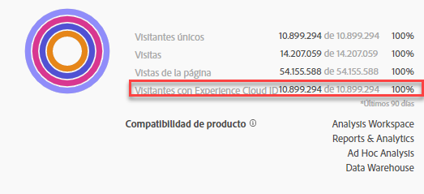

# Publicación de segmentos en Experience Cloud

Publishing a segment to the Experience Cloud lets you use the segment for marketing activity in the [!UICONTROL Audience Library], [!DNL Target], [!DNL Audience Manager], [!DNL Advertising Cloud], and [!DNL Campaign]. Las actualizaciones recientes han optimizado significativamente el flujo de trabajo de publicación. Anteriormente, la publicación de un segmento utilizable tardaba aproximadamente 48 horas.

Ahora, el procesamiento puede tardar hasta 8 horas, pero en función del tráfico y del tamaño del segmento, el procesamiento puede ser aún más rápido. (Sin embargo, actualmente no tenemos una forma de informarle cuando el segmento estará disponible, por lo que tendrá que comprobarlo manualmente). También hemos aumentado el número máximo de segmentos editables a 75 (de 20). Puede ver los segmentos publicados en Componentes > Segmentos.

> [!NOTE] Adobe Campaign (Classic y Standard) se comporta de forma diferente, ya que incurre en una latencia adicional de 24 horas además de la latencia de 8 horas.

## Requisitos previos

* Asegúrese de que el grupo de informes en el que está guardando este segmento está [habilitado para Experience Cloud](https://docs.adobe.com/content/help/en/core-services/interface/audiences/t-publish-audience-segment.html). De lo contrario, no podrá publicarlo en Experience Cloud.
* Asegúrese de que está trabajando en un grupo de informes [asignado a su organización de Experience Cloud](https://docs.adobe.com/content/help/en/core-services/interface/about-core-services/report-suite-mapping.html).
* Asegúrese de que su organización utiliza Experience Cloud ID.
* Before you can publish segments, your Admin needs to assign the [!UICONTROL Segment Publishing] permission to a product profile in the [Admin Console](https://docs.adobe.com/content/help/en/core-services/interface/manage-users-and-products/admin-getting-started.html), and add you to the product profile.

## Consideraciones

* **Límites del grupo de informes**: Puede publicar hasta 75 segmentos por grupo de informes. Este límite se aplica. Si ya ha publicado 75 segmentos, no podrá publicar ningún segmento adicional hasta que cancele la publicación de suficientes segmentos para bajar del umbral de 75 segmentos.
* **Límites de miembros**: Las audiencias compartidas en [!DNL Experience Cloud] desde Analytics no pueden superar los 20 millones de miembros únicos.
* Las audiencias de **Privacidad de los datos** no se filtran según el estado de autenticación de un visitante. Si un visitante puede navegar por su sitio en los estados de autenticado y no autenticado, las acciones que se dan cuando un visitante no está autenticado todavía pueden hacer que un visitante se incluya en una audiencia. Revise la [privacidad de Adobe Experience Cloud](https://www.adobe.com/privacy/experience-cloud.html) para comprender las implicaciones de privacidad completas del uso compartido de audiencias.
* Para ver una discusión sobre las **diferencias entre segmentos en[!DNL Adobe Analytics]y[!DNL Audience Manager]**, vaya[aquí](https://docs.adobe.com/content/help/en/analytics/integration/audience-analytics/audience-analytics-workflow/aam-analytics-segments.html).

## Cronología de publicación de segmentos

| Qué está disponible | Cuándo esté disponible | Dónde está disponible |
|---|---|---|
| Metadatos (título y definición del segmento) | Inmediatamente después de la publicación | [!DNL Audience Manager], [!UICONTROL Experience Cloud Audience Library], [!DNL Target] |
| Segmento utilizable al ser miembro | ~ 8 horas después de la publicación | Visor de perfiles de visitante en [!DNL Audience Manager] |
| Población de miembros y características | En un plazo de 24-48 horas | [!DNL Audience Manager] |

## Publicar segmentos en [!UICONTROL Segment Builder]

1. Vaya a **[!UICONTROL Analytics > Workspace > Components > Segments]> +**
1. Cree un segmento en el [!UICONTROL Segment Builder].
1. Proporcione un título y una descripción para el segmento; de lo contrario, no podrá guardarlo.
1. Marque el grupo **[!UICONTROL Publish this segment to the Experience Cloud (for *de informes *)]**.

>[!IMPORTANT]
>
>Asegúrese de utilizar “Visitantes con Experience Cloud ID” al consultar las vistas previas de segmentos en Analytics en lugar de la vista previa de segmentos de “visitantes únicos” totales al comparar los números de Adobe Analytics con los de Audience Manager:
>
>

| Elemento | Descripción |
|---|---|
| **[!UICONTROL Publish this segment to the Experience Cloud (for *<report suite>*)]** | Cuando esta opción está habilitada, el título y la definición del segmento (es decir, la audiencia del shell que se usa con frecuencia en las plataformas de publicidad) se comparten con Experience Cloud de forma instantánea, mientras que la pertenencia al segmento se evalúa y comparte cada 4 horas.   Cuando dicha audiencia está asociada a una actividad en [!DNL Target], por ejemplo, [!DNL Analytics] comienza a enviar ID para los visitantes que son aptos para esta audiencia de Experience Cloud y [!DNL Target]. En este punto, el nombre de audiencia y los datos correspondientes empiezan a mostrarse en la página de Audiencias de Experience Cloud.   |
| **[!UICONTROL Audience Creation Window]** | El lapso de tiempo seleccionado se utiliza para crear la audiencia en un calendario móvil. Por ejemplo, “Últimos 30 días” (predeterminado) incluye los visitantes que han cumplido los requisitos para la audiencia durante los últimos 30 días respecto a la fecha actual (NO desde la fecha original en que se creó el segmento). |
| **[!UICONTROL Create in Audience Library]** | Los segmentos que cree y publique pueden estar disponibles sin latencia en la biblioteca de audiencias de Experience Cloud. No dependen de las actualizaciones de Analytics. Estos segmentos no cuentan con el límite de 75 segmentos publicados. |
| **[!UICONTROL x of 75 Published]** | Muestra el número de segmentos que ha publicado en Experience Cloud. Haga clic en el vínculo para ver una lista de los segmentos publicados y su grupo de informes y propietario asociados. |
| **[!UICONTROL Save]** | Guarda este segmento. |

## Cancelar la publicación o eliminar segmentos

Para eliminar un segmento publicado en Experience Cloud, tiene que cancelar la publicación primero. Para cancelar la publicación de un segmento, simplemente **demarque** la casilla que utilizó para publicarla.

> [!NOTE]No **puede** cancelar la publicación de un segmento que esté actualmente en uso por ninguna de las siguientes soluciones de Adobe: [!DNL Analytics] (en [!DNL Audience Analytics]), [!DNL Campaign], [!DNL Advertising Cloud] (para clientes de [!DNL Core Service] y [!DNL Audience Manager]) y todos los demás socios externos (para clientes de [!DNL Audience Manager]). **Puede** cancelar la publicación de un segmento en uso por [!DNL Target].

## View segment publishing status in the [!UICONTROL Segment Manager]

1. Vaya a [!UICONTROL Analytics > Components > Segments].
1. Notice the new [!UICONTROL Published] column. Sí/No hace referencia a si el segmento se ha publicado en Experience Cloud o no.

## Conseguir el UUID de [!DNL Audience Manager]

Existen dos formas de registrar el UUID de AAM asociado actualmente al explorador:

* Adobe Experience Cloud Debugger
* Herramienta nativa para desarrolladores en navegadores (por ejemplo, Chrome DevTools)

Las siguientes capturas de pantalla muestran cómo conseguir el UUID de AAM en el navegador y utilizarlo en el visor de perfiles de visitantes de Audience Manager para validar la pertenencia de los rasgos y segmentos.

**Método 1: Uso de Adobe Experience Cloud Debugger**

1. Descargue e instale [Adobe Experience Cloud Debugger](https://docs.adobe.com/content/help/en/analytics/implementation/testing-and-validation/debugger.html) en Chrome Web Store.
1. Inicie Debugger al cargar una página.
1. Desplácese hasta la sección Audience Manager y busque el UUID de AAM definido en la página del navegador actual (`50814298273775797762943354787774730612` en el ejemplo siguiente)

**Método 2: Uso de las herramientas para desarrolladores de Chrome (u otras herramientas para desarrolladores de navegador)**

1. Iniciar Herramientas para desarrolladores Chrome antes de cargar una página
1. Cargue la página y seleccione Aplicaciones > Cookies. El UUID de AAM debe configurarse en la cookie de terceros Demdex ([adobe.demdex.net](https://marketing.adobe.com/resources/help/en_US/aam/demdex-calls.html) en el ejemplo siguiente). El parámetro de campo es la configuración UUID de AAM en el navegador (`50814298273775797762943354787774730612` en el ejemplo siguiente).

## Usar Audience Manager [!UICONTROL Visitor Profile Viewer]

The AAM UUID on the browser will be used by default when [!UICONTROL Visitor Profile Viewer] is loaded. If verifying trait realizations for other users, input a UUID in the UUID field and click [!UICONTROL Refresh]. Consulte [Visor de perfiles de visitantes](https://marketing.adobe.com/resources/help/en_US/aam/t_visitor_profile_viewer.html) para obtener más información.

## Vea las características del segmento en [!DNL Audience Manager]

En AAM, la lista de visitantes con ECID para un segmento determinado se evalúa de forma de flujo continuo, ya que Analytics comparte segmentos con Experience Cloud.

1. En [!DNL Audience Manager], vaya a [!UICONTROL Audience Data > Traits > Analytics Traits]. Verá una carpeta para cada grupo de informes de Analytics asignada a su organización de Experience Cloud. Estas carpetas (para características, segmentos y fuentes de datos) se crean cuando se inicia o aprovisiona el servicio principal Perfiles y Audiencias/Personas.
1. Seleccione la carpeta para el grupo de informes en el que creó el segmento quería compartir con [!DNL Audience Manager]. Verá el segmento o la audiencia que creó. Cuando comparte un segmento, ocurren dos cosas en [!DNL Audience Manager]:
* Se crea una característica, primero sin datos en ella. Aprox. 8 horas después de que se publique el segmento en [!DNL Analytics], la lista de ECID se incorpora y comparte con [!DNL Audience Manager] y otras soluciones de Experience Cloud.

* Se crea un segmento de una característica. Este utiliza la fuente de datos asociada al grupo de informes donde publicó el segmento.
* La caducidad de la característica ahora se establece en 16 días (anteriormente era 2 días).

## Ver el segmento en [!DNL Adobe Target]

The [!UICONTROL Publish this segment to the Experience Cloud] checkbox during the segment creation process in Adobe Analytics allows the segment to be available within the Adobe Target&#39;s custom audience library. Un segmento creado en Analytics o Audience Manager puede utilizarse para actividades en Target. Por ejemplo, puede crear actividades de campaña basadas en métricas de conversión de Analytics y segmentos de audiencias creados en Analytics.
], click [!UICONTROL Audiences].
1. On the [!UICONTROL Audiences] page, locate the audience sourced from the [!DNL Experience Cloud]. Estas audiencias están disponibles para su uso en actividades [!DNL Target].

