# Generar segmentos secuenciales

Los segmentos secuenciales se crean mediante el operador THEN, en lugar de AND u OR. THEN implica que se produce un criterio de segmento, seguido por otro. De forma predeterminada, un segmento secuencial identifica a todos los datos coincidentes y muestra el filtro “Incluir a todos”. Los segmentos secuenciales pueden filtrarse adicionalmente a un subconjunto de visitas coincidentes mediante las opciones “Solo antes de secuencia” y “Solo después de secuencia”.

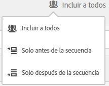

Además, puede restringir los segmentos secuenciales a una duración, granularidad y recuentos entre puntos de comprobación específicos mediante los [operadores After y Within](/help/components/c-segmentation/c-segmentation-workflow/seg-sequential-build.md).

## Incluir a todos {#section_75ADDD5D41F04800A09E592BB2940B35}

Al crear un segmento en el cual se ha definido “Incluir a todos”, el segmento identifica las rutas de acceso que coinciden con el patrón determinado como conjunto. Este es un ejemplo de segmento de secuencia básica que busca una visita individual (Página A) seguida de otra (Página B) según la visita del mismo visitante. El segmento se establece en Incluir a todos.

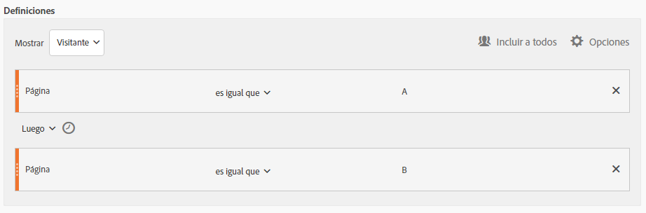

| Si el resultado... | Secuencia |
|--- |--- |
| coincide | A entonces B A entonces (en una visita diferente) B A entonces D, que entonces B |
| No coincide | B entonces A |

## Solo Antes de Secuencia y Solo Después de Secuencia  {#section_736E255C8CFF43C2A2CAAA6D312ED574}

Las opciones **[!UICONTROL Only Before Sequence]** y **[!UICONTROL Only After Sequence]** filtre el segmento a un subconjunto de datos antes o después de la secuencia especificada.

* **Solo Antes de Secuencia**: incluye todas las visitas anteriores a la secuencia + la primera visita de la propia secuencia (consulte los ejemplos 1 y 3). Si la secuencia aparece varias veces en una ruta, “Solo antes de secuencia” incluye la primera visita de la última aparición de la secuencia y todas las visitas anteriores (consulte el ejemplo 2).
* **Solo Después de Secuencia**: incluye todas las visitas posteriores a la secuencia + la última visita de la propia secuencia (consulte los ejemplos 1 y 3). Si la secuencia aparece varias veces en una ruta, “Solo después de secuencia” incluye la última visita de la primera aparición de la secuencia y todas las visitas posteriores (consulte el ejemplo 2).

Por ejemplo, consideremos una secuencia de B -> D. Los tres filtros identificarían las visitas de la siguiente manera:

**Ejemplo 1: B entonces D aparece una vez**

| Ejemplo | A | B | C | D | E | V |
|---|---|---|---|---|---|---|
| Incluir a todos | A | B | C | D | E | V |
| Solo antes de la secuencia | A | B |  |  |  |  |
| Solo después de la secuencia |  |  |  | D | E | V |

**Ejemplo 2: B entonces D aparece varias veces**

| Ejemplo | A | B | C | D | B | C | D | E |
|---|---|---|---|---|---|---|---|---|
| Incluir a todos | A | B | C | D | B | C | D | E |
| Solo antes de la secuencia | A | B | C | D | B |  |  |  |
| Solo después de la secuencia |  |  |  | D | B | C | D | E |

Vamos a enmarcar también este concepto con la dimensión Profundidad de acierto.

**Ejemplo 3: Profundidad de acierto 3 entonces 5**

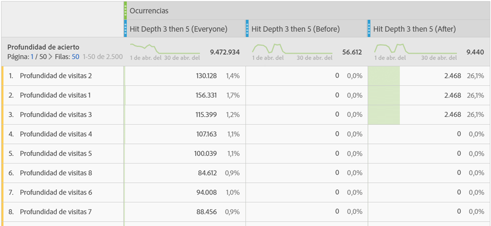

## Restricciones de dimensión {#section_EAFD755F8E674F32BCE9B642F7F909DB}

En una cláusula “En”, entre instrucciones THEN, se puede agregar, por ejemplo, “En 1 instancia de palabra clave de búsqueda”, “En 1 instancia de eVar 47”. Esto restringe el segmento a una instancia de una dimensión.

La configuración de una cláusula “En dimensión” entre reglas permite a un segmento restringir datos a secuencias en las cuales se cumpla la cláusula. Vea el ejemplo siguiente, en el cual la restricción se define en “En 1 página”:

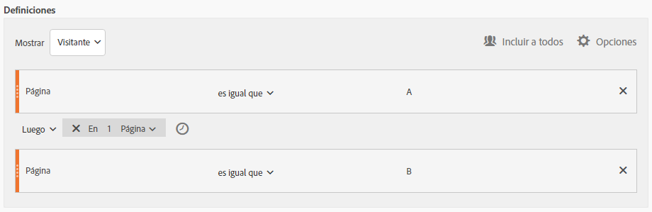

| Si el resultado... | Secuencia |
|--- |--- |
| coincide | A entonces B |
| No coincide | A then C then B (porque B no estaba dentro de 1 página de A) **Nota:** Si se elimina la restricción de dimensión, tanto “A then B” como “A then C then B” coincidirán. |

## Secuencia de vista de página simple

Identifique a los visitantes que vieron una página y luego vieron otra página. Los datos de nivel de visita individual filtrarán esta secuencia independientemente de las sesiones de visita anteriores, pasadas o intermedias o del tiempo o número de vistas de página que se produzcan entre ellas.

**Ejemplo**: Visitante que vio la página A y luego la página B en la misma visita o en otra.

**Casos de uso**

Los siguientes son ejemplos de cómo se puede utilizar el segmento.

1. Visitantes a un sitio deportivo vista la página de aterrizaje de fútbol y luego vista la página de aterrizaje de baloncesto en orden secuencial pero no necesariamente en la misma visita. Esto provoca una campaña para llevar el contenido del baloncesto a los espectadores durante la temporada de fútbol.
1. El minorista de automóviles identifica una relación entre los que aterrizan en la página de lealtad del cliente y luego van a la página de video en cualquier momento durante la visita u otra visita.

**Crear este segmento**

You nest two page rules within a top-level [!UICONTROL Visitor] container and sequence the page hits using the [!UICONTROL THEN] operator.

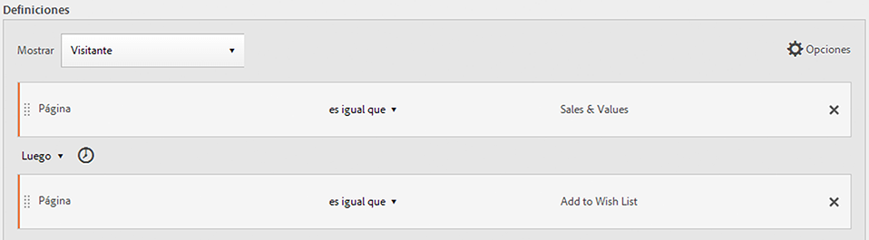

## Secuencia de visitante en varias visitas

Identifique a aquellos visitantes que no siguieron una campaña pero que luego volvieron a la secuencia de vistas de página en otra sesión.

**Ejemplo**: Visitante que vio la página A en una visita y luego vio la página B en otra visita.

**Casos de uso**

A continuación se muestran ejemplos de cómo se puede utilizar este tipo de segmento:

* Visitantes a la página Deportes de un sitio de noticias y luego vuelve a visitar la página Deportes en otra sesión.
* Un comerciante de ropa ve una relación entre visitantes que aterrizan en una página de aterrizaje en una sesión y luego van directamente a la página de cierre de compra en otra sesión.

**Crear este segmento**

This example nests two **[!UICONTROL Visit]** containers within the top-level **[!UICONTROL Visitor]** container and sequences the segment using the [!UICONTROL THEN] operator.

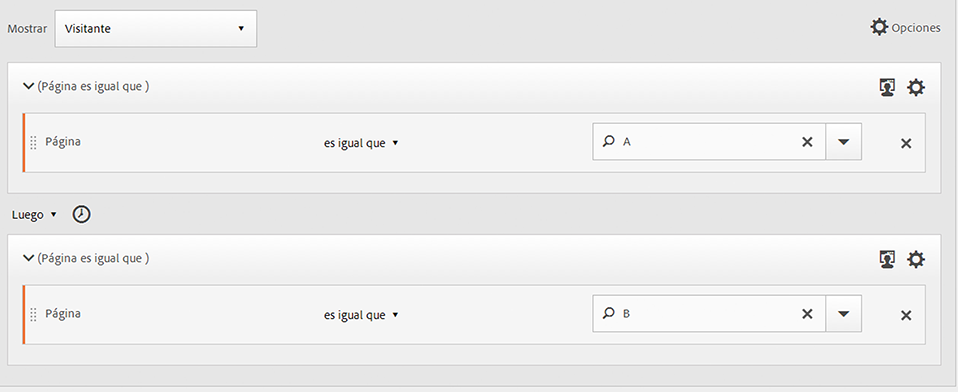

## Secuencia de nivel mixto

Identifique a los visitantes que ven dos páginas en un número indeterminado de visitas, pero luego ven una tercera página en una visita separada.

**Ejemplo**: Visitantes que ven la página A y luego la página B en una o más visitas, seguido de una visita separada a la página C.

**Casos de uso**

A continuación se muestran ejemplos de cómo se puede utilizar este tipo de segmento:

* Los Visitantes visitan primero un sitio de noticias y luego vistas la página de deportes en la misma visita. En otra visita el visitante visita la página del clima.
* El minorista define los visitantes que entran en la página principal y luego van a la página Mi cuenta. En otra visita, visitan la página Carro de Vistas.

**Crear este segmento**

1. Coloque dos dimensiones de página desde los paneles de la izquierda dentro de un [!UICONTROL Visitor] contenedor de nivel superior.
1. Agregue entre ellos el operador THEN.
1. Haga clic en **[!UICONTROL Options]** > **[!UICONTROL Add container]** y agregue un [!UICONTROL Visit] contenedor debajo del [!UICONTROL Visitor] nivel y secuenciado mediante el [!UICONTROL THEN] operador.

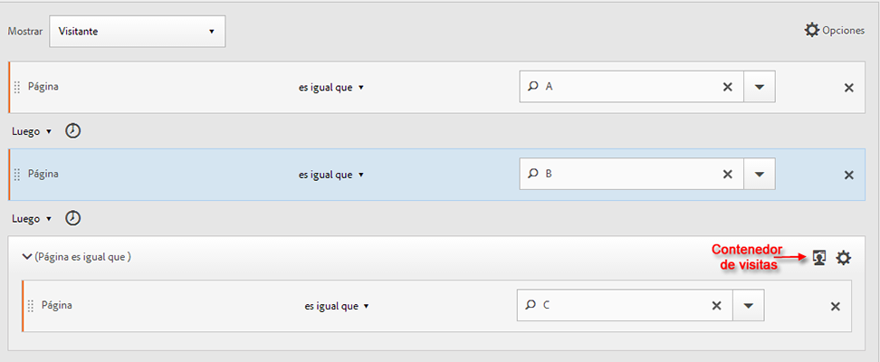

## Contenedores agregados

Añadir varios [!UICONTROL Hit] contenedores dentro de un [!UICONTROL Visitor] contenedor le permite emplear los operadores adecuados entre el mismo tipo de contenedores y utilizar reglas y dimensiones como Página y Número de visita para definir la vista de página y proporcionar una dimensión de secuencia dentro del [!UICONTROL Hit] contenedor. La aplicación de lógica en el nivel de visita individual le permite restringir y combinar coincidencias en un mismo nivel de visitas individuales dentro del [!UICONTROL Visitor] contenedor para generar una variedad de tipos de segmentos.

**Ejemplo**: Los Visitantes visitaron la página A después de la primera visita individual en la secuencia de vistas de página (página D en el ejemplo) y luego visitaron la página B o C independientemente del número de visitas.

**Casos de uso**

A continuación se muestran ejemplos de cómo se puede utilizar este tipo de segmento:

* Identifique a los visitantes que van a la página de aterrizaje principal en una visita, luego vista la página de ropa de hombre en otra visita y luego vista la página de aterrizaje de mujeres o niños en una visita diferente.
* Una revista electrónica captura los visitantes que van a la Página de inicio en una visita, la página Deportes en otra visita y la página Opinión en otra visita.

**Crear este segmento**

1. Seleccione el [!UICONTROL Visitor] contenedor como contenedor de nivel superior.
1. Add two [!UICONTROL Hit]-level containers—a dimension with an appropriate numerical dimension joined at the same [!UICONTROL Hit] level by the [!UICONTROL AND] and [!UICONTROL OR] operator.
1. Within the [!UICONTROL Visit] container, add another [!UICONTROL Hit] container and nest two additional [!UICONTROL Hit] containers joined with an [!UICONTROL OR] or [!UICONTROL AND] operator.

   Sequence these nested [!UICONTROL Hit] containers with the [!UICONTROL THEN] operator.

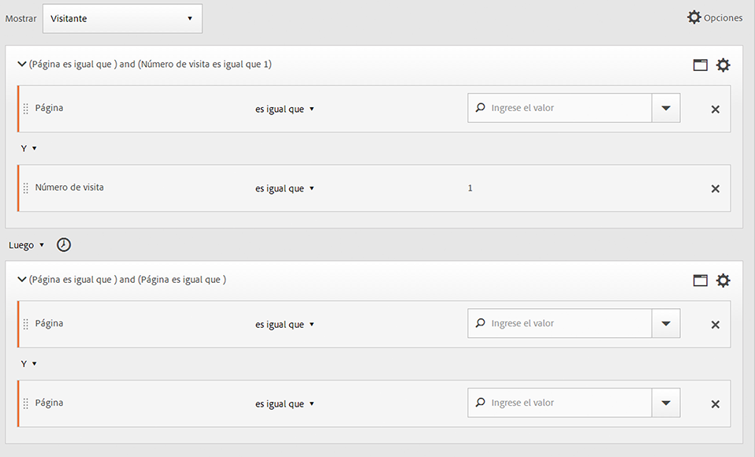

## “Anidado” en segmentos secuenciales

By placing checkpoints at both the [!UICONTROL Visit] and [!UICONTROL Hit] level, you can constrain the segment to meet requirements within a specific visit as well as a specific hit.

**Ejemplo**: Visitante que visitó la página A y luego la página B en la misma visita. En una nueva visita, el visitante fue después a la página C.

**Crear este segmento**

1. Underneath a top-level [!UICONTROL Visit] container, drag in two page dimensions.
1. Seleccione varias reglas, haga clic en **[!UICONTROL Options]** > **[!UICONTROL Add container from selection]** y cámbielas por un [!UICONTROL Visit] contenedor.
1. Únalas con un operador [!UICONTROL THEN].
1. Cree un contenedor de visita individual como punto del [!UICONTROL Visit] contenedor y arrastre una dimensión de página.
1. Join the nested sequence in the [!UICONTROL Visit] container with the [!UICONTROL Hit] container using another [!UICONTROL THEN] operator.

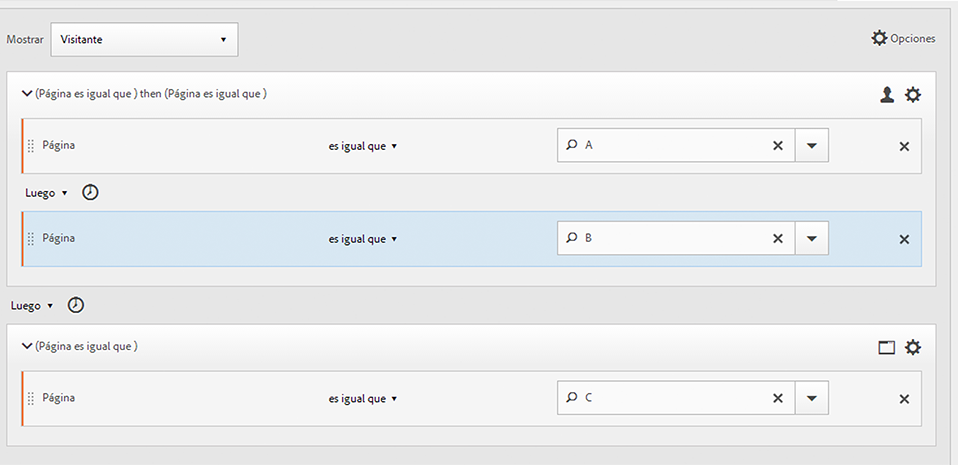

## Excluir visitas

Las reglas de segmentos incluyen todos los datos a menos que se excluyan [!UICONTROL Visitor][!UICONTROL Visit]o [!UICONTROL Hit] específicamente los datos mediante la [!UICONTROL Exclude] regla. Le permite descartar datos comunes y crear segmentos con más enfoque. O bien, le permite crear segmentos excluyendo grupos encontrados para identificar el conjunto de datos restante, como crear una regla que incluya a visitantes exitosos que realizaron pedidos y luego excluirlos para identificar a &quot;no compradores&quot;. Sin embargo, en la mayoría de los casos es mejor crear reglas que excluyan valores amplios en lugar de intentar usar la [!UICONTROL Exclude] regla para destinatario de valores de inclusión específicos.

Por ejemplo:

* **Excluir páginas**. Use una regla de segmento para eliminar una página específica (como la  *`Home Page`*) de un informe, cree una regla de visita individual en la que página sea igual a &quot;Página de inicio&quot; y luego exclúyala. Esta regla incluye automáticamente todos los valores excepto la Página de inicio.
* **Excluir dominios** de referencia. Utilice una regla que incluya solamente los dominios de referencia de Google.com y excluya todos los demás.
* **Identifique a los no compradores**. Identifique cuándo los pedidos son buenos que no son cero y luego excluya el [!UICONTROL Visitor].

El [!UICONTROL Exclude] operador se puede utilizar para identificar una secuencia en la que el visitante no realiza visitas o visitas individuales específicas. [!UICONTROL Exclude Checkpoints] también se puede incluir en un grupo [lógico](/help/components/c-segmentation/c-segmentation-workflow/seg-sequential-build.md).

### Exclusión entre puntos de comprobación

Aplique lógica a los visitantes de un segmento en el caso de que no se haya producido un punto de comprobación explícitamente entre otros dos puntos de comprobación.

**Ejemplo**: Visitantes que visitaron la página A y luego la página C, pero que no visitaron la página B.

**Casos de uso**

A continuación se muestran ejemplos de cómo se puede utilizar este tipo de segmento:

* Visitantes a una página de estilo de vida y luego a la sección de teatro sin ir a la página de artes.
* Un vendedor de automóviles ve una relación entre los que visitan la página de aterrizaje principal y luego van directamente a la campaña Sin intereses sin ir a la página Vehículo.

**Crear este segmento**

Create a segment as you would for a simple, mixed-level, or nested sequential segment and then set the [!UICONTROL EXCLUDE] operator for the container element. The example below is an aggregate segment where the three [!UICONTROL Hit] containers are dragged to the canvas, the [!UICONTROL THEN] operator assigned to join the container logic, then exclude the middle page view container to include only visitors that went from page A to Page C in the sequence.

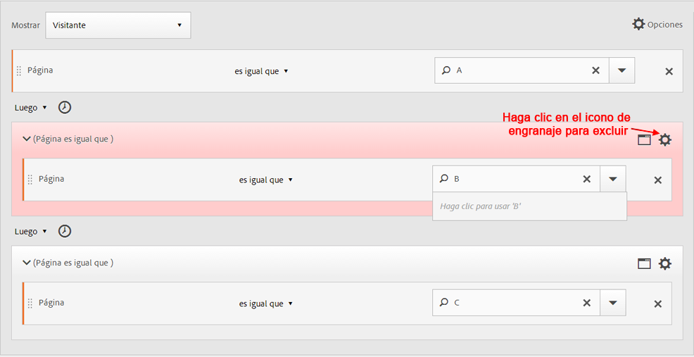

### Exclusión al inicio de la secuencia

Si el punto de comprobación de exclusión se encuentra al inicio de un segmento secuencial, se garantiza que no se ha producido una vista de página excluida antes de la primera visita individual no excluida.

**Ejemplo**: El visitante visitó la página A y no la página B.

**Casos de uso**

A continuación encontrará una serie de ejemplos prácticos de cómo se puede utilizar este tipo de segmento:

* Visitantes que visitaron la página A y no visitaron la página B.
* Un restaurante quiere ver usuarios inveterados que evitan la página de aterrizaje principal y van directamente a la página de pedidos.

**Crear este segmento**

Cree dos contenedores de visita individual independientes dentro de un contenedor de Visitante de nivel superior. A continuación, establezca el [!UICONTROL EXCLUDE] operador para el primer contenedor.

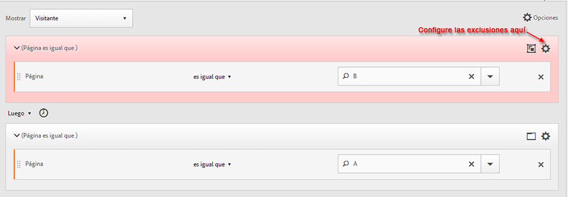

### Exclusión al final de la secuencia

Si el punto de comprobación de exclusión está al final de la secuencia, se garantiza que el punto de comprobación no se produjo entre el último punto de comprobación no excluido y el final de la secuencia del visitante.

**Ejemplos**: Los visitantes que visitaron la página A y luego no visitaron la B en la visita actual o en visitas posteriores.

**Casos de uso**

A continuación se muestran ejemplos de cómo se puede utilizar este tipo de segmento:

* Visitantes que visitaron la página A y no visitaron la página B.
* Un restaurante quiere ver usuarios inveterados que evitan la página de aterrizaje principal y van directamente a la página de pedidos.

**Crear este segmento**

Build a simple sequence segment by dragging two [!UICONTROL Hit] containers to the canvas and connecting them using the [!UICONTROL THEN] operator. Then assign the [!UICONTROL EXCLUDE] operator to the second [!UICONTROL Hit] container in the sequence.

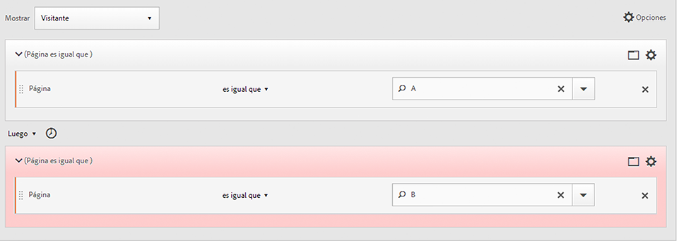

## Contenedores de grupo lógico

Los contenedores de grupo lógico son necesarios para agrupar condiciones en un único punto de comprobación secuencial de segmento. El contenedor de grupo lógico especial solo está disponible en la segmentación secuencial, para garantizar que sus condiciones se cumplen después de cualquier punto de comprobación secuencial anterior y antes de cualquier punto de comprobación secuencial siguiente. Las condiciones dentro del propio punto de comprobación del grupo lógico pueden cumplirse en cualquier orden. Por otro lado, los contenedores no secuenciales (visita individual, visita, visitante) no requieren que se cumplan sus condiciones dentro de la secuencia global, lo que produce resultados poco intuitivos si se utilizan con un operador THEN.
The [!UICONTROL Logic Group] container was designed to treat *several checkpoints as a group*, *without any ordering* among the grouped checkpoints. En otras palabras, no nos importa el orden de los puntos de comprobación dentro de ese grupo. For example, you can&#39;t nest a [!UICONTROL Visitor] container within a [!UICONTROL Visitor] container. But instead, you can nest a [!UICONTROL Logic Group] container within a [!UICONTROL Visitor] container with specific [!UICONTROL Visit]-level and [!UICONTROL Hit]-level checkpoints.

>[!NOTE] Un segmento [!UICONTROL Logic Group] solo se puede definir en un segmento secuencial, lo que significa que el [!UICONTROL THEN] operador se utiliza dentro de la expresión.

| Jerarquía de contenedores | Ilustración | Definición |
|---|---|---|
| Jerarquía de contenedor estándar |  | Dentro del [!UICONTROL Visitor] contenedor, los contenedores [!UICONTROL Visit] y [!UICONTROL Hit] se anidan en secuencia para extraer segmentos en función de las visitas individuales, el número de visitas y el visitante. |
| Jerarquía de contenedor lógico |  | La jerarquía de contenedores estándar también se requiere fuera del [!UICONTROL Logic Group] contenedor. Pero dentro del [!UICONTROL Logic Group] contenedor, los puntos de comprobación no requieren un orden o jerarquía establecidos, simplemente necesitan ser cumplidos por el visitante en cualquier orden. |

Los grupos lógicos pueden resultar intimidantes. Aquí tiene algunas recomendaciones sobre cómo utilizarlos:

**¿Grupo lógico o contenedor de visita/visita individual?**
Si desea agrupar puntos de comprobación secuenciales, su “contenedor” es un grupo lógico. Sin embargo, si estos puntos de comprobación secuenciales deben producirse en el ámbito de una sola visita o visita individual, se requiere un contenedor de visita individual o de visita. (Por supuesto, &#39;visita individual&#39; no tiene sentido para un grupo de puntos de comprobación secuenciales, cuando una visita no puede acreditar más de un punto de comprobación).

**¿Simplifican los grupos lógicos la creación de segmentos secuenciales?**
Sí. Supongamos que está intentando responder a esta pregunta: **¿El visitante vio la página B, la página C o la página D después de la página A?**

Puede generar este segmento sin un contenedor de grupo lógico, pero es complejo y laborioso:
* `Visitor Container [Page A THEN Page B THEN Page C THEN Page D] or`
* `Visitor Container [Page A THEN Page B THEN Page D THEN Page C] or`
* `Visitor Container [Page A THEN Page C THEN Page B THEN Page D] or`
* `Visitor Container [Page A THEN Page C THEN Page D THEN Page B] or`
* `Visitor Container [Page A THEN Page D THEN Page B THEN Page C] or`
* `Visitor Container [Page A THEN Page D THEN Page C THEN Page B]`

Un contenedor de grupo lógico simplifica considerablemente la creación de este segmento, como se muestra aquí:

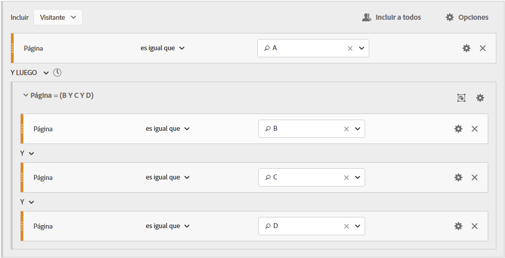

### Generar un segmento de grupo lógico {#section_A5DDC96E72194668AA91BBD89E575D2E}

Al igual que otros contenedores, [!UICONTROL Logic Group] los contenedores se pueden crear de varias formas dentro de la [!UICONTROL Segment Builder]. Esta es una forma preferida de anidar [!UICONTROL Logic Group] contenedores:

1. Arrastre dimensiones, eventos o segmentos desde los paneles de la izquierda.
1. Cambie el contenedor superior a un [!UICONTROL Visitor] contenedor.
1. Cambie el operador [!UICONTROL AND] u [!UICONTROL OR] insertado de forma predeterminada al operador THEN.
1. Seleccione los [!UICONTROL Hit] contenedores (dimensión, Evento o elemento) y haga clic en **[!UICONTROL Options]** > **[!UICONTROL Add container from selection]**.
1. Click the container icon and select **[!UICONTROL Logic Group]**.  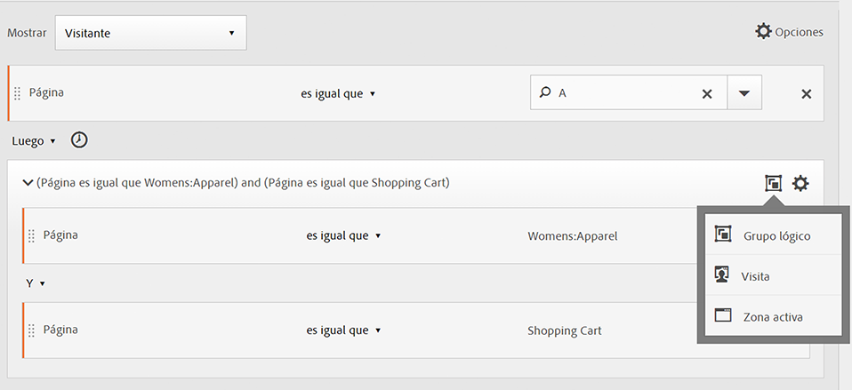
1. You can now set the [!UICONTROL Hit] within the [!UICONTROL Logic Group] container without regard to hierarchy.

### Puntos de comprobación de grupo lógico en cualquier orden

Using the [!UICONTROL Logic Group] lets you meet conditions within that group that reside outside of the sequence. This allows you to build segments where a [!UICONTROL Visit] or [!UICONTROL Hit] container happens irrespective of the normal hierarchy.

**Ejemplo**: Los visitantes que visitaron la página A y luego visitaron la página B y C en cualquier orden.

**Crear este segmento**

Page B and C are nested in a [!UICONTROL Logic Group] container within the outer [!UICONTROL Visitor] container. The [!UICONTROL Hit] container for A is then followed by the [!UICONTROL Logic Group] container with B and C identified using the [!UICONTROL AND] operator. Because it is in the [!UICONTROL Logic Group], the sequence is not defined and hitting both page B and C in any order makes the argument true.

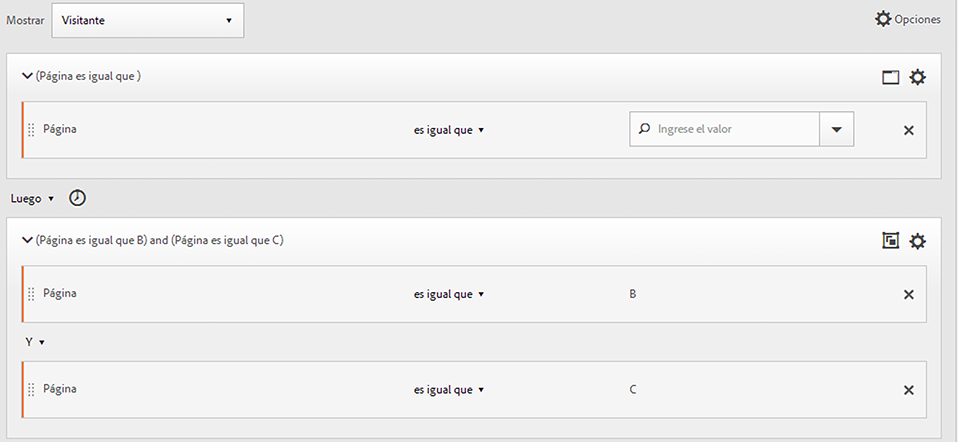

**Otro ejemplo**: Los visitantes que visitaron la página B o la página C y luego visitaron la página A.

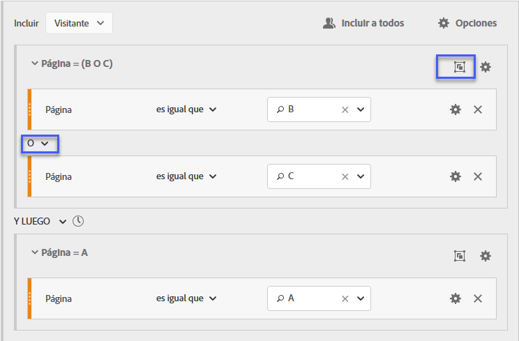

El segmento debe coincidir al menos con uno de los puntos de comprobación del grupo lógico (B o C). Además, las condiciones de grupo lógico pueden cumplirse en la misma visita o en varias visitas individuales. &#x200B;

### Primera coincidencia del grupo lógico

Using the [!UICONTROL Logic Group] lets you meet conditions within that group that reside outside of the sequence. En este segmento de primera coincidencia sin orden, las [!UICONTROL Logic Group] reglas se identifican primero como una vista de página de la página B o C, luego como la vista requerida de la página A.

**Ejemplo**: Los visitantes que visitaron la página B o la página C y luego visitaron la página A.

**Crear este segmento**

Page B and page C dimensions are grouped within a [!UICONTROL Logic Group] container with the [!UICONTROL OR] operator selected, then the [!UICONTROL Hit]container identifying a page view of page A as the value.

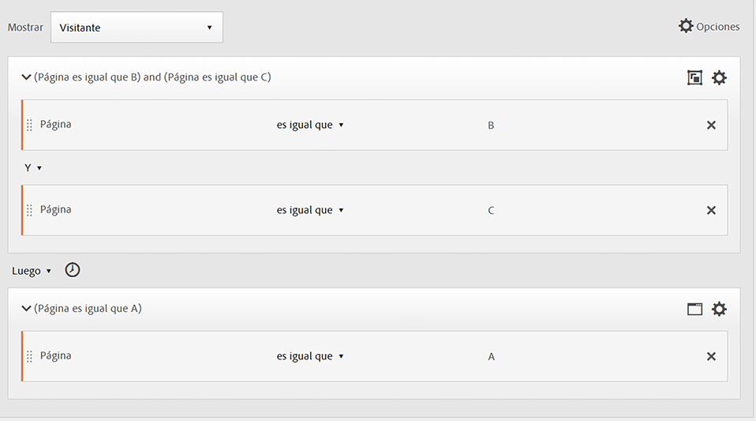

### Grupo lógico excluir AND

Build segments using the [!UICONTROL Logic Group] where multiple page views are aggregated to define what pages were necessary to be hit while other pages were specifically missed. ****

**Ejemplo**: El visitante que visitó la página A y luego no visitó expresamente la página B ni C, pero sí la página D.

**Crear este segmento**

Genere este segmento arrastrando dimensiones, eventos y segmentos pregenerados desde los paneles de la izquierda. Consulte [Generación de un segmento de grupo lógico](/help/components/c-segmentation/c-segmentation-workflow/seg-sequential-build.md).

Después de anidar los valores dentro del [!UICONTROL Logic Group], haga clic en el **[!UICONTROL Exclude]** botón dentro del [!UICONTROL Logic Group] contenedor.

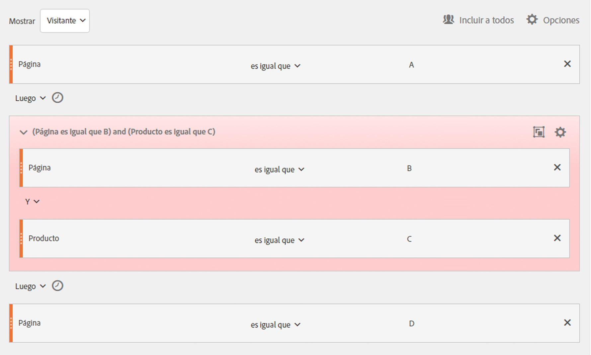

### Grupo lógico excluir OR

Build segments using the [!UICONTROL Logic Group] where multiple page views are aggregated to define what pages were necessary to be hit while other pages were specifically missed.

**Ejemplo**: Los visitantes que visitaron la página A pero que no visitaron ni la página B ni C antes de la página A.

**Crear este segmento**

The initial B and C pages are identified in a [!UICONTROL Logic Group] container that is excluded, and then followed by a hit to page A by the visitor.

Genere este segmento arrastrando dimensiones, eventos y segmentos pregenerados desde los paneles de la izquierda.

Después de anidar los valores dentro del [!UICONTROL Logic Group], haga clic en el **[!UICONTROL Exclude]** botón dentro del [!UICONTROL Logic Group] contenedor.

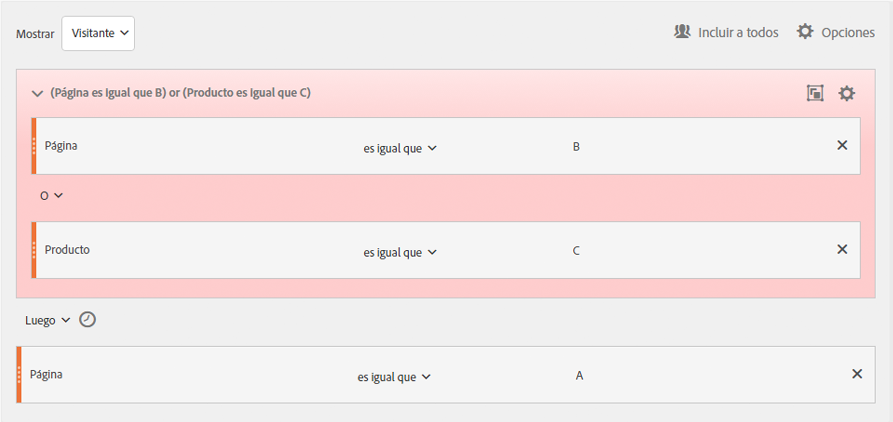

## Generar segmentos temporales En y Después

Use los operadores [!UICONTROL Within] y [!UICONTROL After] incorporados en el encabezado de cada contenedor para definir el tiempo, los eventos y recuentos.

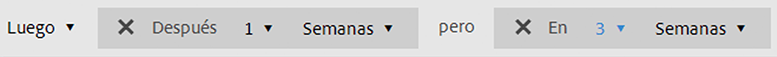

Puede limitar la coincidencia a una duración de tiempo especificada mediante los contenedores [!UICONTROL Within] y [!UICONTROL After] y especificando una granularidad y un recuento. El operador [!UICONTROL Within] se usa para especificar un límite máximo de tiempo entre dos puntos de comprobación. El operador [!UICONTROL After] se usa para especificar un límite mínimo de tiempo entre dos puntos de comprobación.

### Operadores After y Within  {#section_CCAF5E44719447CFA7DF8DA4192DA6F8}

La duración está especificada por una sola letra en mayúsculas que representa la granularidad seguida de un número que representa el recuento de repetición de la granularidad.

**[!UICONTROL Within]** incluye el punto final (menor o igual que).

**[!UICONTROL After]** no incluye el punto final (mayor que).

| Operadores | Descripción |
|--- |--- |
| AFTER | El operador After se usa para especificar un límite mínimo de tiempo entre dos puntos de comprobación. Al establecer los valores de After, el límite de tiempo empezará cuando se aplique el segmento. Por ejemplo, si el operador After se configura en un contenedor para identificar a los visitantes que visitan la página A pero no regresan a la página B hasta después de un día, ese día empezará cuando el visitante abandone la página A. Para que el visitante se incluya en el segmento, debe transcurrir un mínimo de 1440 minutos (un día) desde que salió de la página A hasta que visitó la página B. |
| WITHIN | El operador Within se usa para especificar un límite máximo de tiempo entre dos puntos de comprobación. Por ejemplo, si el operador Within se configura en un contenedor para identificar a los visitantes que visitan la página A y luego regresan para visitar la página B en un día, ese día comenzará cuando el visitante abandone la página A. Para incluirse en el segmento, el visitante tendrá un tiempo máximo de un día antes de abrir la página B. Para que el visitante se incluya en el segmento, la visita a la página B debe realizarse en un máximo de 1440 minutos (un día) desde que salió de la página A hasta que visitó la página B. |
| AFTER/WITHIN | Al usar los operadores After y Within, es importante entender que ambos operadores empezarán y finalizarán en paralelo, no en secuencia.   Por ejemplo, si genera un segmento con el contenedor establecido en:  `After = 1 Week(s) and Within = 2 Week(s)` , las condiciones para identificar a los visitantes en el segmento solo se satisfacen entre 1 y 2 semanas. Ambas condiciones se aplican desde el momento de la primera visita individual a la página. |

### Usar el operador After

* Tiempo después le permite rastrear por año, mes, día, hora y minuto para hacer coincidir visitas.
* Tiempo después solo se puede aplicar a un [!UICONTROL Hit] contenedor porque es el único nivel para el que se define una granularidad tan fina.

**Ejemplo**: Los visitantes que visitaron la página A y luego visitaron la página B solo después de 2 semanas.****

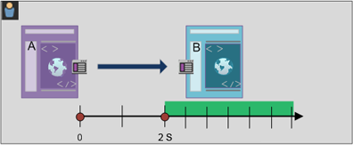

**Crear el segmento**: Este segmento se crea agregando un [!UICONTROL Visitor] contenedor con dos [!UICONTROL Hit] contenedores. Luego puede establecer el operador [!UICONTROL THEN] y abrir la lista desplegable del operador [!UICONTROL AFTER] y establecer el número de semanas.

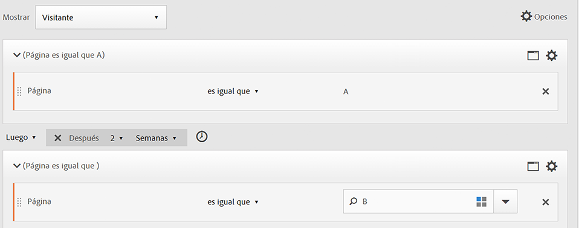

**Coincidencias**

En el caso de &quot;Después de 2 semanas&quot;, si una visita individual a una página A se produce el 1 de junio de 2019 a las 00:01 horas, entonces la siguiente visita individual a la página B coincidirá siempre y cuando se produzca antes del 15 de junio de 2019 a las 00:01 horas (14 días después).

| Visita individual A | Visita individual B | Coincidencia |
|--- |--- |--- |
| Visita individual **A**: 1 de junio de 2019, 00:01 | Visita individual **B**: 15 de junio de 2019, 00:01 | **Coincide**: Esta restricción temporal coincide porque es después del 1 de junio de 2019 (dos semanas). |
| Visita individual **A**: 1 de junio de 2019, 00:01 | Visita individual **B**: Visita individual B del 8 de junio de 2019 a las 00:01 Visita individual B del 15 de junio de 2019 a las 00:01 | **No coincide**: La primera visita individual a la página B no coincide porque está en conflicto con la restricción que requiere que sea después de dos semanas. |

### Usar el operador Within

* [!UICONTROL Within] permite rastrear por año, mes, día, hora y minuto para hacer coincidir visitas.
* [!UICONTROL Within] solo se puede aplicar a un [!UICONTROL Hit] contenedor porque es el único nivel para el que se define una granularidad tan fina.

>[!IMPORTANT]
>
>En una cláusula “En”, entre instrucciones THEN, se puede agregar, por ejemplo, “En 1 instancia de palabra clave de búsqueda”, “En 1 instancia de eVar 47”. Esto restringe el segmento a una instancia de una dimensión.

**Ejemplo**: Los visitantes que visitaron la página A y luego la página B en un plazo de 5 minutos.

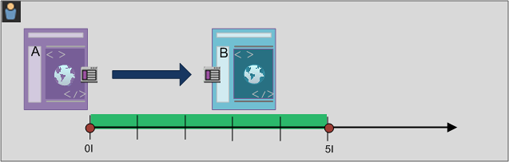

**Cree el segmento**: Este segmento se crea agregando un [!UICONTROL Visitor] contenedor y luego arrastrando dos [!UICONTROL Hit] contenedores. A continuación, puede establecer el operador [!UICONTROL THEN] y abrir la lista desplegable del operador [!UICONTROL AFTER] para establecer el intervalo: visitas individuales, vistas de página, visitas, minutos, horas, días, semanas, meses, trimestres o años.

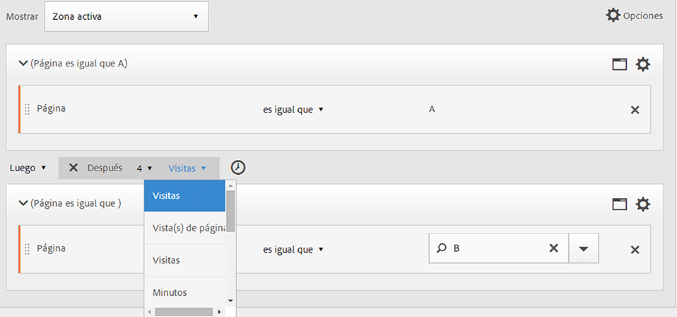

**Coincidencias**

Las coincidencias deben producirse dentro del límite temporal. Para la expresión, si una visita individual a la página A se produce a las 00:01 horas, una visita posterior a la página B producirá una coincidencia siempre que se produzca a las 00:06 o antes (cinco minutos después, incluido el mismo minuto). Las visitas individuales dentro del mismo minuto también serán una coincidencia.

### Los operadores Within y After

Use [!UICONTROL Within] y [!UICONTROL After] para proporcionar un punto final máximo y mínimo en ambos extremos de un segmento.

**Ejemplos**: Los visitantes que visitaron la página A y luego la página B después de 2 semanas pero dentro del plazo de un mes.

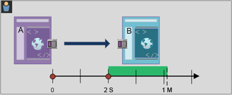

**Crear el segmento**: Cree el segmento secuenciando dos [!UICONTROL Hit] contenedores dentro de un [!UICONTROL Visitor] contenedor. Then set the [!UICONTROL After] and [!UICONTROL Within] operators.

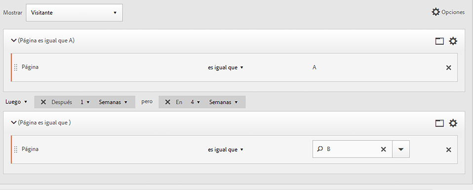

**Coincidencias**

Los visitantes que visiten la página A el 1 de junio de 2019 y vuelvan después del 15 de junio de 2019 a las 00:01 horas, pero *antes* del 1 de julio de 2019, se incluyen en el segmento. Comparar con [Tiempo entre exclusiones](/help/components/c-segmentation/c-segmentation-workflow/seg-sequential-build.md).

Los operadores [!UICONTROL After] y [!UICONTROL Within] pueden usarse juntos para definir un segmento secuencial.

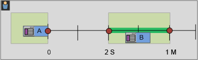

Este ejemplo muestra una segunda visita a la página B después de dos semanas pero dentro de un mes.
