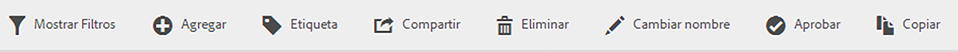
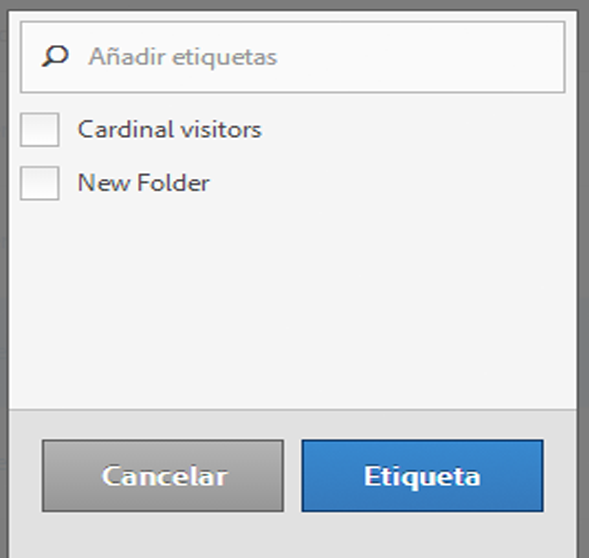

# Etiquetar segmentos

En el Administrador de segmentos, el etiquetado de segmentos le permite organizarlos.

Todos los usuarios pueden crear etiquetas para los segmentos y aplicar una o más a un segmento. Sin embargo, solo verá las etiquetas de los segmentos que sean suyos o que se hayan compartido con usted. ¿Qué tipo de etiquetas debería crear? A continuación encontrará una serie de sugerencias para crear etiquetas útiles:

* Etiquetas basadas en **nombres de equipos**, como Marketing social o Marketing móvil.
* Etiquetas de **proyectos** (etiquetas de análisis), como análisis de páginas de entrada.
* Etiquetas de **categorías**: para hombres, geografía.
* Etiquetas de **flujo de trabajo**: pendiente de aprobación, conservado para (una unidad empresarial específica).

1. En el Administrador de segmentos, marque la casilla que aparece junto al segmento que desea etiquetar. Aparecerá la barra de herramientas para la administración de segmentos:

   

1. Haga clic en **[!UICONTROL Etiqueta]y:**

   * Seleccione una de las etiquetas existentes, o bien
   * Agregue una etiqueta nueva y presione **[!UICONTROL Entrar]**.

      

1. Haga clic en **[!UICONTROL Etiqueta]de nuevo para etiquetar el segmento.**

La etiqueta debería aparecer en la columna de etiquetas. (Haga clic en el icono del engranaje en la esquina superior derecha para administrar las columnas.)

You can also filter on tags by going to **[!UICONTROL Filters]** &gt; **[!UICONTROL Tags]**.
