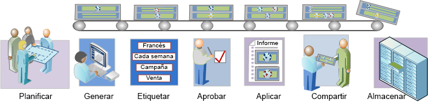

# Descripción general del flujo de trabajo de segmentación

Describe un flujo de trabajo sugerido para los segmentos creados con el Generador de segmentos y administrados con el Administrador de segmentos.

## Segmentation workflow overview {#concept_6D2E1A72A3AD4EBBB9135094F2D9DEDF}

Describe un flujo de trabajo sugerido para los segmentos creados con el Generador de segmentos y administrados con el Administrador de segmentos.

<!-- 

seg_workflow.xml

 -->

 [Planificar segmentos](../../../components/c-segmentation/c-segmentation-workflow/seg-plan.md#concept_D8BE6AB8D8E540E58C3462F9E02F4847)

¿Ha hecho las preguntas correctas antes de crear segmentos y establecer un nuevo entorno de administración de segmentos? ¿Ha diseñado el segmento teniendo en cuenta su propósito y su uso específico?

Consulte la lista de comprobación para la planificación de segmentos para obtener más ayuda a la hora de planificar y organizar sus segmentos.

 [Generar segmentos](../../../components/c-segmentation/c-segmentation-workflow/seg-build.md#concept_BD4C17B01C5B4E378D0C14C852D055D4)

Genere y edite segmentos para utilizarlos en todas las capacidades de Analytics.

Consulte [Genere segmentos secuenciales](../../../components/c-segmentation/c-segmentation-workflow/seg-sequential-build.md#concept_83AEC78CD25F442EBEE364856A889560) para crear segmentos con el operador ENTONCES.

 [Etiquetar segmentos](../../../components/c-segmentation/c-segmentation-workflow/seg-tag.md#concept_CD892CEB326C4986A1B67487052DBA50)

Etiquete segmentos para que sea más fácil organizar y compartir. El etiquetado sustituye las jerarquías de carpetas en los análisis específicos. Consulte cómo planificar y asignar etiquetas para la organización y las búsquedas simples y avanzadas.

 [Aprobar segmentos](../../../components/c-segmentation/c-segmentation-workflow/seg-approve.md#concept_DF477F151A9E483A92ED1DDAAF035953)

Apruebe segmentos para convertirlos en canónicos.

 [Aplicar segmentos](../../../components/c-segmentation/c-segmentation-workflow/t-seg-apply.md#task_13E69C7D428A43EF9CCCA7F1104F1E8F)

Puede aplicar segmentos directamente desde un informe, desde el carril del segmento (Mostrar segmentos).

 [Compartir segmentos](../../../components/c-segmentation/c-segmentation-workflow/t-seg-share.md#task_7DC54643083E42C28F918E4F0845C5A5)

Comparta sus segmentos con la audiencia deseada en otras herramientas de Analytics, así como en Adobe Target y Adobe Experience Cloud.

 [Filtrar segmentos](../../../components/c-segmentation/c-segmentation-workflow/t-seg-filter.md#task_B59946C6D38945629C1FEACF80A85746)

Filtre por etiquetas, propietarios y otros filtros (Mostrar todo, Míos, Compartidos conmigo, Favoritos y Aprobados).

 [Marcar segmento como favoritos](../../../components/c-segmentation/c-segmentation-workflow/t-seg-favorite.md#task_F45DFA3FBF0C4082B46A0D032CB20FC5)

Marcar los segmentos como favoritos es otra manera de organizarlos para que su uso sea más sencillo.

[Administrar segmentos](../../../components/c-segmentation/c-segmentation-workflow/seg-manage.md#concept_7A2E019317864065B7C641DC3315928F)

El Administrador de segmentos ofrece numerosas maneras de conservar los segmentos, como compartir, filtrar, etiquetar, aprobar, copiar, eliminar y marcar como favoritos.