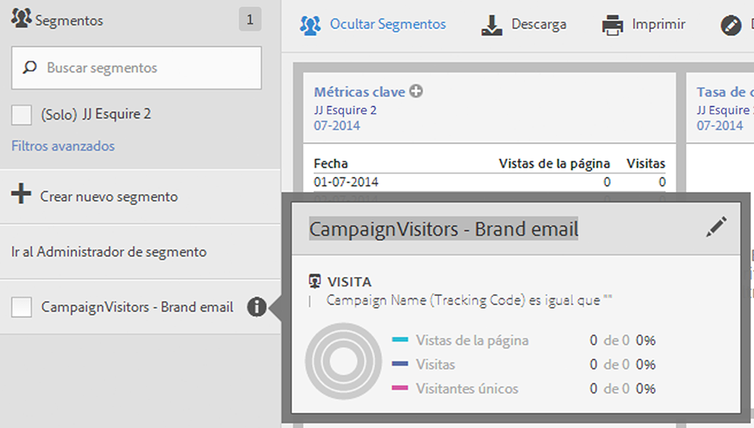
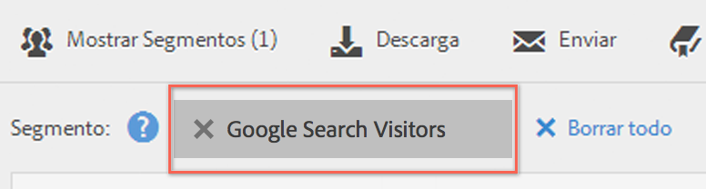

# Seleccionar y aplicar segmentos

Cómo aplicar uno o más segmentos a un informe desde el carril del segmento.

1. Visualice el informe al que desee aplicarle un segmento, por ejemplo el [!UICONTROL informe de páginas].
1. Click **[!UICONTROL Show Segments]** above the report. El carril del segmento se abre.

   

1. Mark the checkbox next to one or more of the segments or **[!UICONTROL Search Segments]** to find the right segment.

   >[!NOTE]
   >
   >Puede aplicar más de un segmento a un informe (esto se denomina apilamiento de segmentos). Cuando se aplican varios segmentos, los criterios de cada uno de ellos se combinan utilizando un operador "y", y se aplican a continuación. Puede apilar segmentos sin límite.

   >[!NOTE]
   >
   >Al hacer clic en el icono Información (i) junto al nombre del segmento, podrá obtener una vista previa de las métricas clave para ver si tiene un segmento válido y cuán amplio es el segmento.

1. You can filter by report suite by selecting the **[!UICONTROL (Only)`<report suite name>`]** check box. De este modo, se mostrarán únicamente los segmentos que se guardaron por última vez en ese grupo de informes.
1. Click **[!UICONTROL Apply Segment]** and the report will refresh. El segmento o segmentos aplicados se mostrarán ahora en la parte superior del informe:

   
