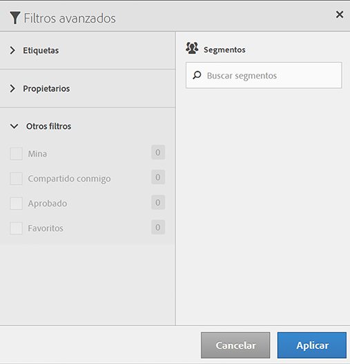

# Filtrar segmentos

Filtre por etiquetas, propietarios y otros filtros (Mostrar todo, Míos, Compartidos conmigo, Favoritos y Aprobados).

El uso de filtros hace mucho más sencilla la búsqueda de segmentos en el carril del segmento.

1. In the Segment Manager, click the **[!UICONTROL Filters]** icon:  

   

1. Los filtros disponibles son los siguientes:

   | Nombre del filtro | Descripción |
   |---|---|
   | Etiquetas | Le permite filtrar segmentos con determinadas [etiquetas](../../../components/c-segmentation/c-segmentation-workflow/seg-tag.md#concept_CD892CEB326C4986A1B67487052DBA50). La columna Etiquetas se muestra de manera predeterminada. |
   | Propietarios | Le permite filtrar segmentos por propietario. |
   | Otros filtros &gt; Mostrar todo | **(Solo administrador)** Muestra todos los segmentos, su propietario y la última fecha de modificación. |
   | Otros filtros &gt; Míos | Muestra todos los segmentos de su propiedad. |
   | Otros filtros &gt; Compartidos conmigo | Muestra todos los segmentos que se han [compartido](../../../components/c-segmentation/c-segmentation-workflow/t-seg-share.md#task_7DC54643083E42C28F918E4F0845C5A5) con usted. |
   | Otros filtros &gt; Favoritos | Muestra todos los segmentos que ha marcado como [Favoritos](../../../components/c-segmentation/c-segmentation-workflow/t-seg-favorite.md#task_F45DFA3FBF0C4082B46A0D032CB20FC5). |
   | Otros filtros &gt; Aprobados | Muestra todos los segmentos oficialmente [aprobados](../../../components/c-segmentation/c-segmentation-workflow/seg-approve.md#concept_DF477F151A9E483A92ED1DDAAF035953). |
   | Buscar segmentos | Le permite buscar segmentos por nombre. |

