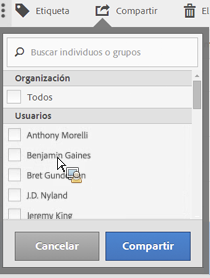

# Compartir segmentos

En función de sus permisos, puede compartir segmentos con toda su organización, con grupos o con usuarios individuales.

| Administrador | Puede compartir segmentos con Todos, con Grupos y con Usuarios. Los grupos se establecen como grupos de permisos en la consola de administración. |
|---|---|
| No administrador | Puede compartir segmentos únicamente con usuarios individuales. |

¿Cuándo debe compartir segmentos con toda la compañía en vez de con un grupo de usuarios o personas? A continuación se indica una serie de prácticas recomendadas seguir:

* Como administrador, comparta un segmento con **[!UICONTROL Todos]si resulta útil para toda la compañía y si todos se sienten cómodos al utilizarlo.** In this case, you should also consider making it an [approved](../../../components/c-segmentation/c-segmentation-workflow/seg-approve.md#concept_DF477F151A9E483A92ED1DDAAF035953) segment.

* Como administrador, comparta un segmento con un **[!UICONTROL Grupo]específico si el segmento le aporta valor empresarial al equipo.** No apruebe oficialmente este tipo de segmentos.
* Como administrador o usuario individual, comparta un segmento con otras personas para examinar y validar un segmento. Si finalmente no resulta útil, descártelo. No apruebe oficialmente este tipo de segmentos.

1. En el Administrador de segmentos, marque la casilla que aparece junto al segmento que desea compartir. Aparecerá la barra de herramientas para la administración de segmentos:

   

1. Haga clic en **[!UICONTROL Compartir]**.

   

   Si es administrador, puede seleccionar **[!UICONTROL Todos]** o elegir entre **[!UICONTROL Grupos]y** Usuarios] de su organización. **[!UICONTROL ** Si no es administrador, solo verá usuarios individuales. Utilice el campo **[!UICONTROL Buscar]para buscar grupos o usuarios.** 1. Click **[!UICONTROL Share]**.

   El icono de compartir aparece junto al segmento:  

1. You can filter on segments shared with you by going to **[!UICONTROL Filters]** &gt; **[!UICONTROL Other Filters]** &gt; **[!UICONTROL Shared with Me]**.
