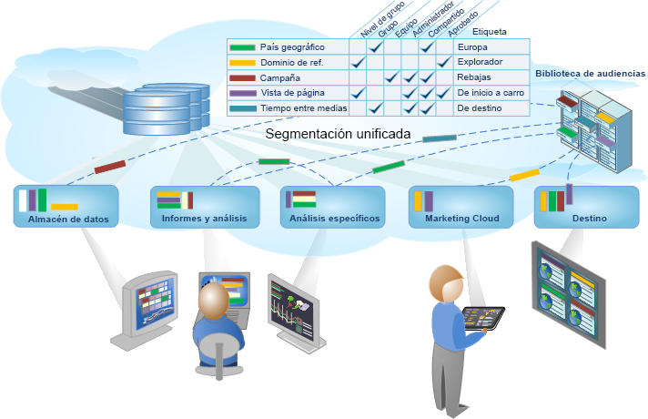

# Segmentación de Analytics

Adobe Analytics le permite generar, administrar, compartir y aplicar a sus informes poderosos segmentos centrados en la audiencia utilizando capacidades de Analytics, Adobe Experience Cloud, Adobe Target y otros productos integrados de Adobe.

La segmentación de Analytics incluye el [Generador de segmentos](../../components/c-segmentation/c-segmentation-workflow/seg-workflow.md#concept_BD4C17B01C5B4E378D0C14C852D055D4) para construir segmentos y ejecutar una prueba previa, y el [Administrador de segmentos](../../components/c-segmentation/c-segmentation-workflow/seg-workflow.md#section_7FDCD12949BE4741A402DB83AB7B37DF) para recopilar, etiquetar, aprobar, establecer la seguridad y compartir segmentos en toda la organización.

Los científicos de datos y analistas de marketing pueden utilizar, ampliar y refinar los segmentos para realizar un análisis específico de sus necesidades, y posteriormente guardar el segmento para que otros usuarios lo amplíen, lo refinen y lo guarden como un segmento nuevo en su biblioteca. En cuanto el proceso se pone en marcha, se convierte en un ciclo en el que se diseña y se administra la información de audiencia codificada como un [flujo de trabajo de segmentos unificado](../../components/c-segmentation/c-segmentation-workflow/seg-workflow.md#concept_6D2E1A72A3AD4EBBB9135094F2D9DEDF).

**Introducción**

Empiece por [Configuración de un flujo de trabajo de segmentación](../../components/c-segmentation/c-segmentation-workflow/seg-workflow.md#concept_6D2E1A72A3AD4EBBB9135094F2D9DEDF) o [generación de segmentos](../../components/c-segmentation/c-segmentation-workflow/seg-build.md#concept_BD4C17B01C5B4E378D0C14C852D055D4), o consulte [Acerca de segmentos](../../components/c-segmentation/seg-overview.md#concept_82653C7E29FE49F5A4B5E5E93B0A6399) para obtener información general rápida.
