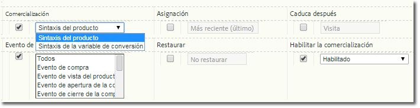

# Implementar una variable de comercialización

Describe cómo habilitar e implementar una variable de comercialización.

## Activación de una variable de comercialización {#section_331B41FF5AED42F2AEFE043DD60238C7}

Merchandising can be enabled for any custom eVar on the **[!UICONTROL Admin Tools]** &gt; **[!UICONTROL Report Suites]** &gt; **[!UICONTROL Conversion Variables]** page (you no longer need to call Adobe):



| Configuración | Descripción |
|--- |--- |
| Caduca después | Determina el tiempo que deben persistir los valores de comercialización. |
| Comercialización | Sintaxis del producto: El valor que se establece en s.products.    Sintaxis de la variable de conversión: El valor que se establece en la variable s.eVar de comercialización designada. |
| Evento de enlace de comercialización (solo para Sintaxis de la variable de conversión) | Indica si un producto debe enlazarse con la categoría de comercialización actual. Para seleccionar varios eventos, mantenga presionada la tecla Ctrl y haga clic en los distintos elementos de la lista.   Nota: Si selecciona "Sintaxis del producto" no podrá elegir ningún evento (se encontrarán deshabilitados, aunque no atenuados). Solo puede seleccionar eventos si también se selecciona la opción "Sintaxis de la variable de conversión". |

## Implementación y uso de Sintaxis del producto {#section_2774578D09CE40A093CB0D0A294DBF7C}

Si se habilita Sintaxis del producto, la categoría de comercialización se rellena directamente en las variables de los productos y por ello no resulta necesario seleccionar y establecer un evento de enlace. Este es el método recomendado y debe usarse a menos que no se encuentre disponible el valor que debe establecerse en `s.products` cuando el evento de éxito tiene lugar.

* **Sintaxis**

```js
  s.products="category;product;quantity;price;event_incrementer; 
<codeph outputclass="syntax">
  eVarN=merch_category| 
 <codeph outputclass="syntax">
   eVarM=merch_category2" 
 </codeph outputclass="syntax"> 
</codeph outputclass="syntax">
```

* **Ejemplo**

```js
  s.events="prodView" 
  s.products=";Fernie Snow Goggles;;;; 
<codeph outputclass="syntax">
  eVar1=goggles" 
   In 
</codeph outputclass="syntax">
```

El valor "gafas protectoras" para eVar1 se encuentra asignado al producto "Gafas protectoras para la nieve Fernie". Todos los eventos de éxito subsiguientes (adiciones de productos, cierres de compra, compras, etc.) relacionados con este producto se abonarán a "gafas protectoras".

## Implementación y uso de Sintaxis de la variable de conversión {#section_6AE10F69F4A14636AB050BEA89A34E4E}

Sintaxis de la variable de conversión debe usarse cuando no se encuentre disponible el valor de la eVar que debe establecerse en `s.products`. Por lo general, esto significa que la página no dispone de contexto para el método de búsqueda o el canal de comercialización. En estos casos, debe establecer la variable de comercialización antes de llegar a la página del producto. El valor persistirá hasta que se produzca el evento de enlace.

Cuando el evento de enlace seleccionado durante la configuración tenga lugar, el valor de la eVar que se ha mantenido se asociará con el producto. Por ejemplo, si se especifica prodView como evento de enlace, la categoría de comercialización solo se enlazará con la lista de productos actual cuando se produzca el evento. Solo los eventos de enlace subsiguientes podrán actualizar una eVar de comercialización que ya se haya asignado a un producto.

* **Sintaxis** En la página del evento de enlace o en la página anterior:

   ```js
   s.eVar1="merchandising_category"
   ```

   En la página donde se produce el evento de enlace:

   ```js
   s.events="prodView" 
   s.products="category;product"
   ```

* **Ejemplo** Página 1 de la visita:

   ```js
   s.eVar1="Outdoors:Ski Goggles"
   ```

   Página 2 de la visita:

   ```js
   s.events="prodView" 
   s.products=";Fernie Snow Goggles"
   ```

   El valor "Aire libre:gafas protectoras de esquí" para eVar1 se encuentra asignado al producto "Gafas protectoras para la nieve Fernie". Todos los eventos de éxito subsiguientes (adiciones de productos, cierres de compra, compras, etc.) relacionados con este producto se abonarán a "gafas protectoras".

Asimismo, el valor actual de la variable de comercialización estará enlazado con todos los productos subsiguientes hasta que se cumpla una de estas condiciones:

* Que caduque la eVar (en función de la opción "Caduca después").
* Que la eVar de comercialización se sobrescriba con un nuevo valor.

Para obtener más información, consulte “[Comercialización de sintaxis de conversión avanzada](https://analyticsdemystified.com/adobe-analytics/advanced-conversion-syntax-merchandising/)” en [!DNL analyticsdemystified.com].
