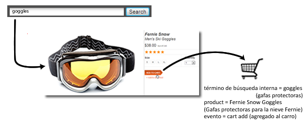
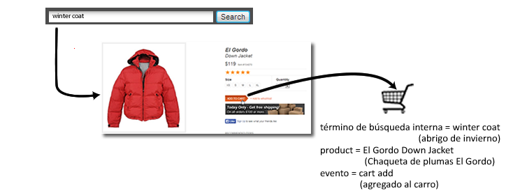

# Descripción general de las variables de comercialización

Al medir el éxito de campañas o términos de búsqueda externos, normalmente se desea que un único valor reciba crédito por los eventos de éxito que se produzcan. Por ejemplo, si un cliente hace clic en un vínculo de una campaña de correo electrónico para visitar un sitio web, todas las compras que se realicen como resultado de ese clic deben abonarse a dicha campaña.

¿Pero qué ocurre con los eventos que se realizan mediante búsquedas internas o a través de la exploración de categorías, cuando un cliente busca varios artículos? Por ejemplo, un cliente busca "gafas protectoras" en un sitio y agrega un par al carro de compras:

Antes de cerrar la compra, el cliente busca "abrigo de invierno" y agrega una chaqueta de plumón al carro de compras:

Cuando la compra se complete, si no se modifica la asignación de Más reciente, aparecerá una búsqueda interna de "abrigo de invierno" abonada con la compra de un par de gafas protectoras. Positivo para "abrigo de invierno", pero negativo para las decisiones de marketing:

| Término de búsqueda interna | Ingresos |
|---|---|
| abrigo de invierno | 157 $ |

**Solución de este problema con las variables de comercialización**

Las variables de comercialización entre categorías o "eVars de comercialización" permiten asignar el valor actual de una eVar a un producto en el momento en que se produce un evento de éxito. Este valor se mantendrá enlazado con dicho producto, incluso en el caso de que posteriormente se establezcan uno o varios valores nuevos para la eVar específica.

Si se habilita la comercialización para la eVar del ejemplo anterior, el término de búsqueda "gafas protectoras" se enlazará con Gafas protectoras para la nieve Fernie, y el término de búsqueda "abrigo de invierno" se enlazará con Chaqueta de plumas El Gordo. Las variables de comercialización asignan los ingresos en el nivel de producto, por lo que cada término recibe crédito por la cantidad de ingresos del producto al que se encuentra asociado:

| Término de búsqueda interna | Ingresos |
|---|---|
| abrigo de invierno | 119 $ |
| gafas protectoras | 38 $ |

