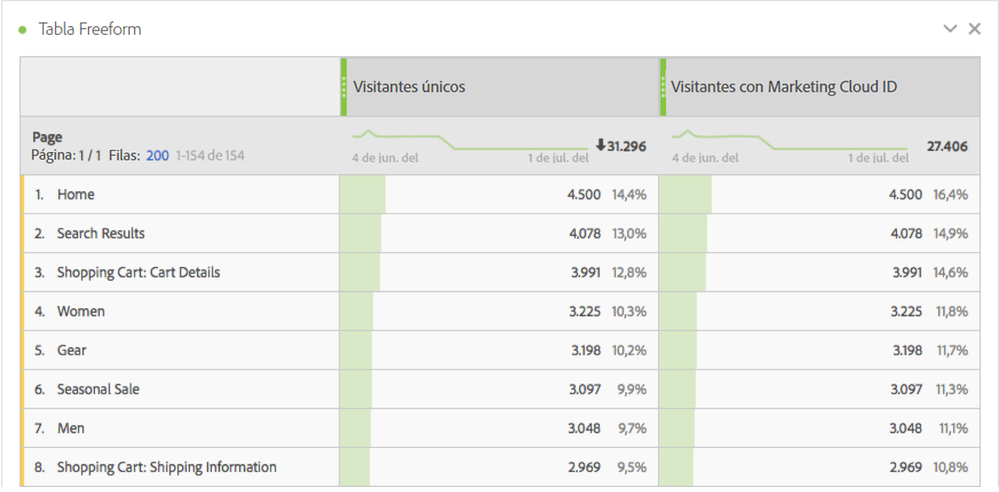
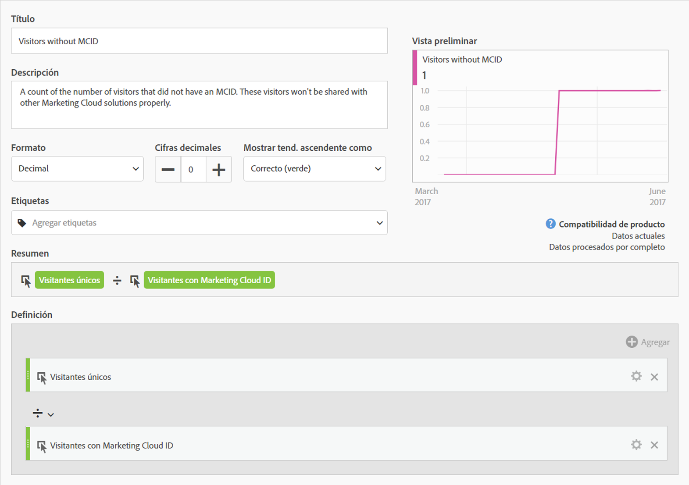
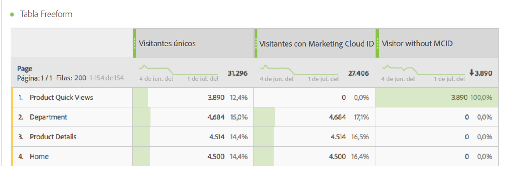
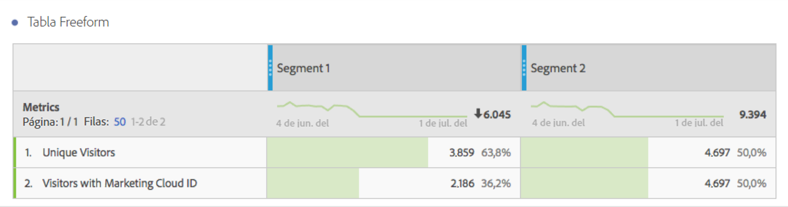

# Visitantes con Experience Cloud ID

Está disponible en Analysis Workspace y en el Generador de segmentos.

Muestra el número de visitantes que tienen un Experience Cloud ID. Puede comprender qué páginas tienen implementado el servicio de identidad y cuántos visitantes pueden compartirse con otras soluciones de Experience Cloud. También puede usar esta métrica en segmentos que se comparten con Experience Cloud.

>[!IMPORTANT]
>
>For this metric to appear, you have to have the [Identity Service](https://marketing.adobe.com/resources/help/en_US/mcvid/) running for the report suite.

## Depuración de la configuración de Experience Cloud ID {#section_679E62142A3E46548FF8FBDA46568005}

The [!UICONTROL Visitors with Experience Cloud ID] metric is a useful metric in Adobe Analytics intended to help you find and debug your [!UICONTROL Identity Service]setup. La métrica es un recuento del número de visitantes en un grupo de informes al que se ha asignado un ID de Experience Cloud desde el servicio de identidad. Esta métrica puede ser muy útil para diagnosticar por qué es posible que determinadas integraciones de Experience Cloud no compartan tantos visitantes como se esperaba, o bien para identificar áreas del sitio que no tengan aún MCID implementados.

Para utilizar la métrica Visitantes con Experience Cloud ID, simplemente arrástrela a cualquier informe como métrica, como este informe [!UICONTROL Páginas]:

En este ejemplo, observe que cada página tiene el mismo número de visitantes únicos y de visitantes con un Experience Cloud ID. Sin embargo, el número total de visitantes únicos es mayor que el número total de visitantes con Experience Cloud ID. Para buscar las páginas que no han configurado el MCID para todos los visitantes, [cree una métrica calculada](https://marketing.adobe.com/resources/help/en_US/analytics/calcmetrics/cm_build_metrics.html) con esta definición:

Al añadir la métrica calculada al informe, puede ordenar el informe Páginas de manera que aparezcan las páginas con el mayor número de visitantes sin un MCID:

Ahora puede ver rápidamente que las páginas «Vistas rápidas del producto» no se han implementado correctamente con el servicio de identidad y que deben actualizarse lo antes posible. Se puede construir un informe similar en relación a cualquier tipo de dimensión, como el tipo de navegador, la sección del sitio o los tipos de contenido.

Una vez que haya identificado las páginas que tienen visitantes sin MCID, podrá enviarlas al equipo de implementación para que puedan solucionar el problema de dichas páginas.

En algunos casos, es posible que observe que un número pequeño de MCID no se ha configurado para algunos visitantes a pesar de que el servicio MCID se implementó en la página. Esto se debe probablemente a una configuración errónea del JavaScript de Analytics o de la configuración de DTM donde la función AppMeasurement se adopta antes de proporcionar un grupo de informes. Para evitar esto, asegúrese de [insertar el código de AppMeasurement principal](https://marketing.adobe.com/resources/help/en_US/sc/implement/dtm/t_appmeasurement-code.html) correctamente.

Tenga en cuenta que cualquier segmento basado en la página “Vistas rápidas de productos” (como se muestra arriba) que comparta con Experience Cloud probablemente tendrá una tasa de coincidencia muy baja con otras soluciones de Experience Cloud. Para comprobar el alcance de MCID de cualquier segmento, puede crear un informe de la siguiente manera:

A partir de esta tabla, en la que se comparan el número de visitantes únicos y el de visitantes con un Experience Cloud ID, es fácil observar que el “Segmento 1” no tiene un alcance de MCID del 100 %, mientras que el “Segmento 2”, sí. Esto significa que, si tuviera que compartir el Segmento 1 con Experience Cloud, solo se podrían compartir 2186 de los 3859 visitantes que forman el total.
