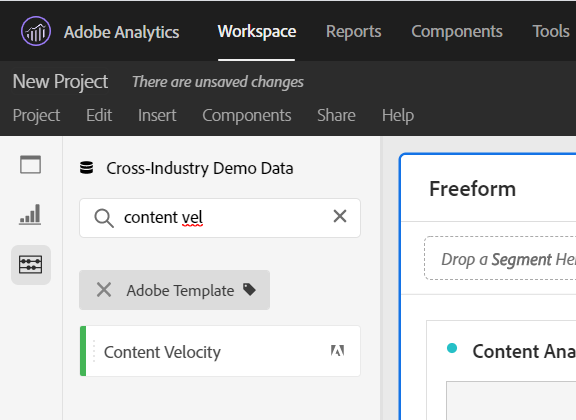

# [!UICONTROL Content Velocity]

[!UICONTROL Content Velocity] es una plantilla de métrica estándar de Adobe Analytics. [!UICONTROL Content Velocity] se define como [[!UICONTROL Page Views] | [!UICONTROL Visit Participation]] / [[!UICONTROL Visits]] y ayuda a medir el impacto de una parte del contenido en particular (página, sección del sitio, etc.) estaba en el contenido descendente. Puede ayudarle a comprender qué contenido es y qué no retiene a los usuarios en el sitio web o la aplicación móvil.

[!UICONTROL Content Velocity] en Espacio de trabajo de Análisis, filtrando el carril izquierdo, buscando o utilizando etiquetas (#Adobe Template).

[!UICONTROL Content Velocity] generalmente se utiliza en la análisis de contenido junto con otras métricas clave como [!UICONTROL Page Views], [!UICONTROL Visits]y [!UICONTROL Bounce Rate].

