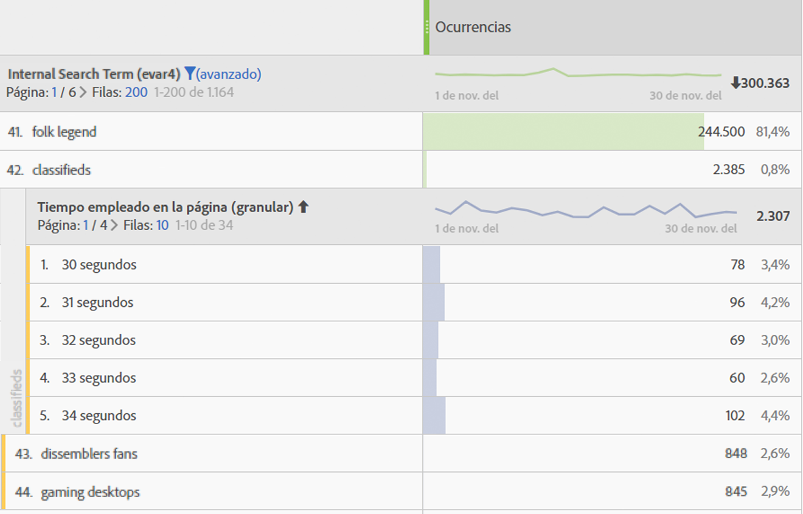
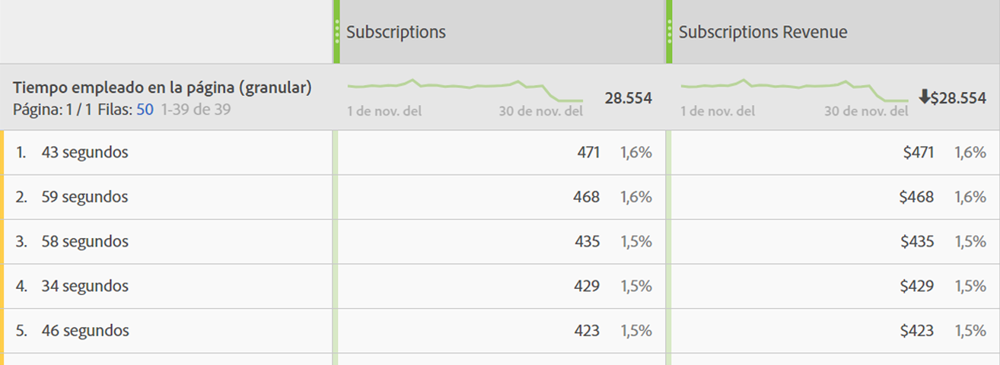

# Tiempo empleado

Adobe Analytics ofrece varias métricas y dimensiones de Tiempo empleado. Averigüe qué son y cómo se calculan.

* [Métricas de tiempo empleado](../../../components/c-variables/c-metrics/metrics-time-spent.md#section_4F54D70300944748A62088F5870E4B6C)
* [Dimensiones de tiempo empleado](../../../components/c-variables/c-metrics/metrics-time-spent.md#section_D51606544CB046FC902E2E317318892C)
* [Cómo se calcula el tiempo empleado](../../../components/c-variables/c-metrics/metrics-time-spent.md#section_90A3882638974969A4B8B674FFDB7624)
* [Preguntas más frecuentes sobre el tiempo empleado](../../../components/c-variables/c-metrics/metrics-time-spent.md#section_51C2735BACAB42CCBA1DD3CBF238E2F7)
* [Ejemplos de cálculo](../../../components/c-variables/c-metrics/metrics-time-spent.md#section_3D63D6A601F34E42AD5366435CB610D5)

## Métricas de tiempo empleado {#section_4F54D70300944748A62088F5870E4B6C}

Esta tabla muestra las distintas métricas de Tiempo empleado, su definición y en qué parte de Adobe Analytics pueden utilizarse.

<table id="table_7095406DF1614F3CAD5E437B919598D1"> 
 <thead> 
  <tr> 
   <th colname="col1" class="entry"> Métrica </th> 
   <th colname="col2" class="entry"> Definición </th> 
   <th colname="col3" class="entry"> Disponible en </th> 
  </tr> 
 </thead>
 <tbody> 
  <tr> 
   <td colname="col1"> 
Segundos totales empleados 
 </td> 
   <td colname="col2"> 
Representa el tiempo total que los visitantes interactúan con un elemento de dimensión específico. 
 
Incluye la instancia de un valor y persistencia en todas las visitas individuales posteriores. En el caso de las props, el tiempo empleado también se cuenta en los eventos de vínculo siguientes. 
 </td> 
   <td colname="col3"> 
Analysis Workspace 
 
Reports &amp; Analytics 
 
Report Builder (llamado “tiempo total empleado”) 
 
Data Warehouse 
 </td> 
  </tr> 
  <tr> 
   <td colname="col1"> 
Tiempo empleado por visita (segundos) 
 </td> 
   <td colname="col2"> 
<i>Segundos totales empleados / (devoluciones de visita)</i> 
 
Representa el tiempo medio que los visitantes interactúan con un elemento de dimensión específico durante cada visita. 
 </td> 
   <td colname="col3"> 
Analysis Workspace 
 
Reports &amp; Analytics 
 </td> 
  </tr> 
  <tr> 
   <td colname="col1"> 
Tiempo empleado por visitante (segundos) 
 </td> 
   <td colname="col2"> 
<i>Segundos totales empleados / (visitante único - visitantes únicos de devolución)</i> 
 
Representa el tiempo medio que los visitantes interactúan con un elemento de dimensión específico a lo largo de la duración del visitante (la duración de su cookie). 
 </td> 
   <td colname="col3"> 
Analysis Workspace 
 
Reports &amp; Analytics 
 </td> 
  </tr> 
  <tr> 
   <td colname="col1"> 
Tiempo promedio empleado en el sitio (segundos) 
 </td> 
   <td colname="col2"> 
Representa el tiempo total que los visitantes interactúan con un elemento de dimensión específico, por secuencia con un elemento de dimensión. No se limita al promedio del “sitio”, como su nombre sugiere. Consulte la sección Cómo se calcula el tiempo empleado para obtener más información sobre las secuencias. 
 
Nota: Es muy probable que, en el nivel de elemento de dimensión, esta métrica difiera del Tiempo empleado por visita debido a diferencias en el denominador del cálculo. 
 </td> 
   <td colname="col3"> 
Analysis Workspace 
 
Reports &amp; Analytics (se muestra en minutos) 
 
Report Builder (se muestra en minutos) 
 </td> 
  </tr> 
  <tr> 
   <td colname="col1"> 
Tiempo promedio empleado en la página 
 </td> 
   <td colname="col2"> 
<b>Métrica obsoleta. </b> 
 
Se recomienda el uso de “Tiempo promedio empleado en el sitio” si se necesita el tiempo promedio para un elemento de dimensión. 
 </td> 
   <td colname="col3"> 
Report Builder (cuando hay una dimensión en la solicitud) 
 </td> 
  </tr> 
  <tr> 
   <td colname="col1"> 
Duración total de la sesión 
 
(También denominada: Duración de la sesión anterior) 
 </td> 
   <td colname="col2"> 
Solo SDK de aplicaciones móviles. Se determina para la sesión anterior la próxima vez que se inicia la aplicación. Esta métrica se calcula en segundos y no cuenta cuando la aplicación se encuentra en segundo plano, solo cuando está en uso. Es una métrica de nivel de sesión. 
 
Por ejemplo: instala la aplicación ABC, la inicia, la utiliza durante 2 minutos y la cierra. No se envía ningún dato acerca de la duración de la sesión. La próxima vez que la inicie, el valor de Duración total de la sesión se establecerá en 120. 
 </td> 
   <td colname="col3"> 
Analysis Workspace 
 
Reports &amp; Analytics 
 
Report Builder 
 
Interfaz de usuario de Mobile Services 
 </td> 
  </tr> 
  <tr> 
   <td colname="col1"> 
Longitud promedio de sesión (móvil) 
 </td> 
   <td colname="col2"> 
Duración total de la sesión/(Usos - Primeros lanzamientos) 
 
Solo SDK de aplicaciones móviles. Es una métrica de nivel de sesión. 
 </td> 
   <td colname="col3"> 
Report Builder 
 
Interfaz de usuario de Mobile Services 
 </td> 
  </tr> 
 </tbody> 
</table>

## Dimensiones de tiempo empleado {#section_D51606544CB046FC902E2E317318892C}

Esta tabla muestra las distintas dimensiones de Tiempo empleado, su definición y en qué parte de Adobe Analytics pueden utilizarse.

<table id="table_BF1B7B8620714105BFB5C1AC37ABE02C"> 
 <thead> 
  <tr> 
   <th colname="col1" class="entry"> Dimensión </th> 
   <th colname="col2" class="entry"> Definición </th> 
   <th colname="col3" class="entry"> Disponible en </th> 
  </tr> 
 </thead>
 <tbody> 
  <tr> 
   <td colname="col1"> 
Tiempo empleado por visita (granular) 
 </td> 
   <td colname="col2"> 
El tiempo total empleado durante la visita, truncado al segundo más cercano y aplicado a todas las visitas individuales que formaron parte de la visita. Es una dimensión de nivel de visita. 
 </td> 
   <td colname="col3"> 
Analysis Workspace 
 </td> 
  </tr> 
  <tr> 
   <td colname="col1"> 
Tiempo empleado por visita - General 
 </td> 
   <td colname="col2"> 
La dimensión granular, agrupada en 9 intervalos distintos. Es una dimensión de nivel de visita. Los intervalos son: 
 
    <ul id="ul_BC909A2D22ED4D48A3F7CE6A666F26E5"> 
     <li id="li_0FB28A1F0D894B7C95724A8C6BD5B00B">Menos de 1 minuto </li> 
     <li id="li_10223656420A475AAB3443981D49D10E">1 a 5 minutos </li> 
     <li id="li_0DEE723B81C64EAFB5BD1125D48D3AD2">5 a 10 minutos </li> 
     <li id="li_B736AC970E0049EB8844480702F345A6">10 a 30 minutos </li> 
     <li id="li_21B8ECC3EE66497E8D870A004351B04B">30 a 60 minutos </li> 
     <li id="li_79FB658128FD4F97AAE1A803F1687BD1">1 a 2 horas </li> 
     <li id="li_CCC0746FEB954BECB9E670ECCDBF30F3">2 a 5 horas </li> 
     <li id="li_BD7AFC524C814F9FAE423A4E301661D4">5 a 10 horas </li> 
     <li id="li_C9B5F1A83F99437A98A61756EE286687">10 a 15 horas </li> 
     <li id="li_8CC5A279D5804C5EA34C1B3589EF07BA">Más de 15 horas </li> 
    </ul> 
Nota: Si los resultados no se reciben ordenados, se pueden producir visitas de más de 12 horas. 
 </td> 
   <td colname="col3"> 
Analysis Workspace 
 
Reports &amp; Analytics 
 
Report Builder 
 </td> 
  </tr> 
  <tr> 
   <td colname="col1"> 
Tiempo empleado en la página (granular) 
 </td> 
   <td colname="col2"> 
El tiempo total empleado en cada visita individual, truncado al segundo más cercano. Es una dimensión de nivel de visita individual e incluye tanto las vistas de página como los eventos de vínculo. No se limita a la dimensión “página”, como su nombre sugiere. 
 </td> 
   <td colname="col3"> 
Analysis Workspace 
 </td> 
  </tr> 
  <tr> 
   <td colname="col1"> 
Tiempo empleado en la página (general) 
 </td> 
   <td colname="col2"> 
La dimensión granular, agrupada en 10 intervalos distintos; sin embargo, la dimensión agrupada solo cuenta vistas de página (y excluye los eventos de vínculo). Es una dimensión de nivel de visita individual. Los intervalos son: 
 
    <ul id="ul_D5F067A2520646A99AA261F9A4625C03"> 
     <li id="li_82307DE66EC548F0AD79DB1505A21F0D">menos de 15 segundos </li> 
     <li id="li_585965B82C4D43B6870978A5CE63B5B6">de 15 a 29 segundos </li> 
     <li id="li_5C20DC78E126472A838818EBA1D954D0">de 30 a 59 segundos </li> 
     <li id="li_2579C0B9279340ABA3AD4A527D758239">de 1 a 3 minutos </li> 
     <li id="li_E0FD800E948049A48DB4329A3E7A2478">de 3 a 5 minutos </li> 
     <li id="li_D9DBBFE6004F42BD80BB4F9268DF7DA7">de 5 a 10 minutos </li> 
     <li id="li_20F146799679456E8D6434D79EE12C31">de 10 a 15 minutos </li> 
     <li id="li_A38951A553A14AE7A0F23A904EEE35DE">de 15 a 20 minutos </li> 
     <li id="li_D44D773A344E47BFAA771302A49D8BD4">de 20 a 30 minutos </li> 
     <li id="li_8766683DB29147CD8470D2317F750E97">más de 30 minutos </li> 
    </ul> </td> 
   <td colname="col3"> 
Analysis Workspace 
 
Reports &amp; Analytics 
 </td> 
  </tr> 
 </tbody> 
</table>

## Cómo se calcula el tiempo empleado {#section_90A3882638974969A4B8B674FFDB7624}

Adobe Analytics utiliza valores explícitos (incluidos eventos de vínculo y vistas de vídeo) para calcular la métrica [!UICONTROL Tiempo empleado].

>[!NOTE]
>
>Without link events like [!UICONTROL Video Views] or [!UICONTROL Exit Links], time spent on the last hit of a visit cannot be known. Además, y por motivos similares, las [!UICONTROL visitas de devolución] (las [!UICONTROL visitas] con una sola visita individual) no tienen asociado un valor de [!UICONTROL Tiempo empleado].

El **numerador** en todos los cálculos de tiempo empleado es “Segundos totales empleados”.

El **denominador** no está disponible como una métrica separada en Analytics. Para métricas de tiempo empleado de nivel de visita individual, el denominador son secuencias. Una secuencia es un conjunto consecutivo de visitas individuales en el que una variable dada contiene el mismo valor (por configuración, por propagarse hacia delante o por persistir). “Propagarse hacia delante” se refiere a la persistencia de las props entre vistas de página (es decir, entre eventos de vínculo subsiguientes) con el propósito de calcular el tiempo empleado.

* Por ejemplo, en el caso de [!UICONTROL Nombre de página] u otras dimensiones de nivel de visitas individuales, el denominador es esencialmente [!UICONTROL Instancias] o [!UICONTROL Vistas de página], pero contando las recargas y los valores sin configurar (por ejemplo, eventos de vínculo) como una sola interacción (una secuencia).

* Las visitas individuales de [!UICONTROL Devolución] y [!UICONTROL Salida] también se eliminan del denominador porque no es posible saber el tiempo empleado.

## Preguntas más frecuentes sobre el tiempo empleado {#section_51C2735BACAB42CCBA1DD3CBF238E2F7}

<table id="table_D8BA825412B6420390CA78D77A5E57C2"> 
 <thead> 
  <tr> 
   <th colname="col1" class="entry"> Pregunta </th> 
   <th colname="col2" class="entry"> Respuesta </th> 
  </tr> 
 </thead>
 <tbody> 
  <tr> 
   <td colname="col1"> 
¿Es posible aplicar todas las métricas de tiempo empleado a cualquier dimensión? 
 </td> 
   <td colname="col2"> 
Las siguientes métricas de tiempo empleado pueden aplicarse a cualquier dimensión: 
 
    <ul id="ul_FC9513D0184B4A74BA1F4CCEA8BC1940"> 
     <li id="li_669156CC549040E08AB4977AF4B8AECB">Segundos totales empleados </li> 
     <li id="li_3CCD7E7D127448689228E98A5EE854CB">Tiempo empleado por visita (segundos) </li> 
     <li id="li_1F61C157EC414C7F8702BC3F365AA2D7">Tiempo empleado por visitante (segundos) </li> 
     <li id="li_A3EF959A9BAB4872915F1A5C1A86D48E">Tiempo promedio empleado en el sitio (segundos) </li> 
    </ul> </td> 
  </tr> 
  <tr> 
   <td colname="col1"> 
¿Qué dimensión de tiempo empleado es más apropiada para su desglose con otras dimensiones? 
 </td> 
   <td colname="col2"> 
La dimensión «Tiempo empleado en la página (granular)» es una dimensión de nivel de visita individual. Desglosarla mediante otra dimensión indicará los segundos que duró una visita individual en la que la dimensión de desglose también estaba presente. 
 
En el ejemplo siguiente, el término de búsqueda “classifieds” se asocia a los tiempos de visita individual 54 segundos, 59 segundos, etc., tal vez indicando que los visitantes pasan tiempo leyendo el contenido devuelto por el término de búsqueda. 
 
 
 </td> 
  </tr> 
  <tr> 
   <td colname="col1"> 
¿Qué métrica es apropiada para la dimensión «Tiempo empleado en la página - granular»? 
 </td> 
   <td colname="col2"> 
Cualquiera. La dimensión muestra el tiempo empleado en la visita individual exacta en la que se produjo el evento. Un tiempo empleado mayor significa que un visitante pasó más tiempo en una página (visita individual) en la que se produjo el evento. 
 
 
 </td> 
  </tr> 
  <tr> 
   <td colname="col1"> ¿En qué se diferencian Tiempo promedio invertido en el sitio y Tiempo empleado por visita? </td> 
   <td colname="col2"> 
La diferencia es el denominador de la métrica: 
 
    <ul id="ul_E9D7B4D3EDCC4691B2C724E0FE5480D2"> 
     <li id="li_CA34D84A3164473A8737D258425CA468">  Tiempo promedio invertido en el sitio utiliza las secuencias que incluyen un elemento de dimensión. </li> 
     <li id="li_2F2639480BE24927919732D00364EECA"> Tiempo empleado por visita utiliza el recuento de visitas. </li> 
    </ul> 
Como resultado, ambas métricas pueden arrojar resultados similares en el nivel de visita, pero distintos en el de visita individual. 
 </td> 
  </tr> 
 </tbody> 
</table>

## Ejemplos de cálculo {#section_3D63D6A601F34E42AD5366435CB610D5}

Supongamos que el siguiente conjunto de llamadas de servidor es para un único visitante dentro de una sola visita:

<table id="table_63CBB5097E5A46659877E2CA3C94D81C"> 
 <thead> 
  <tr> 
   <th colname="col1" class="entry"> N.º de visita individual de la visita </th> 
   <th colname="col2" class="entry"> 1 </th> 
   <th colname="col3" class="entry"> 2 </th> 
   <th colname="col4" class="entry"> 3 </th> 
   <th colname="col5" class="entry"> 4 </th> 
   <th colname="col6" class="entry"> 5 </th> 
   <th colname="col7" class="entry"> 6 </th> 
   <th colname="col8" class="entry"> 7 </th> 
  </tr> 
 </thead>
 <tbody> 
  <tr> 
   <td colname="col1"> <b>Tiempo de visita transcurrido (segundos)</b> </td> 
   <td colname="col2"> 0 </td> 
   <td colname="col3"> 30 </td> 
   <td colname="col4"> 80 </td> 
   <td colname="col5"> 180 </td> 
   <td colname="col6"> 190 </td> 
   <td colname="col7"> 230 </td> 
   <td colname="col8"> 290 </td> 
  </tr> 
  <tr> 
   <td colname="col1"> <b>Segundos empleados</b> </td> 
   <td colname="col2"> 30 </td> 
   <td colname="col3"> 50 </td> 
   <td colname="col4"> 100 </td> 
   <td colname="col5"> 10 </td> 
   <td colname="col6"> 40 </td> 
   <td colname="col7"> 60 </td> 
   <td colname="col8"> - </td> 
  </tr> 
  <tr> 
   <td colname="col1"> <b>Tipo de visita</b> </td> 
   <td colname="col2"> Página </td> 
   <td colname="col3"> Vínculo </td> 
   <td colname="col4"> Página </td> 
   <td colname="col5"> Página </td> 
   <td colname="col6"> Página </td> 
   <td colname="col7"> Página </td> 
   <td colname="col8"> Página </td> 
  </tr> 
  <tr> 
   <td colname="col1"> <b>Nombre de la página</b> </td> 
   <td colname="col2"> Página principal </td> 
   <td colname="col3"> - </td> 
   <td colname="col4"> Producto </td> 
   <td colname="col5"> Página principal </td> 
   <td colname="col6"> Página principal 
(recarga) 
 </td> 
   <td colname="col7"> Carro de compras </td> 
   <td colname="col8"> Confirmación de pedido </td> 
  </tr> 
 </tbody> 
</table>

### Ejemplo de eVar

<table id="table_6D0CF0C53DC145D3A53C06EC3012BCC0">  
 <thead> 
  <tr> 
   <th colname="col1" class="entry"> N.º de visita individual de la visita </th> 
   <th colname="col2" class="entry"> 1 </th> 
   <th colname="col3" class="entry"> 2 </th> 
   <th colname="col4" class="entry"> 3 </th> 
   <th colname="col5" class="entry"> 4 </th> 
   <th colname="col6" class="entry"> 5 </th> 
   <th colname="col7" class="entry"> 6 </th> 
   <th colname="col8" class="entry"> 7 </th> 
  </tr> 
 </thead>
 <tbody> 
  <tr> 
   <td colname="col1"> <b>eVar1</b> </td> 
   <td colname="col2"> Rojo 
(configurado) 
 </td> 
   <td colname="col3"> Rojo 
(persistente) 
 </td> 
   <td colname="col4"> (caducado) </td> 
   <td colname="col5"> Azul 
(configurado) 
 </td> 
   <td colname="col6"> Azul 
(configurado) 
 </td> 
   <td colname="col7"> Azul 
(persistente) 
 </td> 
   <td colname="col8"> Rojo 
(configurado) 
 </td> 
  </tr> 
  <tr> 
   <td colname="col1"> <b>Segundos empleados por eVar</b> </td> 
   <td colname="col2"> 30 </td> 
   <td colname="col3"> 50 </td> 
   <td colname="col4"> - </td> 
   <td colname="col5"> 10 </td> 
   <td colname="col6"> 40 </td> 
   <td colname="col7"> 60 </td> 
   <td colname="col8"> - </td> 
  </tr> 
 </tbody> 
</table>

### Ejemplo de prop

<table id="table_1CB4D24A6CAA479C8E59A7C77FFB8226">  
 <thead> 
  <tr> 
   <th colname="col1" class="entry"> N.º de visita individual de la visita </th> 
   <th colname="col2" class="entry"> 1 </th> 
   <th colname="col3" class="entry"> 2 </th> 
   <th colname="col4" class="entry"> 3 </th> 
   <th colname="col5" class="entry"> 4 </th> 
   <th colname="col6" class="entry"> 5 </th> 
   <th colname="col7" class="entry"> 6 </th> 
   <th colname="col8" class="entry"> 7 </th> 
  </tr> 
 </thead>
 <tbody> 
  <tr> 
   <td colname="col1"> <b>prop1</b> </td> 
   <td colname="col2"> A 
(configurado) 
 </td> 
   <td colname="col3"> A 
(propagado hacia delante) 
 </td> 
   <td colname="col4"> (sin configurar) </td> 
   <td colname="col5"> B 
(configurado) 
 </td> 
   <td colname="col6"> B 
(configurado) 
 </td> 
   <td colname="col7"> A 
(configurado) 
 </td> 
   <td colname="col8"> C 
(configurado) 
 </td> 
  </tr> 
  <tr> 
   <td colname="col1"> <b>Segundos empleados por prop1</b> </td> 
   <td colname="col2"> 30 </td> 
   <td colname="col3"> 50 </td> 
   <td colname="col4"> - </td> 
   <td colname="col5"> 10 </td> 
   <td colname="col6"> 40 </td> 
   <td colname="col7"> 60 </td> 
   <td colname="col8"> - </td> 
  </tr> 
 </tbody> 
</table>

En función de la tabla anterior, la métrica Tiempo empleado se calcula del modo siguiente:

| prop1 | Segundos totales empleados | Tiempo empleado por visita | Tiempo empleado por visitante | Número de secuencias | Tiempo promedio empleado en el sitio |
|---|---|---|---|---|---|
| A | 30+50+60=140 | 140/1=140 | 140/1=140 | 2 | 140/2=70 |
| B | 10+40=50 | 50/1=50 | 50/1=50 | 1 | 50/1=50 |
| C | 0 | 0 | 0 | 0 | 0 |
| Tiempo no atribuido | 100 | - | - | - | - |

| eVar1 | Segundos totales empleados | Tiempo empleado por visita | Tiempo empleado por visitante | Número de secuencias | Tiempo promedio empleado en el sitio |
|---|---|---|---|---|---|
| Rojo | 30+50=80 | 80/1=80 | 80/1=80 | 1 | 80/1=80 |
| Azul | 10+40+60=110 | 110/1=110 | 110/1=110 | 1 | 110/1=110 |
| Tiempo no atribuido | 100 | - | - | - | - |

Para las dimensiones de tiempo empleado, en los informes asociados aparecerán las siguientes filas:

* Tiempo empleado por visita (granular): 290
* Tiempo empleado en la página (granular): 10, 30, 40, 50, 60, 100

Algunas notas adicionales para complementar el ejemplo:

* Todos los cálculos del tiempo empleado se basan en el tiempo transcurrido de visita, que comienza en cero en la primera visita individual de la visita.
* “Segundos empleados” es la diferencia entre la marca de tiempo de la visita individual actual y la de la visita individual siguiente. Como resultado, la última visita individual de la visita (y las devoluciones) carecen de tiempo empleado.
* Una “secuencia” es un conjunto consecutivo de visitas individuales en el que una variable dada contiene el mismo valor (por configuración, por propagarse hacia delante o por persistir). Por ejemplo, prop1 “A” tiene dos secuencias: las visitas individuales 1 y 2, y la visita individual 6. Los valores en la última visita individual de la visita no comienzan una nueva secuencia porque la última visita individual no tiene valor de tiempo empleado. El tiempo promedio empleado en un sitio utiliza secuencias en el denominador.

   * Solo para los propósitos de Tiempo empleado, las props se “propagan hacia delante” desde las visitas individuales de página hacia las visitas individuales de vínculo subsiguientes, como se muestra arriba para la visita individual n.º 2 de prop1. Esto permite que el valor configurado para prop1 en la visita individual n.º 1 (“A”) acumule el tiempo empleado en la visita individual n.º 2.
   * Las eVars acumulan Tiempo empleado en cualquier visita individual en las que estén configuradas o persistan. La persistencia de una eVar se define en la configuración de eVar, en Administración de Analytics.
