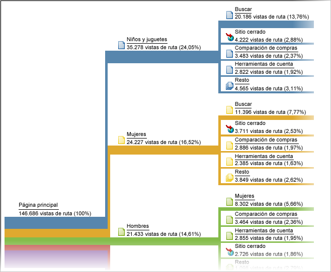

# Rutas

Grupo de informes basado en el análisis de rutas. Técnicamente, las rutas suponen el paso de un nombre de página a otro (de un valor a otro).

Utilice [Analysis Workspace Flow](https://marketing.adobe.com/resources/help/en_US/analytics/analysis-workspace/flow.html) para disponer de opciones más flexibles de control de rutas.

>[!NOTE]
>
>To enable pathing, go to **[!UICONTROL Admin &gt; Report Suites &gt; Edit Settings &gt; Traffic &gt; Traffic Variables]**. Para habilitar el control de rutas en la sección del sitio y en los informes de servidor, póngase en contacto con el Servicio de atención al cliente.

Si necesita saber el orden en que se recopilan los valores, deberá habilitar el control de rutas para la variable que recopila dichos valores. El control de rutas está habilitado de forma predeterminada para las páginas. No está habilitado para cualquier propiedad de manera predeterminada porque únicamente es adecuado en determinados casos. Para habilitar el control de rutas en una propiedad, el usuario debe ponerse en contacto con el Servicio de atención al cliente.

>[!NOTE]
>
>En Análisis específicos, cuando se habilitan las clasificaciones en una prop, las métricas de rutas estarán disponibles para todas las clasificaciones configuradas para la prop habilitada.

**Ejemplo: Rutas en secciones del sitio**

Si activa las rutas para la variable *`s.channel`*, podrá rastrear cómo las visitas del sitio se desplazan de una sección a otra del sitio (a medida que va cambiando el valor).


Las rutas estarán entonces disponibles en varios informes de rutas, como [!UICONTROL Flujo de sección de sitio siguiente], cómo los visitantes se desplazan a través de los grupos de páginas o secciones del sitio.



**Ejemplo: Rutas en búsquedas**

El mismo concepto de pasar de un valor a otro se aplica también a otras variables de tráfico, incluyendo términos de búsqueda interna *`s.props`*. For example, if you enable pathing for your Internal Search Term *`s.prop`*, you could see the path visitors take through search terms.

**Ejemplo: Rutas por estado de inicio de sesión**

Es posible que desee conocer la ruta de los visitantes a través del sitio en función del estado de inicio de sesión de un visitante. Para conocer esta información no se recomienda acudir a los informes de rutas para obtener el estado de inicio de sesión, ya que le mostrarían el cambio de valores de los visitantes en ese informe o el cambio de estado de sesión de los visitantes. En cambio, concatene el valor de segmentos con la variable *`s.pageName`* y luego enrute la variable resultante. El código siguiente es un ejemplo de rutas de páginas por estado de miembro:

```js
s.pageName=“Home Page”; 
s.prop18=“Gold”; // Member Status 
s.prop19=s.prop18 + “:” + s.pageName;
```

A continuación, active las rutas para *`s.prop19`* a fin de ver qué rutas toman los miembros a través de las páginas.

>[!NOTE]
>
>Si realiza análisis específicos, puede segmentar las rutas de páginas sin necesidad de concatenar valores de segmento y aplicar cualquier segmento a los informes de rutas.

