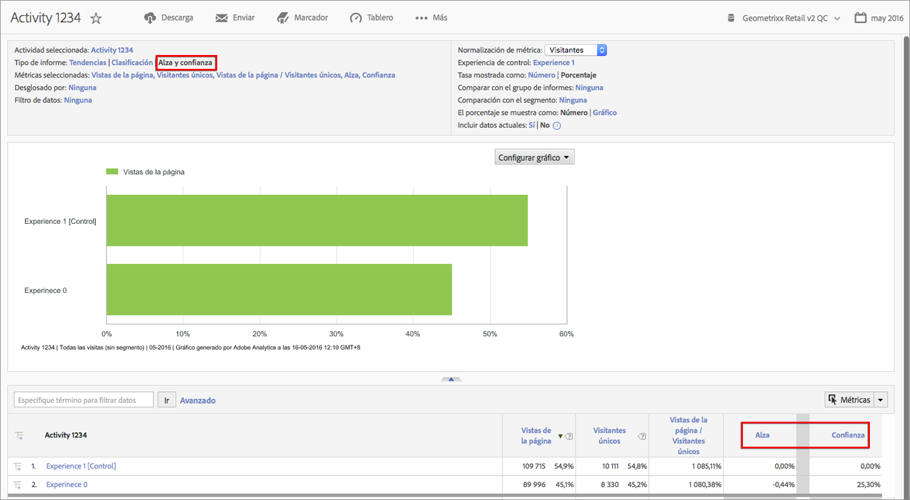

# Alza y confianza de Target

Lets you assess the success of campaigns in Adobe Analytics in the same way you have done in [!DNL Target Classic]  in the past.

**[!UICONTROL Analytics]** &gt; **[!UICONTROL Informes]** &gt; **[!UICONTROL Ver todos los informes]** &gt; **[!UICONTROL Adobe Target]** &gt; **[!UICONTROL Analytics para Target]** &gt; Actividades de **** Target.

La documentación de Adobe Target contiene más información sobre [Alza](https://marketing.adobe.com/resources/help/en_US/target/target/c_estimating_lift_in_revenue.html) y [confianza](https://marketing.adobe.com/resources/help/en_US/rec/c_Confidence_Level_and_Confidence_Interval.html).

Para calcular el alza y la confianza:

1. En el informe **[!UICONTROL Actividades de Target], haga clic en una actividad para que aparezcan sus detalles.**
1. En Tipo de informe, seleccione **[!UICONTROL Alza y confianza]**.
1. Haga clic en **[!UICONTROL Mostrar métricas]para agregar una métrica.** No se puede agregar más de una métrica para este tipo de informe, dado que es recomendable evaluar una prueba solo con una métrica. Más métricas sólo agregarían ruido y reducirían la señal de la prueba.
1. (Optional) Under **[!UICONTROL Normalizing Metric]**, select one of the following: Visitors, Visits, or Impressions. La mayoría de las veces, Visitantes será la opción predeterminada.

1. El informe agregará estas métricas, incluida la proporción entre métrica y métrica de normalización.

## Configuración de informes {#section_3508439E09CA4E38B2EA309BA477C01D}

<table id="table_0FBB257C96454CDA82D487DC68459C13"> 
 <thead> 
  <tr> 
   <th colname="col1" class="entry"> Configuración </th> 
   <th colname="col2" class="entry"> Descripción </th> 
  </tr> 
 </thead>
 <tbody> 
  <tr> 
   <td colname="col1"> Actividad seleccionada </td> 
   <td colname="col2"> La actividad de Target que se ve actualmente, para la que se calculan los valores de alza y confianza. </td> 
  </tr> 
  <tr> 
   <td colname="col1"> Tipo de informe </td> 
   <td colname="col2"> Aquí es donde selecciona Alza y confianza: se mostrarán como métricas en los resultados del informe que se muestra más abajo. </td> 
  </tr> 
  <tr> 
   <td colname="col1"> Métricas seleccionadas </td> 
   <td colname="col2"> Muestra la métrica que se ha seleccionado (en el ejemplo anterior, Ingresos), la métrica de normalización (visitantes únicos), la proporción entre esas 2 métricas y los cálculos de Alza y confianza en comparación con la Experiencia de control. </td> 
  </tr> 
  <tr> 
   <td colname="col1"> Desglosado por </td> 
   <td colname="col2"> El informe se puede desglosar aún más en otros informes. </td> 
  </tr> 
  <tr> 
   <td colname="col1"> Filtro de datos </td> 
   <td colname="col2"> Permite aplicar filtros específicos a este informe. </td> 
  </tr> 
  <tr> 
   <td colname="col1"> Métrica de normalización </td> 
   <td colname="col2"> La normalización se puede realizar con las opciones Visitas, Visitantes o Impresiones. La métrica de normalización se convierte en el denominador del cálculo del alza. También afecta a la manera en que se agregan los datos antes de que se calcule la confianza. </td> 
  </tr> 
  <tr> 
   <td colname="col1"> Experiencia de control </td> 
   <td colname="col2"> La experiencia de Target con la que se establece la comparación y para la que calcula el alza. </td> 
  </tr> 
  <tr> 
   <td colname="col1"> Comparar con el grupo de informes </td> 
   <td colname="col2"> Permite elegir otros grupos de informes con los que compararse. </td> 
  </tr> 
  <tr> 
   <td colname="col1"> Comparación con el segmento </td> 
   <td colname="col2"> Permite elegir segmentos con los que compararse. </td> 
  </tr> 
  <tr> 
   <td colname="col1"> El porcentaje se muestra como número/gráfico </td> 
   <td colname="col2"> Muestra el porcentaje de Alza y confianza como un número o un gráfico. </td> 
  </tr> 
  <tr> 
   <td colname="col1"> Incluir datos actuales </td> 
   <td colname="col2"> 
La opción Incluir datos actuales de Reports &amp; Analytics le permite ver los datos de Analytics más recientes, con frecuencia antes incluso de que dichos datos se hayan completado y procesado totalmente. Datos actuales muestra la mayoría de las métricas en cuestión de minutos y proporciona datos procesables que facilitan una toma de decisiones rápida. 
 </td> 
  </tr> 
 </tbody> 
</table>

