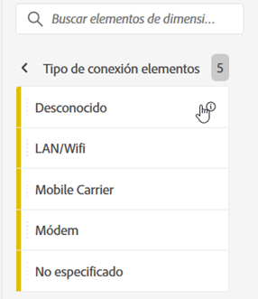
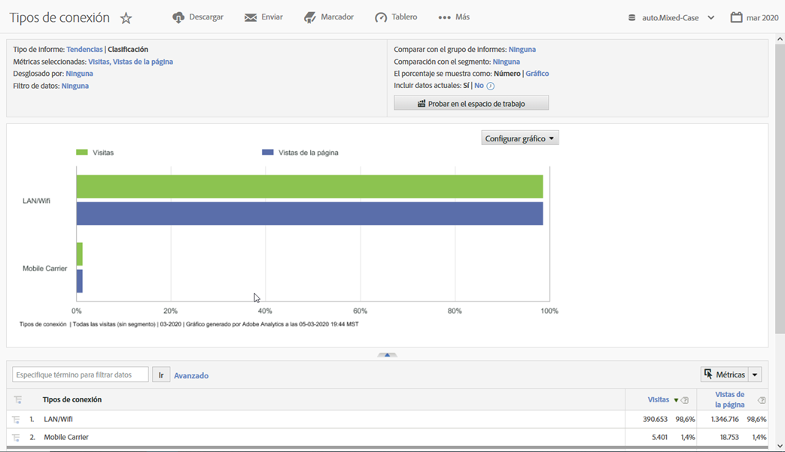

# Tipo de conexión

Muestra métricas para el tipo de conexión a Internet, incluso módem, LAN/WiFi, operador de telefonía móvil, etc.

## Ejemplo

El siguiente informe compara los tipos de conexión para las métricas [Visitas](https://docs.adobe.com/content/help/en/analytics/components/variables/metrics/metrics-visit.html) y Vistas de [página](https://docs.adobe.com/content/help/en/analytics/components/variables/dimensions-reports/reports-page-views.html):

Para obtener perspectivas adicionales sobre el tipo de conexión de operador de telefonía móvil, consulte el informe [**de operador de telefonía **](https://docs.adobe.com/content/help/en/analytics/components/variables/dimensions-reports/reports-mobile-carrier.html)móvil.
