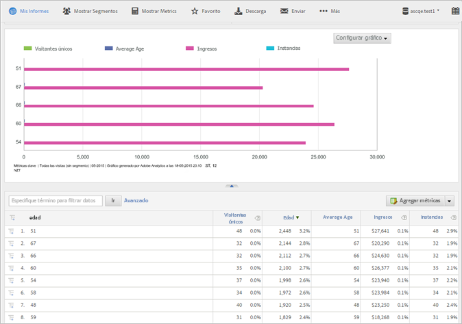

# Atributos del cliente

Sección de preguntas más frecuentes de Analytics sobre atributos del cliente y cómo ejecutar el informe de atributos del cliente.

**[!UICONTROL Informes]** **[!UICONTROL &gt; Perfil]** del visitante &gt; Atributos **[!UICONTROL del cliente]**

Si captura los datos del cliente empresarial en una base de datos de administración de la relación con los clientes (CRM), podrá cargar los datos en un origen de datos de atributos del cliente en Experience Cloud. Una vez que los datos se hayan cargado, podrá ejecutar el informe de atributos del cliente en Reports &amp; Analytics.

* [Atributos del cliente e informes de métricas en Analytics](../../../components/c-variables/dimensionslist/reports-customer-attributes.md#section_EF343662146B460A882D3DF772ADD86D)
* [Preguntas más frecuentes - Atributos del cliente en Analytics](../../../components/c-variables/dimensionslist/reports-customer-attributes.md#section_E29641D1F3D649C1AC9EA5231921F038)

Consulte [Atributos del cliente](https://marketing.adobe.com/resources/help/en_US/mcloud/index.html?f=attributes) en la ayuda de Experience Cloud para obtener información sobre cómo cargar datos de atributos del cliente.

## Atributos del cliente e informes de métricas en Analytics {#section_EF343662146B460A882D3DF772ADD86D}

Después de cargar atributos de cliente y validar el esquema (en Experience Cloud), el sistema crea métricas basadas en nombres prácticos (como *`age`* o *`gender`*) que se asignan a las cadenas de atributos y los enteros. These metrics appear in **[!UICONTROL Visitor Profile]** &gt; **[!UICONTROL Customer Attributes]** reports.

Por ejemplo:

**[!UICONTROL Perfil]** del visitante &gt; Atributos **** del cliente &gt; **[!UICONTROL Edad]**

**Ejemplo - Métrica de edad**

Si especifica una cadena como *`age`*, el sistema crea las siguientes métricas y dimensiones:

* Dimensión Edad: le permite ejecutar un informe basado en el atributo Edad.
* Métrica Edad: métrica que puede añadir a un informe, como el de visitantes únicos.
* Métrica Recuento de edad: le permite saber, por ejemplo, si los visitantes han especificado un valor de *`age`* en un formulario.

Como las métricas son sumas en una tabla de informe, debería [crear una métrica calculada](https://marketing.adobe.com/resources/help/en_US/analytics/calcmetrics/) que le indique la edad media. La fórmula para esta métrica es `Age / Count of Age`.

## Preguntas más frecuentes - Atributos del cliente en Analytics {#section_E29641D1F3D649C1AC9EA5231921F038}

<table id="table_88631069013B408EBB0A810657662B36"> 
 <thead> 
  <tr> 
   <th colname="col1" class="entry"> Pregunta </th> 
   <th colname="col2" class="entry"> Respuesta </th> 
  </tr> 
 </thead>
 <tbody> 
  <tr> 
   <td colname="col1"> 
¿Por qué es preferible utilizar el servicio de identidad para establecer el ID de cliente en lugar de rellenar el ID de cliente en una propiedad o eVar? 
 </td> 
   <td colname="col2"> 
El uso del servicio de identidad ofrece una serie de ventajas: 
 
    <ul id="ul_5D3659604D43419F9CA5920B4F93728E"> 
     <li id="li_BA2EF0715C5A47EFAFA7191CFAD088A4">Si no establece el ID de cliente con el servicio de identidad, los registros de cliente solo estarán disponibles para Adobe Analytics. Si desea utilizar los registros de cliente para la segmentación en tiempo real, debe utilizar el servicio de identidad. </li> 
     <li id="li_228358684E474A298E39578D427BF932">El uso del servicio de identidad para establecer el ID de cliente reduce el tiempo necesario para sincronizar los ID con Experience Cloud. Si pone el ID de cliente en una propiedad o eVar, los ID de cliente se envían a Experience Cloud mediante la sincronización de servidor de back-end que se produce por lotes. El servicio de identidad sincroniza el ID de cliente con Experience Cloud inmediatamente. </li> 
     <li id="li_BCF28219E4014FCF9F747C3D8D270526"> El uso del servicio de identidad en lugar de una propiedad o eVar libera esa prop o eVar para otros usos. </li> 
    </ul> </td> 
  </tr> 
  <tr> 
   <td colname="col1"> 
Si ya estoy almacenando un ID de cliente en una propiedad o eVar, ¿por qué debería utilizar esta nueva funcionalidad en lugar de clasificar mi propiedad o eVar con atributos de CRM? 
 </td> 
   <td colname="col2"> 
Las propiedades o eVars están sujetas a limitaciones por superación únicas. El uso de esta funcionalidad puede aportar datos de atributos para un número ilimitado de ID de cliente. De igual forma, si utiliza el método de propiedad/eVar, limitará la información de CRM para Analytics. 
 </td> 
  </tr> 
  <tr> 
   <td colname="col1"> 
¿Cómo aparecerán mis atributos de CRM en Adobe Analytics? 
 </td> 
   <td colname="col2"> 
Los atributos de CRM se manifestarán en Analysis Workspace, Reports &amp; Analytics, Ad Hoc Analysis, la API de informes y el Report Builder. Los atributos de texto aparecerán como informes o dimensiones. Los atributos numéricos aparecerán como dimensiones o como métricas. 
 </td> 
  </tr> 
  <tr> 
   <td colname="col1"> 
¿Los datos de CRM estarán disponibles en el Data Warehouse y en las fuentes de datos? 
 </td> 
   <td colname="col2"> 
En este momento, los datos de CRM no están disponibles en el Data Warehouse y en la fuente de datos. 
 </td> 
  </tr> 
 </tbody> 
</table>

