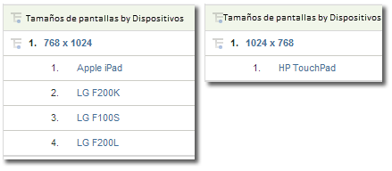

# Dispositivos portátiles

Muestran información sobre el acceso a sitios web desde dispositivos móviles. Los informes sobre dispositivos móviles mejoran la identificación del visitante recopilando datos sobre los dispositivos móviles utilizados para ver el sitio. Los informes de dispositivos móviles pueden identificar al fabricante y las capacidades del dispositivo, como tamaño de pantalla, vídeo, audio, compatibilidad con cookies y otras métricas. Los informes de dispositivos móviles están disponibles para todos los grupos de informes.

## Móvil {#topic_D306EA4558194488AC47A45B9C570150}

Muestran información sobre el acceso a sitios web desde dispositivos móviles. Los informes sobre dispositivos móviles mejoran la identificación del visitante recopilando datos sobre los dispositivos móviles utilizados para ver el sitio. Los informes de dispositivos móviles pueden identificar al fabricante y las capacidades del dispositivo, como tamaño de pantalla, vídeo, audio, compatibilidad con cookies y otras métricas. Los informes de dispositivos móviles están disponibles para todos los grupos de informes.

>[!NOTE]
>
>Los informes Mobile muestran solamente tráfico web móvil. Los datos recopilados de aplicaciones móviles que usen iOS nativo, Android y otros SDK aparecen en los informes de aplicaciones móviles y solo se muestran si se habilita esta opción en Herramientas de administración.

Están disponibles los siguientes informes móviles:

<table id="table_900BB8F2F3A746B6B97DC629B39910DA"> 
 <thead> 
  <tr> 
   <th colname="col1" class="entry"> Informe </th> 
   <th colname="col2" class="entry"> Descripción </th> 
  </tr> 
 </thead>
 <tbody> 
  <tr> 
   <td colname="col1"> 
Dispositivos 
 </td> 
   <td colname="col2"> 
Muestra la cantidad de visitantes que accedieron al sitio mediante dispositivos móviles, por ejemplo dispositivos móviles que ejecutan iOS o Android. Este informe puede ayudarle a comprender el impacto de las campañas dirigidas a dispositivos móviles, para tenerlo en cuenta en los planes. Puede utilizar este informe para: 
 
 
     <ul id="ul_8CC40461C2944A63AED561E384275D24"> 
      <li id="li_4667815ED7384DE9824FB47F02040374"> 
Desarrollar estrategias dirigidas a los usuarios de dispositivos móviles 
 </li> 
      <li id="li_12C1F430E5464FB4AC29C2D970165935"> 
Identificar las preferencias de audiencia 
 </li> 
      <li id="li_BFECB3B1F5A345BA82FC22BF99E8E418"> 
Rastrear la aparición de usuarios de equipos inalámbricos y móviles 
 </li> 
     </ul> 
 </td> 
  </tr> 
  <tr> 
   <td colname="col1"> Fabricante </td> 
   <td colname="col2"> Agrupa las visitas al sitio con dispositivos móviles según el fabricante. El informe muestra el tipo de fabricante, la cantidad de vistas para cada fabricante y los porcentajes correspondientes. </td> 
  </tr> 
  <tr> 
   <td colname="col1"> Tamaño de la pantalla </td> 
   <td colname="col2"> 
 Agrupa las visitas al sitio con dispositivos móviles según el tamaño de pantalla del dispositivo. El informe muestra cada tamaño de pantalla, el número de visitantes al sitio por cada tamaño de pantalla y cada tamaño de pantalla como porcentaje de las vistas totales. En comparación con los informes Ancho de la pantalla y Altura de la pantalla, el informe de tamaño de pantalla muestra tanto la altura como el ancho del tamaño de la pantalla. 
 
Actualmente, el informe de tamaño de pantalla de dispositivos móviles estático por dispositivo. Independientemente de la orientación de pantalla, cada dispositivo tiene una resolución de pantalla fija en el informe. Para ver esto, desglose el informe de tamaño de pantalla por dispositivo móvil. 
 </td> 
  </tr> 
  <tr> 
   <td colname="col1"> Altura de la pantalla </td> 
   <td colname="col2"> 
 Muestra la altura de la pantalla de distintos dispositivos móviles y la cantidad de vistas por cada altura de pantalla. Puede consultar también el informe de tamaño de pantalla para ver tanto la altura como el ancho de la pantalla. 
 </td> 
  </tr> 
  <tr> 
   <td colname="col1"> Ancho de la pantalla </td> 
   <td colname="col2"> 
 Muestra el ancho de la pantalla de distintos dispositivos móviles y la cantidad de vistas por cada ancho de pantalla. Puede consultar también el informe de tamaño de pantalla para ver tanto la altura como el ancho de la pantalla. 
 </td> 
  </tr> 
  <tr> 
   <td colname="col1"> Compatibilidad con cookies </td> 
   <td colname="col2"> 
Agrupa las visitas realizadas con dispositivos portátiles según si admiten cookies o no. Los visitantes se dividen en grupos: los que admiten cookies y los que no. El tipo de dispositivo móvil se identifica en la cadena del agente de usuario. Adobe mantiene una lista de dispositivos portátiles de los que se sabe que admiten cookies. If the mobile device listed in the user agent string is also listed in Adobe’s list of mobile devices, then the  Supported line item in the  Cookie Support report is incremented. Otherwise, the  Not Supported line item in the report is incremented. 
 </td> 
  </tr> 
  <tr> 
   <td colname="col1"> Compatibilidad con imágenes </td> 
   <td colname="col2"> 
 Agrupa los dispositivos móviles según los tipos de imágenes que admiten. 
 
Por ejemplo, si el teléfono de un visitante que admite imágenes .jpeg accede al sitio, el informe de compatibilidad con imágenes se incrementa por lo menos en uno. Si el teléfono admite más de un formato de imagen, una visita al sitio puede dar como resultado varios incrementos correspondientes a esa visita. Dicho de otro modo, si su teléfono admite los formatos .jpeg, .png y .gif, cada uno de estos grupos se verá incrementado en uno en el informe. Por lo tanto, la suma de los grupos puede ser mayor que el total que aparece al final del informe. 
 </td> 
  </tr> 
  <tr> 
   <td colname="col1"> Profundidad de color </td> 
   <td colname="col2"> 
 Agrupa las visitas realizadas desde dispositivos móviles según la cantidad de colores admitidos. El informe muestra la cantidad total de visitantes al sitio que utilizaron un dispositivo móvil y los divide en grupos según la cantidad de colores configurados en sus dispositivos móviles. 
 
Por ejemplo, si el teléfono móvil de un visitante admite 24 colores, el informe incrementa el elemento de línea correspondiente a 24 colores. 
 </td> 
  </tr> 
  <tr> 
   <td colname="col1"> Compatibilidad con audio </td> 
   <td colname="col2"> 
 Agrupa los dispositivos móviles según los tipos de formato de audio que admiten. 
 
Por ejemplo, si el teléfono de un visitante admite formatos .mp3, el informe de compatibilidad con audio se incrementa al menos en uno. Si el teléfono admite más de un formato de imagen, una visita a un sitio podría dar como resultado incrementos para cada tipo de audio admitido. En otras palabras, si un teléfono admite los formatos .mp3, .aac y .amr, cada uno de estos grupos se incrementa en el informe. Por lo tanto, la suma de los grupos puede ser mayor que el total que aparece al final del informe. 
 </td> 
  </tr> 
  <tr> 
   <td colname="col1"> Compatibilidad con vídeo </td> 
   <td colname="col2"> 
 Agrupa los dispositivos móviles según los tipos de formato de vídeo que admiten. 
 
Por ejemplo, si el dispositivo móvil de un visitante admite .mp4, el informe de compatibilidad con vídeo aumenta al menos en uno cuando obtiene acceso al sitio. Si el teléfono admite varios formatos de imagen (como .mp4 y .wmv), se incrementa cada uno de esos grupos en el informe. Por lo tanto, la suma de los grupos puede ser mayor que el total que aparece al final del informe. 
 </td> 
  </tr> 
  <tr> 
   <td colname="col1"> DRM </td> 
   <td colname="col2"> 
 Agrupan los dispositivos móviles según el tipo de administración de derechos digitales (DRM) que admiten. Los grupos de DRM incluyen  Bloqueo de reenvío,  Envío combinado,  Envío separadoy  Desconocido. 
 </td> 
  </tr> 
  <tr> 
   <td colname="col1"> Protocolos de red </td> 
   <td colname="col2"> 
 Agrupa los dispositivos móviles según los protocolos de red (GPRS, CSD, EDGE, HSCSD, etc.) que admiten. El informe también incluye un grupo desconocido para los protocolos de red no identificados. 
 
Si un visitante utiliza un dispositivo móvil para acceder al sitio, el informe de protocolos de red se incrementa por lo menos en uno. Si el teléfono admite varios protocolos de red, entonces se incrementa cada uno de los grupos del informe. Por lo tanto, la suma de los grupos puede ser mayor que el total que aparece al final del informe. 
 </td> 
  </tr> 
  <tr> 
   <td colname="col1"> Sistema operativo (obsoleto) </td> 
   <td colname="col2"> 
 Agrupa los dispositivos móviles según el sistema operativo que ejecutan. Entre los sistemas operativos de dispositivos móviles figuran Windows, RIM, iOS, Symbian, etc. El informe también incluye un grupo desconocido para los sistemas operativos no identificados de dispositivos móviles. 
 
Note: This report was deprecated when the Technology &gt; <a href="../../../components/c-variables/dimensionslist/reports-operating-system.md#concept_3FADC871C6204533B4FCE73316B0B34F" format="dita" scope="local"> Operating Systems</a> report was updated to include all operating systems, including mobile. Puede crear un segmento en el existe "dispositivo móvil" y aplicarlo al informe Tecnología &gt; Sistemas operativos para ver solo sistemas operativos móviles. 
 </td> 
  </tr> 
  <tr> 
   <td colname="col1"> Versión de Java </td> 
   <td colname="col2"> 
 Agrupa los dispositivos móviles según la versión de Java que admiten. El informe de versión de Java identifica la versión de Java según la solicitud de especificación de Java (JSR) admitida en el dispositivo. El informe también incluye un grupo desconocido para los sistemas operativos no identificados de dispositivos móviles. 
 
Para obtener más información sobre una JSR específica, visite el sitio web de <a href="https://jcp.org/en/jsr/overview" scope="external" format="html">Java Community Process</a>. 
 </td> 
  </tr> 
  <tr> 
   <td colname="col1"> Longitud de la dirección URL del marcador </td> 
   <td colname="col2"> 
 Agrupa los dispositivos móviles según la longitud máxima admitida, en caracteres, de las direcciones URL de los marcadores. 
 </td> 
  </tr> 
  <tr> 
   <td colname="col1"> Longitud de la dirección URL del mensaje </td> 
   <td colname="col2"> 
 Agrupa los dispositivos móviles según la longitud máxima admitida, en caracteres, de la dirección URL del mensaje de correo electrónico. 
 </td> 
  </tr> 
  <tr> 
   <td colname="col1"> Longitud de la dirección URL del navegador </td> 
   <td colname="col2"> 
 Agrupa los dispositivos móviles según la longitud máxima admitida, en caracteres, de las direcciones URL de los exploradores web. 
 </td> 
  </tr> 
  <tr> 
   <td colname="col1"> Transmisión del número de dispositivo (ENCENDIDO/APAGADO) </td> 
   <td colname="col2"> 
 Agrupa los dispositivos móviles en función de si admiten la transmisión del número de dispositivo. El informe también incluye un grupo desconocido para los dispositivos de los que no pueda determinarse si admiten la transmisión del número de dispositivo. 
 </td> 
  </tr> 
  <tr> 
   <td colname="col1"> PTT </td> 
   <td colname="col2"> 
 Agrupa los dispositivos móviles en función de si el dispositivo admite la función de pulsar y hablar (PTT). El informe también incluye un grupo  Grupo desconocido para los dispositivos en los que no se puede determinar la compatibilidad con PTT. 
 </td> 
  </tr> 
  <tr> 
   <td colname="col1"> Compatibilidad con Decoration Mail </td> 
   <td colname="col2"> 
 Agrupa los dispositivos móviles en función de si admiten DecoMail, que permite al usuario decorar los mensajes con gráficos y animaciones. El informe también incluye un grupo  Grupo desconocido para los dispositivos en los que no se puede determinar la compatibilidad con Decoration Mail. 
 </td> 
  </tr> 
  <tr> 
   <td colname="col1"> Servicios de información </td> 
   <td colname="col2"> 
 Agrupa los dispositivos móviles según los servicios de noticias (Canal I/B, EZ News Flash, W+INFO, etc.) que admiten. Si un visitante utiliza un dispositivo móvil compatible con servicios de noticias para acceder al sitio, el informe de servicios de información se incrementa por lo menos en uno. Si el teléfono admite varios servicios de noticias, se incrementa cada uno de los grupos del informe. Por lo tanto, la suma de los grupos puede ser mayor que el total que aparece al final del informe. 
 </td> 
  </tr> 
 </tbody> 
</table>

