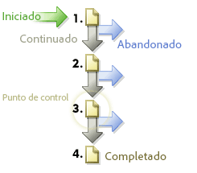

# Rutas

Muestra información sobre el orden en que se accede a las páginas del sitio Web. Puede recopilar información sobre los lugares a los que va un visitante antes y después de visitar una página del sitio.

## Rutas {#topic_39F11BCBEDC3495EA1300149FC6D4F14}

Muestra información sobre el orden en que se accede a las páginas del sitio Web. Puede recopilar información sobre los lugares a los que va un visitante antes y después de visitar una página del sitio.

Los informes de rutas incluyen informes exhaustivos estándar y de análisis avanzado opcionales que revelan el flujo de navegación de las páginas vistas. Se pueden ver las rutas completas, las rutas más largas y las rutas más populares; explicar el flujo de página, las visitas en el orden previsto y las bajas de manera gráfica; mostrar patrones nuevos y cambiantes en el tiempo; y analizar las rutas de entrada y salida.

**[!UICONTROL Flujo de página siguiente]** o **[!UICONTROL Flujo de sitio siguiente]**: muestra un gráfico ramificado de dos niveles de una página seleccionada (o sección, departamento, etc.) que el visitante ve tras irse de la página seleccionada. Use este informe para analizar e identificar los pasos que siguen los visitantes con más frecuencia después de ver una página determinada. Puede:

* Comprender los pasos que se siguen con mayor frecuencia después de ver una página seleccionada.
* Optimizar el diseño de rutas del sitio para canalizar el tráfico hacia una página objetivo.
* Identificar hacia dónde se dirigen los visitantes en lugar de visitar las páginas objetivo.

**[!UICONTROL Página siguiente]** (o categorías siguientes): ofrece un análisis detallado de las rutas del sitio mostrándole las páginas del sitio que los visitantes vieron después de ver una página determinada. Por ejemplo, cuando selecciona y genera informes sobre todo el sitio, el informe muestra las diez páginas de aterrizaje principales con las cinco páginas siguientes más populares enumeradas debajo de cada página de aterrizaje. Esta información le ayudará a entender qué contenido, qué características y qué otros datos instan a los visitantes a navegar por el sitio

**[!UICONTROL Flujo de página anterior]** (u otro flujo de categorías anterior): muestra dos niveles de las páginas más populares que sus visitantes ven antes de la página seleccionada. El informe también indica el momento en el que los visitantes entran en el sitio.

**[!UICONTROL Página anterior]** (u otras categorías anteriores): proporciona un análisis detallado de las rutas del sitio mostrando las páginas de este que los visitantes vieron antes de ver una página seleccionada del sitio.

**[!UICONTROL Visita en el orden previsto]**: muestra la baja en visitas y los índices de conversión entre cada punto de comprobación definido. Los pasos están organizados desde arriba hacia abajo, con las cifras y porcentajes sin procesar a la izquierda, y la conversión y los porcentajes de visitas en el orden previsto a la derecha.

Consulte [Informe de visitas en el orden previsto](../../../components/c-variables/dimensionslist/reports-fallout.md#concept_DE1F8040F1B741F087B78568B342EC41).

**[!UICONTROL PathFinder]**: permite dividir las rutas completas en fragmentos, dando como resultado patrones precisos que contribuyen a optimizar su sitio. El asistente de Pathfinder permite especificar los criterios de selección que se utilizan para generar el informe. De este modo, se pueden analizar los fragmentos de la ruta y consultar los que comienzan o finalizan en una página determinada, o incluso los que comienzan en una página y finalizan en otra.

**[!UICONTROL Longitud de ruta]**: muestra la profundidad con que los visitantes navegan por el sitio (según el porcentaje y el recuento total). Dicho de otro modo, el informe indica la cantidad de páginas en las que entra el visitante promedio antes de retirarse.

**[!UICONTROL Análisis de página]**: contiene un subconjunto de informes que permiten analizar lo siguiente:

* **[!UICONTROL Resumen de página / Resumen de categoría del sitio]**: indica todo lo que se necesita saber sobre el informe de página. Este informe toma y organiza información específica acerca de una página individual y la presenta en un informe único.
* **[!UICONTROL Recargas]**: muestra la cantidad de veces que los visitantes recargaron las páginas individuales.
* **[!UICONTROL Tiempo invertido en la página / Categoría del sitio]**: muestra durante cuánto tiempo los visitantes navegan por páginas individuales del sitio. El tiempo empleado se divide en diez categorías: menos de 15 segundos, entre 15 y 30 segundos, entre 30 y 60 segundos, entre 1 y 3 minutos, entre 3 y 5 minutos, entre 5 y 10 minutos, entre 10 y 15 minutos, entre 20 y 30 minutos y más de 30 minutos.
* **[!UICONTROL Clics hasta la página]**: identifica la cantidad de clics que los visitantes hicieron para acceder a cada página del sitio. La profundidad de una página se mide contando la cantidad de páginas vistas antes de ella.

**[!UICONTROL Entradas y salidas]**: el informe de página de entrada muestra, según el porcentaje y el número total de visitas, qué páginas del sitio son las primeras en ser vistas por un nuevo visitante. Se pueden ver:

* **[!UICONTROL Páginas de entrada]** (o secciones): muestra, según el porcentaje y el número total de visitas, las páginas del sitio que son las primeras en ser vistas por un nuevo visitante. Puede utilizar este informe para identificar qué páginas web del sitio son los puntos de entrada más frecuentes; optimizar los principales puntos de entrada al sitio y dirigir el tráfico de entrada hacia los mensajes clave.
* **[!UICONTROL Páginas de entrada originales]**: muestra la primera página vista por los visitantes que entraron en el sitio por primera vez. Cada uno de los usuarios se cuenta una sola vez, a menos que estos borren sus cookies o que no se los esté rastreando con cookies.
* **[!UICONTROL Visitas a una sola página]**: muestra las páginas que, con mayor frecuencia, constituyen la página de entrada y de salida en las sesiones de navegación de los visitantes.
* **[!UICONTROL Páginas de salida]**: muestra, según el porcentaje y el número total de visitas, las páginas del sitio que fueron las últimas en ser vistas por los visitantes antes de abandonar el sitio.

