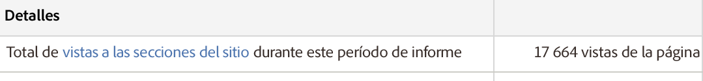

# Resumen de las secciones del sitio

Un informe de resumen para secciones de sitio que muestra puntos de entrada de página anterior, puntos de salida de página siguiente, e información sobre instancias (denominadas vistas de página en esta interfaz), profundidad de las secciones del sitio, tiempo empleado en el sitio, etc.

De nuevo, las Vistas de páginas que se muestran dentro de **[!UICONTROL Detalles]deberían interpretarse como Instancias:**

