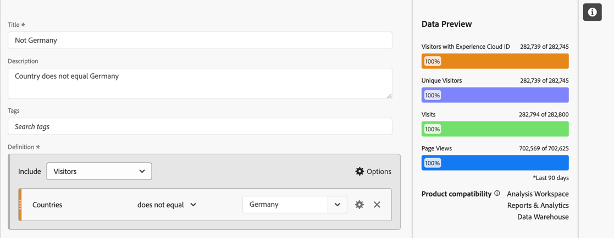
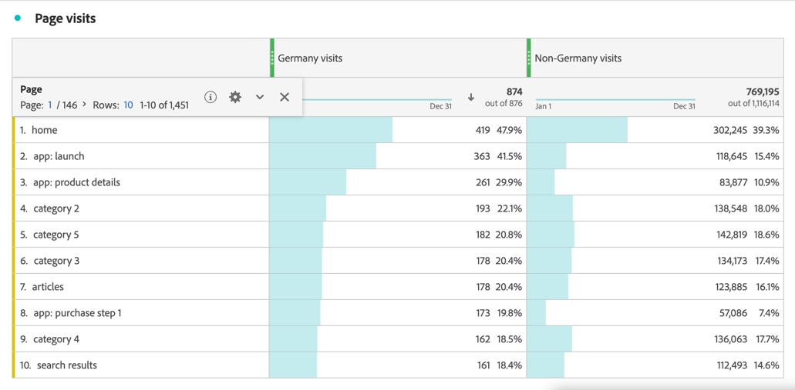

# Métricas segmentadas

En el [Creador de métricas calculadas](cm-build-metrics.md#definition-builder), puede aplicar segmentos dentro de su definición de métrica. La aplicación de segmentos resulta útil si desea utilizar métricas para un subconjunto de los datos en el análisis.

>[!NOTE]
>
>Las definiciones de segmentos se actualizan a través de [Generador de segmentos](/help/components/segmentation/segmentation-workflow/seg-build.md). Si realiza un cambio en un segmento, este se actualiza automáticamente en cualquier lugar donde se utilice, incluso si forma parte de una definición de métrica calculada.
>

Desea comparar las métricas de los alemanes que interactúan con su marca con las de otros fuera de Alemania. Por lo tanto, puede responder preguntas como:

1. ¿Cuántas personas alemanas o internacionales están visitando tus [páginas más populares](#popular-pages)?
1. ¿Cuántas personas alemanas versus internacionales en [total](#totals) han interactuado en línea con su marca este mes?
1. ¿Cuáles son los [porcentajes](#percentages) de alemanes y personas internacionales que han visitado tus páginas populares?

Consulte las secciones siguientes para ilustrar cómo las métricas segmentadas pueden ayudarle a responder a estas preguntas. Si procede, se hace referencia a documentación más detallada.

## Páginas populares

1. [Cree una métrica calculada](../cm-workflow.md) a partir de un proyecto de Workspace, denominado `Germany`.
1. Desde el [Creador de métricas calculadas](cm-build-metrics.md), [cree un segmento](/help/components/segmentation/segmentation-workflow/seg-build.md), con el título `Germany`, que esté usando el campo Países.

   >[!TIP]
   >
   >En el Creador de métricas calculadas, puede crear un segmento directamente mediante el panel Componentes.
   >   

   El segmento podría tener el aspecto siguiente:.

   

1. En el Creador de métricas calculadas, utilice el segmento para actualizar la métrica calculada.

   

Repita los pasos anteriores para la versión internacional de la métrica calculada.

1. Cree una métrica calculada a partir del proyecto de Workspace, con el título `Non Germany visits`.
1. Desde el Creador de métricas calculadas, cree un segmento con el título `Not Germany` que esté usando el campo País de CRM a partir de los datos de CRM para determinar de dónde proviene una persona.

   El segmento debería tener el aspecto siguiente:.

   

1. En el Creador de métricas calculadas, utilice el segmento para actualizar la métrica calculada.

   

1. Cree un proyecto en Analysis Workspace, donde verá las páginas visitadas por visitantes alemanes y no alemanes.

   

## Totales

1. Cree dos nuevas métricas calculadas basadas en el Total general. Abra cada uno de los segmentos creados anteriormente, cambie el nombre del segmento, establezca el **[!UICONTROL Tipo de métrica]** para **[!UICONTROL Personas]** en **[!UICONTROL Total general]** y use **[!UICONTROL Guardar como]** para guardar el segmento con el nuevo nombre. Por ejemplo:

   

1. Agregue una nueva visualización de tabla de forma libre a su proyecto de Workspace, que mostrará las páginas totales de este año.

   

## Porcentajes

1. Cree dos nuevas métricas calculadas que calculen un porcentaje a partir de las métricas calculadas creadas anteriormente.

   

1. Actualice el proyecto de Workspace.

   

