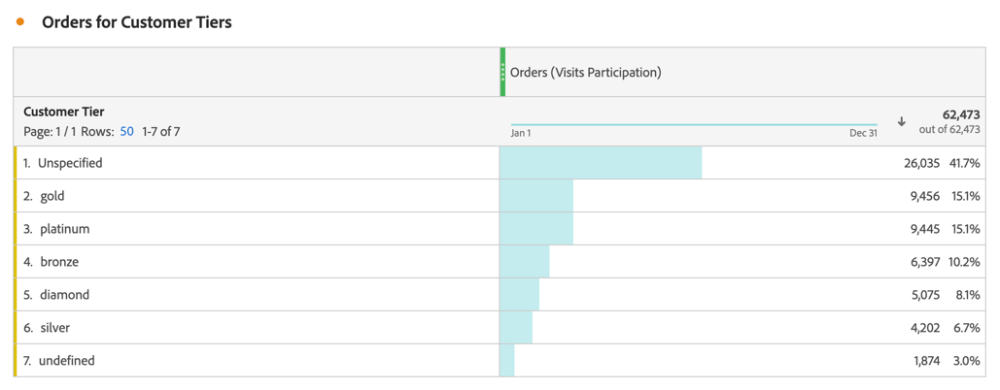

# Métricas de participación

Las métricas de participación se utilizan para cuantificar cómo los valores individuales de una dimensión (como Vistas de página) contribuyen a las visitas que contienen una métrica específica (como Pedidos), o participan en ellas.

Los pasos siguientes muestran cómo crear una métrica de participación.

1. [Cree una métrica calculada](../cm-workflow.md) y, en el [creador de métricas calculadas](cm-build-metrics.md), asigne un nombre a la métrica `Orders (Visit Participation)` o similar.
1. Arrastre una métrica que contenga un evento de éxito, por ejemplo [!DNL Online Orders], al área [!UICONTROL **[!UICONTROL Definición]**].
1. Seleccione  para la métrica.
1. En la ventana emergente que aparece, seleccione **[!UICONTROL Usar un modelo de atribución no predeterminado]** para definir el [modelo de atribución](m-metric-type-alloc.md#attribution-models) de ese evento para **[!UICONTROL Participación]** y seleccione **[!UICONTROL Visitas]** para el [!UICONTROL Contenedor]. Seleccione **[!UICONTROL Aplicar]** para confirmar.

   

   **(Partición|Visitas|30 días)** se agrega al nombre del componente de métrica.

1. Seleccione [!UICONTROL **Guardar**] para guardar la métrica.
1. Utilice la métrica calculada en el informe. Por ejemplo, use la métrica [!DNL Orders (Session Participation)] calculada en un informe para mostrar qué nivel de cliente contribuyó a sesiones que contenían un pedido o participó en ellas.

   

<!--

The following information explains how to create a metric that shows which pages contributed to (or participated in) visits that contained an order.

This type of information could be useful for any content owner.

>[!NOTE]
>
>You can enable participation metrics in the Admin Tools, but only for custom events 1 - 100.

1. Begin creating a calculated metric, as described in [Build metrics](/help/components/calculated-metrics/workflow/c-build-metrics/cm-build-metrics.md).

1. In the Calculated metrics builder, name the metric "Participation".

1. Drag the success event "Orders" into the Definition canvas.

1. Change the [attribution model](/help/components/calculated-metrics/workflow/c-build-metrics/m-metric-type-alloc.md) of that event to **[!UICONTROL Participation]** under the **[!UICONTROL Settings]** gear. Select **[!UICONTROL Visit]** lookback. The definition should look similar to this:

   

1. Select [!UICONTROL **Save**] to save the metric.

1. Use the calculated metric in a **[!UICONTROL Pages]** report.

    

1. (Optional) Share the metric with other users in your organization, as described in [Share calculated metrics](/help/components/calculated-metrics/workflow/cm-sharing.md).
-->