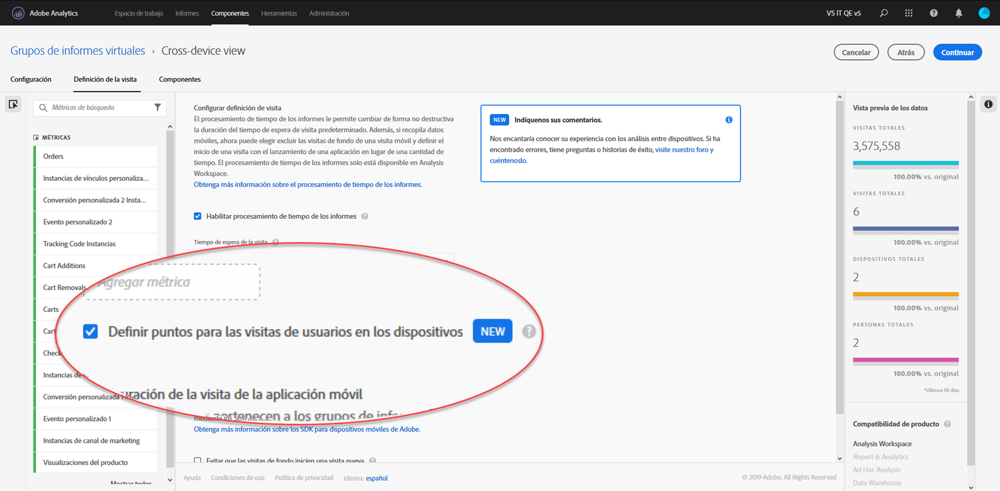

# Configuración de análisis entre dispositivos

> [!NOTE] La documentación de Análisis entre dispositivos está sujeta a cambios a medida que la función se desarrolla. Vuelva regularmente para ver las actualizaciones.

Una vez cumplidos todos los requisitos previos, siga los pasos siguientes para habilitar el análisis entre dispositivos. Debe pertenecer a un grupo de administradores de perfil de producto o tener privilegios de administrador en Adobe Analytics para seguir estos pasos.

> [!IMPORTANT] Todos los requisitos previos deben cumplirse antes de seguir estos pasos. Si no se cumplen todos los requisitos previos, la función no estará disponible o no funcionará. Consulte [Análisis entre dispositivos](cda-home.md) para conocer los requisitos previos y las limitaciones.

## Elija el grupo de informes entre dispositivos que se habilitará para CDA

Cuando su organización está aprovisionada para utilizar CDA, usted elige qué grupo de informes utilizar. Esta opción se puede comunicar a través del administrador de cuentas de Adobe. A continuación, Adobe habilita el grupo de informes elegido para el procesamiento de CDA.

## Crear un grupo de informes virtuales entre dispositivos para ver la vista entre dispositivos

Los administradores con acceso para crear grupos de informes virtuales pueden crear grupos de informes virtuales CDA de la siguiente manera:

1. Vaya a [experience.adobe.com](https://experiencecloud.adobe.com) e inicie sesión con sus credenciales de Adobe ID.
2. Haga clic en el icono de 9 cuadrículas en la parte superior y, a continuación, haga clic en Analytics.
3. Pase el ratón sobre los componentes en la parte superior y, a continuación, haga clic en Grupos de informes virtuales.
4. Haga clic en Agregar.
5. Escriba un nombre para el grupo de informes virtuales y asegúrese de que está seleccionado el grupo de informes habilitado para CDA.
6. (Opcional) Aplique un segmento al grupo de informes virtuales. Por ejemplo, puede aplicar un segmento que limite el grupo de informes virtuales a las fechas después de activar CDA y de iniciar la vinculación. Este segmento permite a los usuarios ver solamente intervalos de fechas enlazados dentro del VRS.
7. Haga clic en la casilla de verificación “Habilitar procesamiento de tiempo de informes”, que permite varias opciones más, incluido Análisis entre dispositivos.
8. Haga clic en la casilla de verificación “Estirar las visitas del usuario entre dispositivos”.
9. Haga clic en Continuar, termine de configurar el grupo de informes virtuales y, a continuación, haga clic en Guardar.

## Adiciones y cambios en los grupos de informes virtuales entre dispositivos

Cuando Análisis entre dispositivos está habilitado en un grupo de informes virtuales, tenga en cuenta los siguientes cambios:

* Aparece un nuevo icono entre dispositivos junto al nombre del grupo de informes virtuales. Este icono es exclusivo para grupos de informes virtuales entre dispositivos.
* Hay disponible una nueva dimensión denominada &#39;Estado identificado&#39;. Esta dimensión determina si el gráfico del dispositivo conoce el ID de Experience Cloud de esa visita en ese momento.
* Hay disponibles nuevas métricas etiquetadas como “Personas” y “Dispositivos únicos”.
* La métrica &#39;Visitantes únicos&#39; no está disponible, ya que se sustituye por &#39;Personas&#39; y &#39;Dispositivos únicos&#39;.
* Al generar segmentos, el contenedor de segmentos “Visitante” se reemplaza por un contenedor “Persona”.

## Plantilla de espacio de trabajo CDA

Adobe ofrece una plantilla para ver datos de rendimiento vitales entre dispositivos.

1. Vaya a [experience.adobe.com](https://experiencecloud.adobe.com) e inicie sesión con sus credenciales de Adobe ID.
1. Haga clic en el icono de 9 cuadrículas en la parte superior y, a continuación, haga clic en Analytics.
1. Haga clic [!UICONTROL Workspace] en en la parte superior y luego en [!UICONTROL Create New Project].
1. Localice el &quot;Journey IQ: &quot;Análisis entre dispositivos&quot; y, a continuación, haga clic en [!UICONTROL Create].
1. Si se le solicita, cambie el grupo de informes a uno que admita CDA.

Se crea un proyecto de Analysis Workspace que contiene varios paneles. En la parte superior, se muestra una tabla de contenido e introducción, lo que permite el contexto del informe y la navegación hacia informes individuales. Haga clic en un vínculo dentro de la tabla de contenido o expanda el acordeón de un panel para ver esos informes.

* **Nota especial para los miembros del Gráfico** de Cooperación: Muestra qué parte del grupo de informes contiene visitantes en regiones donde se admite el gráfico de cooperación y en regiones donde no se admite.
* **Identificación de los usuarios**: Muestra la frecuencia con la que se identifican los visitantes del sitio mediante métodos basados en análisis entre dispositivos.
* **Medición del tamaño** de la audiencia: Muestra una comparación de &#39;Dispositivos únicos&#39; comparados con &#39;Personas&#39;. La proporción de estos dos números se conoce como &#39;compresión entre dispositivos&#39;, una métrica calculada visible en este panel. Esta métrica de compresión depende de una amplia gama de factores:
   * Uso del gráfico de colaboración o del gráfico privado: En términos generales, las organizaciones que utilizan la colaboración entre dispositivos tienden a ver mejores tasas de compresión que las organizaciones que utilizan el gráfico privado.
   * Velocidad de inicio de sesión: Cuantos más usuarios inicien sesión en el sitio, más podrá Adobe identificar y unir a los visitantes entre dispositivos. Los sitios con una tasa de inicio de sesión baja también tienen tasas de compresión bajas.
   * Cobertura del Experience Cloud ID: Solo se pueden vincular los visitantes con un ECID. Un porcentaje menor de visitantes que utilizan un ECID se correlaciona con tasas de compresión más bajas.
   * Uso de varios dispositivos: Si los visitantes del sitio no utilizan varios dispositivos, puede ver tasas de compresión más bajas.
   * Granularidad de informes: La compresión por día suele ser menor que la compresión por mes o año. Las posibilidades de que un individuo utilice varios dispositivos se reducen en un solo día en comparación con todo un mes. Segmentar, filtrar o utilizar dimensiones de desglose también puede mostrar una tasa de compresión más baja.
* **Segmentos** basados en personas: Contiene una lista desplegable de segmentos que le permite ver datos específicos del dispositivo. Este panel alienta la experimentación con segmentos para ver cómo la inclusión o exclusión de tipos de dispositivos afecta a los informes.
* **Análisis del viaje** entre dispositivos: Proporciona informes de flujo y visitas en el orden previsto en función del tipo de dispositivo.
* **Atribución** entre dispositivos: Combine las características de Journey IQ y Atribución IQ juntos.
* **Otros consejos y trucos**: Temas útiles en torno a CDA que le permite aprovechar al máximo su uso.
