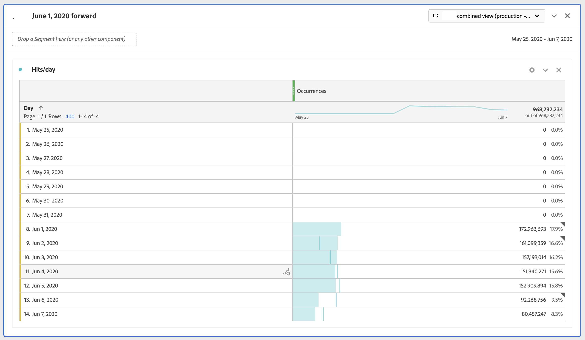

# Limitar un grupo de informes virtuales a determinadas fechas

{{available-existing-customers}}

Cuando activamos la vinculación, la vinculación comienza en una fecha específica. Supongamos que la fecha es el 1 de junio. El grupo de informes virtuales de CDA contendrá datos no enlazados antes del 1 de junio. Es posible que desee ocultar cualquier dato del grupo de informes virtuales anterior al 1 de junio para que el análisis pueda centrarse en los intervalos de fechas después de iniciar la vinculación.

Puede limitar los datos del grupo de informes virtuales a determinadas fechas haciendo lo siguiente:

## Paso 1: Crear un grupo de informes virtuales con un intervalo de fechas diario móvil

Cuando configure el grupo de informes virtuales, en Componentes, añada un intervalo de fechas que tenga un inicio fijo, con un intervalo de fechas diario móvil. El inicio fijo debe ser el día en que comenzó la vinculación.

## Paso 2: Crear un segmento de &quot;exclusión&quot;

A continuación, cree un segmento de visitas que coloque el intervalo de fechas en un contenedor de exclusión dentro de otro contenedor de exclusión. Es una &quot;exclusión&quot;.

El motivo de la exclusión es que los intervalos de fechas pretenden anular el intervalo de fechas del informe. Por lo tanto, si solo se incluye el 1 de junio en adelante, siempre se realizará el intervalo de fechas del informe a partir del 1 de junio. Esto dará lugar a resultados no deseados. Cuando excluye, anula este comportamiento y limita los datos que puede dibujar al intervalo de fechas adecuado.

## Paso 3: Aplicar este segmento a su grupo de informes virtuales de análisis entre dispositivos

## Paso 4: Ver los resultados en la creación de informes

Tenga en cuenta que ahora la creación de informes se inicia en la fecha deseada, el mismo día en que se implementó la vinculación por primera vez:

