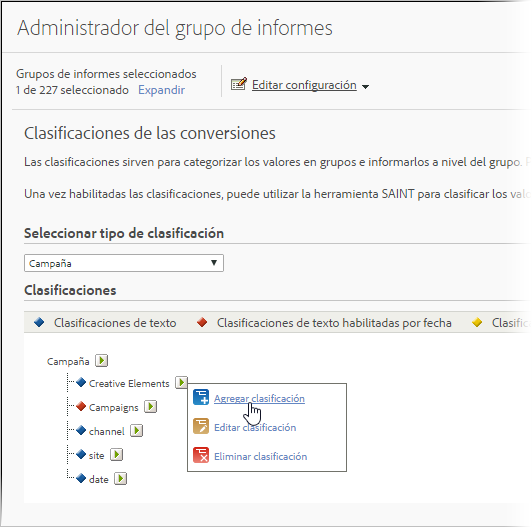

# Clasificaciones de conversión

Las clasificaciones sirven para clasificar los valores en grupos e informar a nivel del grupo. Por ejemplo, puede clasificar todas las campañas de búsqueda pagada en una categoría como términos de música pop e informar sobre el éxito de esa categoría en relación a métricas como Instancias (pulsaciones) y la conversión a eventos de éxito.

## Clasificaciones de conversión {#concept_B4B1478A8CB540599AC9D4A58CA4B6FE}

Las clasificaciones sirven para clasificar los valores en grupos e informar a nivel del grupo. Por ejemplo, puede clasificar todas las campañas de búsqueda pagada en una categoría como *términos de música pop* e informar sobre el éxito de esa categoría en relación a métricas como Instancias (pulsaciones) y la conversión a eventos de éxito.

Las clasificaciones de conversión permiten clasificar variables de conversión. Una vez clasificado, cualquier informe que se pueda generar con los datos clave también se puede generar con las propiedades de datos asociadas.

Después de activar las clasificaciones, utilice el [Importador de clasificaciones](/help/components/classifications/importer/c-working-with-saint.md) para asignar valores determinados a la clasificación adecuada.

## Descripciones de clasificaciones de conversión {#section_4A98DD5F5C314B9DAEE710AEE4EE51D4}

<table id="table_0B72C485467348E2A34BF913441F4AF5"> 
 <thead> 
  <tr> 
   <th colname="col1" class="entry"> Elemento </th> 
   <th colname="col2" class="entry"> Descripción </th> 
  </tr> 
 </thead>
 <tbody> 
  <tr> 
   <td colname="col1">  Nombre </td> 
   <td colname="col2"> Nombre de la clasificación. </td> 
  </tr> 
  <tr> 
   <td colname="col1">  Habilitada por fecha (de texto solamente) </td> 
   <td colname="col2"> 
Indica si la clasificación de texto es un intervalo de fechas para las variables de campaña. 
 </td> 
  </tr> 
  <tr> 
   <td colname="col1">  Opciones (de texto solamente) </td> 
   <td colname="col2">Crea una lista de valores de clasificación disponibles para esta clasificación. Utilice Opciones con variables de campaña para proporcionar a los usuarios una lista de los valores admitidos para la clasificación en el Administrador de campañas. </td> 
  </tr> 
  <tr> 
   <td colname="col1">  Tipo de número (numérica solamente) </td> 
   <td colname="col2">Especifica el tipo de número en la clasificación numérica. Las opciones son Numérica, Porcentaje y Moneda. </td> 
  </tr> 
 </tbody> 
</table>

## Agregar clasificaciones de conversión {#task_D535D09E3EAF4CD1A15A6B93C0BB1BB5}

<!-- 

t_classification_conversion.xml

 -->

Instrucciones que describen cómo se agregan clasificaciones de conversión en Administración.

1. Haga clic en **[!UICONTROL Admin]** > **[!UICONTROL Grupos de informes]**.
1. Selección de un grupo de informes.
1. Haga clic en **[!UICONTROL Editar configuración]** > **[!UICONTROL Conversión]** > **[!UICONTROL Clasificaciones de conversión]**.
1. En la lista desplegable **[!UICONTROL Seleccionar tipo de clasificación]**, seleccione la variable donde desee agregar una clasificación.

   

1. Pase el cursor sobre el icono **[!UICONTROL Editar clasificación]**, a continuación seleccione **[!UICONTROL Añadir clasificación]**.
1. En el campo **[!UICONTROL Seleccionar tipo]**, seleccione el tipo de clasificación que desee agregar a la variable.

   Las opciones son **[!UICONTROL Texto]** y **[!UICONTROL Numérica]**. Para obtener más información acerca de los tipos de clasificaciones, consulte [esta página de ayuda](/help/components/classifications/c-classifications.md).
1. En el cuadro de diálogo **[!UICONTROL Clasificaciones de texto]**, configure la clasificación como desee:

   Consulte [Descripciones de clasificaciones de conversión](/help/components/classifications/conversion-classifications.md#section_4A98DD5F5C314B9DAEE710AEE4EE51D4) para obtener información sobre estos elementos.

1. En el cuadro de diálogo **[!UICONTROL Lista desplegable]**, agregue o elimine opciones.

   Al agregar opciones, se crea una lista de valores de clasificación disponibles para esta clasificación. Puede utilizarse esta opción con las variables de Campaña para proporcionar a los usuarios una lista de los valores admitidos para la clasificación en el Administrador de campañas. Utilice esto para dimensiones de clasificación donde tiene un número pequeño de valores permitidos que cambian pocas veces o nunca. Por ejemplo, podría ejecutar diferentes campañas dirigidas a diferentes niveles de lealtad de clientes: Plata, Oro y Platino. Luego podría utilizar una lista desplegable para asegurarse de que solo los valores aceptados sean aquellos que coincidan con sus tres niveles. Si alguien intenta utilizar un valor diferente, se descarta.
1. Haga clic en **[!UICONTROL Guardar]**.

## Eliminar una clasificación de conversión {#task_566651BC245944618A6A833E58211FDE}

<!-- 

t_classification_delete_conversion.xml

 -->

Elimine una clasificación de conversión cuando ya no la necesite.

1. Abra el Administrador de grupos de informes haciendo clic en **[!UICONTROL Admin]** > **[!UICONTROL Grupos de informes]**, en el encabezado de Suite.
1. Selección de un grupo de informes.
1. Haga clic en **[!UICONTROL Editar configuración]** > **[!UICONTROL Conversión]** > **[!UICONTROL Clasificaciones de conversión]**.
1. En la lista desplegable **[!UICONTROL Seleccionar tipo de clasificación]**, seleccione la variable donde desee eliminar una clasificación.
1. Pase el cursor sobre **[!UICONTROL Editar clasificación]** y, a continuación, seleccione **[!UICONTROL Eliminar clasificación]**.
1. En el cuadro de diálogo Eliminar clasificación, haga clic en **[!UICONTROL Eliminar]**.
