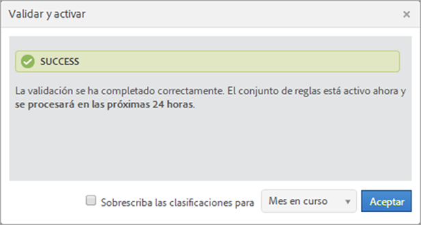
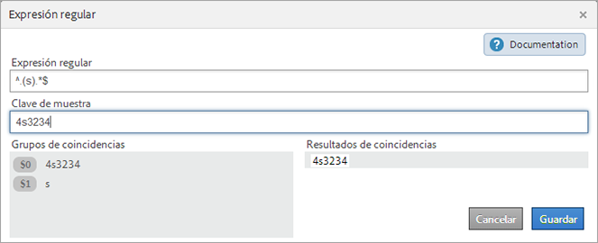
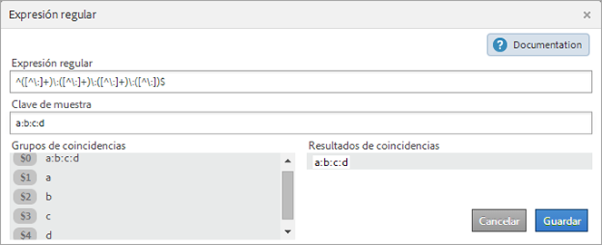
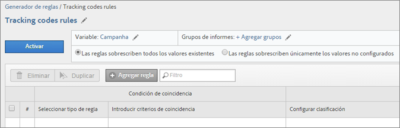
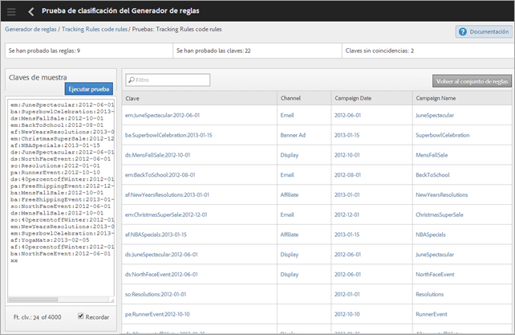

# Reglas de clasificación

Las reglas de clasificación buscan términos no clasificados de forma periódica. Cuando se encuentra una coincidencia de regla, las reglas agregan los términos automáticamente a las tablas de datos de clasificación. Las reglas de clasificación también permiten sobrescribir las claves existentes.

**[!UICONTROL Analytics]** > **[!UICONTROL Administración]** > **[!UICONTROL Clasificación del Generador de reglas]**

El Generador de reglas permite crear una *`classification rule set`*, que es una lista de *`classification rules`*. La regla que coincida con los criterios especificados realizará una acción.

Las reglas de clasificación resultan adecuadas para:

* **Correo electrónico** y **anuncios en pantalla**: al crear reglas de clasificación pueden agruparse campañas de anuncios en pantalla individuales, y esto permite comprobar los resultados de las campañas de visualización frente a las de correo electrónico.

* **Códigos de seguimiento**: con las reglas de clasificación pueden aplicarse categorías a los valores clave derivados de cadenas de códigos de seguimiento, y hacerlos coincidir con los criterios específicos definidos.
* **Términos de búsqueda**: las [expresiones regulares](/help/components/classifications/crb/classification-quickstart-rules.md) y los comodines simplifican la clasificación de los términos de búsqueda. Por ejemplo, si un término de búsqueda contiene *`baseball`*, puede establecer una *`Sports League`* clasificación en *`MLB`*.

Por ejemplo, imaginemos el código de seguimiento siguiente para un ID de campaña de correo electrónico:

`em:Summer:2013:Sale`.

Pueden definirse un máximo de tres reglas en un conjunto de reglas para identificar los elementos de la cadena y, a continuación, clasificar los valores:

| Seleccionar tipo de regla | Introducir criterios de coincidencia | Configurar clasificación | Hasta |
|---|---|---|---|
| Comienza con | em: | Canal | Correo electrónico |
| Finaliza con | Venta | Tipo | Venta |
| Contiene | 2013 | Año | 2013 |

## Cómo procesar las reglas {#how-rules-are-processed}

Información relevante sobre cómo procesar las reglas de clasificación.

<!-- 

about_classification_rules.xml

 -->

* [Información relevante sobre las reglas](/help/components/classifications/crb/classification-rule-builder.md)
* [¿En qué casos las reglas no clasifican claves?](/help/components/classifications/crb/classification-rule-builder.md)
* [Acerca de la prioridad de las reglas](/help/components/classifications/crb/classification-quickstart-rules.md)

>[!NOTE]
>
>El [!UICONTROL Generador de reglas] no admite las clasificaciones numéricas 2.

## Información relevante sobre las reglas

* Especifique [permisos del grupo](https://docs.adobe.com/content/help/es-ES/analytics/admin/user-product-management/user-groups/groups.html) para clasificaciones en las [!UICONTROL Herramientas de administración].

* **Expresiones regulares**: La ayuda está disponible en [Expresiones regulares en Reglas de clasificación](/help/components/classifications/crb/classification-quickstart-rules.md).

* **Grupos de informes**: para elegir una clasificación, primero debe seleccionarse como mínimo un grupo de informes. No se podrá aplicar el grupo de informes hasta que se cree el conjunto de reglas y se asigne una variable.

   Para probar el conjunto de reglas, debe comprobarse el efecto que este ejerce sobre las claves del informe (la variable que se clasifica). (La [clave](/help/components/classifications/importer/c-saint-data-files.md) es la variable que se clasifica, o la primera columna de la tabla de carga de clasificaciones).

* **Prioridad de las reglas**: si una clave coincide con varias reglas que definen la misma clasificación (en la columna [!UICONTROL Configurar clasificación]), se utilizará la última de estas reglas. Consulte [Acerca de la prioridad de las reglas](/help/components/classifications/crb/classification-quickstart-rules.md).

* **Límites en el número de reglas**: no se ha definido ningún límite para el número de reglas que pueden crearse. No obstante, un número de reglas elevado puede afectar al rendimiento del explorador.
* **Procesamiento**: Las reglas se procesan a intervalos regulares, según el volumen del tráfico relacionado con la clasificación.

   Las reglas activas se procesan cada cuatro horas y los datos de clasificación suelen examinarse de forma mensual. Las reglas comprueban automáticamente la existencia de nuevos valores y cargan las clasificaciones a través del importador.

* **Sobrescritura de las clasificaciones existentes**: consulte [¿En qué casos las reglas no clasifican las claves?](/help/components/classifications/crb/classification-quickstart-rules.md) Si es necesario, puede eliminar las clasificaciones existentes mediante el importador.

## ¿En qué casos las reglas no clasifican claves?

Cuando se activan las reglas, pueden sobrescribirse las clasificaciones existentes. En las situaciones siguientes, una regla de clasificación no clasifica ninguna [clave](/help/components/classifications/importer/c-saint-data-files.md) (variable) si:

* La clave ya se ha clasificado y no se selecciona [Sobrescriba las clasificaciones para](/help/components/classifications/crb/classification-rule-definitions.md).

   Las clasificaciones pueden sobrescribirse al [ Agregar y activar](/help/components/classifications/crb/classification-quickstart-rules.md) una regla, y al activar una integración de Data Connectors. (En el caso de los Data Connectors, las reglas son creadas por socios en el Centro de desarrolladores y se muestran en la [!UICONTROL Clasificación del Generador de reglas]).

* Las claves clasificadas no aparecen en los datos una vez transcurrido el lapso de tiempo especificado al sobrescribir una clave, ni siquiera tras habilitar [Sobrescriba las clasificaciones para](/help/components/classifications/crb/classification-rule-definitions.md).
* La clave no se clasifica y nunca se transfiere a [!DNL Adobe Analytics] después del lapso de tiempo a partir de un mes antes.

   >[!NOTE]
   >
   >En los informes, las clasificaciones se aplican a cualquier lapso de tiempo especificado, siempre que exista una clave. El intervalo de fecha de un informe no afecta a su generación.



## Expresiones regulares en las reglas de clasificación {#regex-in-classification-rules}

Las expresiones regulares sirven para hacer coincidir los valores de cadena que tienen un mismo formato con una clasificación. Por ejemplo, puede crear una clasificación a partir de caracteres específicos de un código de seguimiento. Según se considere conveniente, pueden hacerse coincidir patrones de caracteres, palabras o caracteres determinados.

<!-- 

regex_classification_rules.xml

 -->

* [Expresión regular: ejemplo de código de seguimiento](/help/components/classifications/crb/classification-quickstart-rules.md#section_2EF7951398EB4C2F8E52CEFAB4032669)
* [Expresión regular: clasificación de un carácter específico ](/help/components/classifications/crb/classification-quickstart-rules.md#section_5D300C03FA484BADACBFCA983E738ACF)
* [Expresiones regulares: hacer coincidir códigos de seguimiento de distinta longitud](/help/components/classifications/crb/classification-quickstart-rules.md#section_E86F5BF5C2F44ABC8FFCE3EA67EE3BB2)
* [Expresiones regulares: ejemplo de &quot;No contiene&quot; ](/help/components/classifications/crb/classification-quickstart-rules.md#section_FCA88A612A4E4B099458E3EF7B60B59C)
* [Expresiones regulares: tabla de referencia](/help/components/classifications/crb/classification-quickstart-rules.md#section_0211DCB1760042099CCD3ED7A665D716)

>[!NOTE]
>
>Como práctica recomendada, las expresiones regulares funcionan mejor con los códigos de seguimiento con delimitadores.

## Expresión regular: ejemplo de código de seguimiento {#section_2EF7951398EB4C2F8E52CEFAB4032669}

>[!NOTE]
>
>Si el código de seguimiento tiene codificación URL, el Generador de reglas **no** lo clasificará.

En este ejemplo, imaginemos que debe clasificarse el ID de campaña siguiente:

[!UICONTROL Sample Key]: `em:JuneSale:20130601`

Los elementos del código de seguimiento que deben clasificarse son:

* `em` = email
* `JuneSale` = Nombre de la campaña
* `20130601` = date

[!UICONTROL Regular Expression]: `^(.+)\:(.+)\:(.+)$`

Correlación entre la expresión regular y el ID de campaña:


[!UICONTROL Grupos de coincidencias]: muestra la correspondencia entre la expresión regular y los caracteres del ID de campaña para poder clasificar una posición en este ID.


Este ejemplo indica a la regla que la fecha de la campaña `20140601` se encuentra en el tercer grupo `(.+)`, identificado por `$3`.

**[!UICONTROL Generador de reglas]**

En el [!UICONTROL Generador de reglas], la regla debe configurarse como se muestra:

| Seleccionar tipo de regla | Introducir criterios de coincidencia | Configurar clasificación | Hasta |
|---|---|---|---|
| Expresión regular | &amp;Hat;(.+)\:(.+)\:(.+)$ | Fecha de campaña | $3 |

**Sintaxis**

| Expresión regular | Cadena o resultados de coincidencias | Grupos de coincidencias correspondientes |
|--- |--- |--- |
| `^(.+)\:(.+)\:(.+)$` | em:JuneSale:20130601 | `$0`: em:JuneSale:20130601  `$1`: em  `$2`: JuneSale  `$3`: 20130601 |
| Creación de la sintaxis | `^` = comienza la línea  () = agrupa los caracteres y permite extraer los coincidentes entre paréntesis.  `(.+)` = captura uno ( . ) carácter y ( + ) más  \ = inicio de una cadena.  `$` = indica que el carácter (o grupo de caracteres) precedente es el último de la línea. |

Consulte [Expresiones regulares: tabla de referencia](/help/components/classifications/crb/classification-quickstart-rules.md#section_0211DCB1760042099CCD3ED7A665D716) para obtener más información sobre el significado de los caracteres de las expresiones regulares.

## Expresión regular: clasificación de un carácter específico {#section_5D300C03FA484BADACBFCA983E738ACF}

Una de las utilidades de las expresiones regulares es clasificar un carácter específico de una cadena de caracteres. Por ejemplo, imaginemos que el código de seguimiento siguiente contiene dos caracteres importantes:

[!UICONTROL Sample Key]: `4s3234`

* `4` = nombre de la marca.
* `s` = identifica un motor de búsqueda (por ejemplo, Google)



**[!UICONTROL Generador de reglas]**

En el [!UICONTROL Generador de reglas], la regla debe configurarse como se muestra:

| Seleccionar tipo de regla | Introducir criterios de coincidencia | Configurar clasificación | Hasta |
|--- |--- |--- |--- |
| Expresión regular | `^.(s).*$` | Marca y motor | `$0` (Registra los dos primeros caracteres del nombre de la marca y el motor de búsqueda.) |
| Expresión regular | `^.(s).*$` | Motor de búsqueda | `$1` (Registra el segundo carácter de Google.) |

## Expresiones regulares: hacer coincidir códigos de seguimiento de distinta longitud {#section_E86F5BF5C2F44ABC8FFCE3EA67EE3BB2}

En este ejemplo se muestra cómo identificar caracteres específicos entre delimitadores de dos puntos si se dispone de códigos de seguimiento de distinta longitud. Adobe recomienda utilizar una expresión regular para código de seguimiento.

Claves de muestra:

* `a:b`
* `a:b:c`
* `a:b:c:d`

**Sintaxis**




**[!UICONTROL Generador de reglas]**

En el [!UICONTROL Generador de reglas], la regla debe configurarse como se muestra:

| Seleccionar tipo de regla | Introducir criterios de coincidencia | Configurar clasificación | Hasta |
|--- |--- |--- |--- |
| Expresión regular: Para cadena de coincidencia a:b | `^([^\:]+)\:([^\:]+)$` | a | `$1` |
| Expresión regular: Para cadena de coincidencia a:b | `^([^\:]+)\:([^\:]+)$` | b | `$2` |
| Expresión regular: Para la cadena de coincidencia a:b:c | `^([^\:]+)\:([^\:]+)\:([^\:]+)$` | a | `$1` |
| Expresión regular: Para la cadena de coincidencia a:b:c | `^([^\:]+)\:([^\:]+)\:([^\:]+)$` | b | `$2` |
| Expresión regular: Para la cadena de coincidencia a:b:c | `^([^\:]+)\:([^\:]+)\:([^\:]+)$` | c | `$3` |
| Expresión regular: Para la cadena de coincidencia a:b:c:d | `^([^\:]+)\:([^\:]+)\:([^\:]+)\:([^\:])$` | d | `$4` |

## Expresiones regulares: ejemplo de &quot;No contiene&quot; {#section_FCA88A612A4E4B099458E3EF7B60B59C}

En este ejemplo se muestra una expresión regular que coincide con todas las cadenas que no contienen caracteres específicos (en este caso, `13`).

Expresión regular:

`^(?!.*13.*).*$`

Cadenas de prueba:

```
a:b:
a:b:1313
c:d:xoxo
c:d:yoyo
```

Resultados de coincidencias:

```
a:b:
c:d:xoxo
c:d:yoyo
```

En este resultado, `a:b:1313` no indica una coincidencia.

## Expresiones regulares: tabla de referencia {#section_0211DCB1760042099CCD3ED7A665D716}

| Expresión | Descripción |
|---|---|
| `(?ms)` | Hace que toda la expresión regular coincida con una entrada de varias líneas, lo que permite que el comodín coincida con cualquier carácter de línea nueva. |
| (`?i`) | Hace que toda la expresión regular no distinga mayúsculas de minúsculas. |
| [`abc`] | Un solo carácter de: a, b o c. |
| [`^abc`] | Cualquier carácter individual distinto de: a, b o c. |
| [`a-z`] | Cualquier carácter individual del intervalo a-z. |
| [`a-zA-Z`] | Cualquier carácter individual del intervalo a-z o A-Z. |
| `^` | Inicio de línea (coincide con el comienzo de la línea). |
| `$` | Coincide con el final de la línea (o antes de una nueva línea al final). |
| `\A` | Inicio de cadena. |
| `\z` | Final de cadena. |
| `.` | Coincide cualquier carácter (excepto una nueva línea). |
| `\s` | Cualquier carácter de espacio en blanco. |
| `\S` | Cualquier carácter que no sea un espacio en blanco. |
| `\d` | Cualquier dígito. |
| `\D` | Cualquier carácter que no sea un dígito. |
| `\w` | Cualquier carácter de palabra (letra, número o guión bajo). |
| `\W` | Cualquier carácter que no sea de palabra. |
| `\b` | Cualquier límite de palabra. |
| `(...)` | Capturar todo lo incluido. |
| `(a|b)` | a o b |
| `a?` | Cero o uno de a. |
| `a*` | Cero o más de a. |
| `a+` | Uno o más de a. |
| `a{3}` | Exactamente 3 de a. |
| `a{3,}` | 3 o más de a. |
| `a{3,6}` | Entre 3 y 6 de a. |

Se ofrece un buen recurso para probar la validez de las expresiones regulares en https://rubular.com/.

## Acerca de la prioridad de las reglas

Si una clave que define la misma columna de clasificación que se muestra en la columna [!UICONTROL Configurar clasificación] coincide con varias reglas, se utilizará la última. En este caso puede resultar interesante clasificar los artículos de mayor relevancia al final del conjunto de reglas.

<!-- 

rule_priority.xml

 -->

Si se crean varias reglas que no comparten clasificación, el orden de procesamiento no es relevante.

A continuación se muestra un ejemplo de regla de término de búsqueda que clasifica los tipos de búsqueda por un atleta:

| Número de regla | Tipo de regla | Coincidencias | Configurar clasificación | Hasta |
|---|---|---|---|---|
| 1 | Contiene | Cowboys | Tipo de búsqueda | Equipo |
| 2 | Contiene | Fantasy | Tipo de búsqueda | Fantasy |
| 3 | Contiene | Romo | Tipo de búsqueda | Jugador |

Si un usuario busca *`Cowboys fantasy Tony Romo`*, el término *`Player`* se clasifica porque coincide con la última clasificación proporcionada que aparece en la columna Configurar clasificación.

Del mismo modo, supongamos que se configuran hasta dos reglas en un conjunto para los términos de búsqueda siguientes:

| Número de regla | Tipo de regla | Coincidencias | Configurar clasificación | Hasta |
|---|---|---|---|---|
| 1 | Contiene | Cowboys | Ciudad | Dallas |
| 2 | Contiene | Broncos | Ciudad | Denver |

Un usuario busca *`Cowboys vs. Broncos`*. Si el Generador de reglas encuentra un conflicto en la coincidencia de reglas, se aplicará a la búsqueda la clasificación de la segunda regla (Denver).

## Agregar una regla de clasificación a un conjunto de reglas {#add-classification-to-rule-set}

<!-- 

t_classification_rule.xml

 -->

Instrucciones sobre cómo agregar o editar una regla de clasificación.

Para agregar nuevas reglas, debe establecerse la coincidencia entre una condición y una clasificación. Seguidamente, debe especificarse la acción.

>[!NOTE]
>
>En este procedimiento deben aplicarse reglas a uno o varios grupos de informes. El número recomendado de reglas por conjunto de reglas está entre 500 y 1000, aunque no hay límites. Si el número de reglas supera las 100, considere la posibilidad de simplificar el conjunto de reglas mediante [subclasificaciones](/help/components/classifications/c-sub-classifications.md).

1. [Crear un conjunto de reglas de clasificación](/help/components/classifications/crb/classification-rule-set.md) .
1. En la página del conjunto de reglas, haga clic en **[!UICONTROL Agregar regla]**.

   

1. Junto a **[!UICONTROL Grupos de informes]**, haga clic en **[!UICONTROL Agregar grupos]** para especificar uno o varios grupos de informes que quiera asignar a este conjunto de reglas.

   Se muestra la página **[!UICONTROL Seleccionar grupos de informes]**.

   >[!NOTE]
   >
   >Los grupos de informes se muestran en esta página *`only`* cuando se cumplen las siguientes condiciones:
   >
   >* Los grupos de informes tienen como mínimo una clasificación definida para la variable en [!UICONTROL Herramientas de administración].
      >
      >   
      (Consulte *`Variable`* en [Conjuntos de reglas de clasificación](/help/components/classifications/crb/classification-rule-set.md) para obtener una explicación sobre este requisito previo).
      >
      >
   * Ha seleccionado el grupo de informes en la página **[!UICONTROL Grupos de informes disponibles]**, que se muestra después de hacer clic en [Agregar conjunto de reglas](/help/components/classifications/crb/classification-rule-set.md) para crear el conjunto de reglas.


1. Especifique si desea sobrescribir los valores existentes:

   | **Las reglas sobrescriben los valores existentes** | (Configuración predeterminada) Sobrescriba siempre las claves de clasificación existentes, incluidas las clasificaciones cargadas mediante el importador (SAINT). |
   |---|---|
   | **Las reglas solo sobrescriben los valores no establecidos** | Rellene solo las celdas vacías (no establecidas). Las clasificaciones existentes no cambiarán. |

1. [Defina la regla o las reglas](/help/components/classifications/crb/classification-rule-definitions.md#section_4A5BF384EEEE4994B6DC888339833529).

   

   Para ver ejemplos sobre la creación de reglas, consulte [Generador de reglas de clasificación](/help/components/classifications/crb/classification-rule-builder.md) y [Expresiones regulares en Reglas de clasificación](/help/components/classifications/crb/classification-quickstart-rules.md).

   >[!NOTE]
   >
   >Si una clave coincide con varias reglas que definen la misma clasificación (en la columna Configurar clasificación), se utilizará la última de estas reglas. Consulte **Acerca de la prioridad de las reglas** para obtener más información sobre cómo ordenar las reglas.

1. [Pruebe el conjunto de reglas](/help/components/classifications/crb/classification-quickstart-rules.md).
1. Tras la prueba, haga clic en **[!UICONTROL Activo]** para validar y activar la regla.

   Al activar una regla, se genera y se carga automáticamente el archivo.

   Definiciones de campo: Consulte [Generador de reglas de clasificación](/help/components/classifications/crb/classification-rule-definitions.md) para acceder a las definiciones de las opciones de la interfaz de esta página.

## Probar un conjunto de reglas de clasificación

<!-- 

t_classifications_test_rule.xml

 -->

Instrucciones sobre cómo probar un conjunto de reglas o de reglas de clasificación. Al ejecutar una prueba se comprueban todas las reglas de un conjunto.

1. [Crear un conjunto de reglas de clasificación](/help/components/classifications/crb/classification-rule-set.md) .
1. En el [!UICONTROL Generador de reglas de clasificación], haga clic en el nombre del conjunto de reglas.
1. Asegúrese de que el conjunto de reglas esté asociado con un grupo de informes.
1. En el editor de reglas, haga clic en **[!UICONTROL Conjunto de reglas de prueba]**.

   

1. Escriba o pegue claves de prueba en el campo [!UICONTROL Claves de muestra].

   Entre las claves de muestra se encuentran:

   * Códigos de seguimiento
   * Palabras clave o expresiones de búsqueda

   Consulte [Expresiones regulares en reglas de clasificación](/help/components/classifications/crb/classification-quickstart-rules.md) para obtener información sobre pruebas de expresiones regulares.
1. Haga clic en **[!UICONTROL Ejecutar prueba]**.

   Las reglas que coinciden se muestran en la tabla [!UICONTROL Resultados].
1. (Opcional) Haga clic en **[!UICONTROL Activar]** para activar la regla y sobrescribir las clasificaciones existentes.

   Consulte para obtener más información sobre el uso de reglas para sobrescribir clasificaciones existentes.

## Validar y activar reglas de clasificación

<!-- 

t_validate_rules.xml

 -->

Instrucciones sobre cómo validar y activar reglas de clasificación.

1. [Cree un conjunto de reglas de clasificación](/help/components/classifications/crb/classification-rule-set.md) y luego [agregue reglas de clasificación](/help/components/classifications/crb/classification-quickstart-rules.md) al conjunto.
1. En el editor de reglas, haga clic en **[!UICONTROL Activar]**.

   

1. (Opcional) Para sobrescribir clasificaciones, active **[!UICONTROL Sobrescriba las clasificaciones para]** *`<selection>`*.

   Esta opción permite sobrescribir las clasificaciones existentes de las claves afectadas.

   Consulte la [página Reglas](/help/components/classifications/crb/classification-rule-definitions.md#section_4A5BF384EEEE4994B6DC888339833529) para ver una definición de esta opción.
