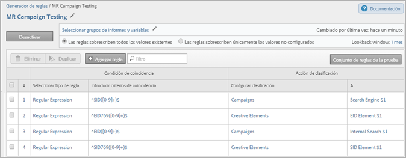
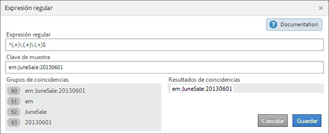

# Definiciones de reglas de clasificación (heredadas)

{{classification-rulebuilder-deprecation}}

Definiciones de los elementos de la interfaz en las páginas del Generador de reglas de clasificación.

## Página Reglas

Esta página muestra las reglas en un conjunto de reglas.

**Definiciones**

<table id="table_2B3A8BB7BDE14836ACA6A1D444B011CD"> 
 <thead> 
  <tr> 
   <th colname="col1" class="entry"> Elemento </th> 
   <th colname="col2" class="entry"> Descripción </th> 
  </tr> 
 </thead>
 <tbody> 
  <tr> 
   <td colname="col1"> 
Seleccionar grupos de informes y variables 
 </td> 
   <td colname="col2"> 
<b>Grupo de informes</b> 
 
Los grupos de informes a los que se aplica el conjunto de reglas. 
 
<b>Variable</b> 
 
Solo se puede aplicar una variable al crear un conjunto de reglas de clasificación. Si se desea crear varios conjuntos de reglas para una variable, debe aplicarse cada uno de estos conjuntos a varios grupos de informes. 
 
Nota: Solo puede usar las variables a las que tenga acceso en sus grupos de informes. Las variables se mostrarán en el panel Nuevo conjunto de reglas solo después de haber definido como mínimo una clasificación para la variable. 
 
 El usuario puede crear clasificaciones en variables desde Administradores &gt; Grupos de informes &gt; Tráfico &gt; Clasificaciones de tráfico (o Conversión &gt; Clasificaciones de las conversiones). A continuación, debe seleccionar la variable y hacer clic en Agregar clasificación. 
 
Consulte <a href="/help/admin/tools/manage-rs/edit-settings/c-traffic-variables/traffic-classifications.md"  >Clasificaciones de tráfico</a> y <a href="/help/admin/tools/manage-rs/edit-settings/conversion-var-admin/conversion-classifications.md"  >Clasificaciones de las conversiones</a> en la ayuda del administrador. 
 </td> 
  </tr> 
  <tr> 
   <td colname="col1"> 
 Activar 
 </td> 
   <td colname="col2"> 
Valida y activa una regla. Las reglas activas se procesan a diario y los datos de clasificación suelen examinarse de forma mensual. Las reglas comprueban automáticamente la existencia de nuevos valores y cargan las clasificaciones. 
 </td> 
  </tr> 
  <tr> 
   <td colname="col1"> 
 Desactivar 
 </td> 
   <td colname="col2"> 
Desactiva las reglas para editarlas y probarlas. 
 </td> 
  </tr> 
  <tr> 
   <td colname="col1"> 
Configurar grupos de informes y variables 
 </td> 
   <td colname="col2"> 
Muestra la página Grupos de informes disponibles, en la que puede seleccionar uno o más grupos de informes disponibles para usarlos para todos sus conjuntos de reglas. (Esta página también se muestra la primera vez que ejecuta el enerador de reglas de clasificación). 
 
Esta función sirve para ayudar a reducir el tiempo de carga del grupo de informes, en el caso de que tenga cientos de grupos de informes disponibles. 
 
Los grupos de informes que seleccione aquí están disponibles al nivel de regla, cuando hace clic en Agregar grupos al crear una regla. 
 
Nota: Un grupo de informes  solo estará disponible cuando los grupos de informes tengan al menos una clasificación definida para la variable en las  Herramientas de administración. 
(Consulte Variable en <a href="/help/components/classifications/crb/classification-rule-set.md"  >Conjuntos de reglas de clasificación</a> para obtener una explicación sobre este requisito previo). 
 
 </td> 
  </tr> 
  <tr> 
   <td colname="col1"> 
Las reglas sobrescriben los valores existentes 
 </td> 
   <td colname="col2"> 
 (Configuración predeterminada) Sobrescriba siempre las claves de clasificación existentes, incluidas las clasificaciones cargadas mediante el importador (SAINT). 
 </td> 
  </tr> 
  <tr> 
   <td colname="col1"> 
Las reglas solo sobrescriben los valores no establecidos 
 </td> 
   <td colname="col2"> 
Rellene solo las celdas vacías (no establecidas). Las clasificaciones existentes no cambiarán. 
 </td> 
  </tr> 
  <tr> 
   <td colname="col1"> 
Ventana de retroactividad 
 </td> 
   <td colname="col2"> 
A la hora de activar y validar reglas, puede especificar si estas reglas deben sobrescribir las clasificaciones existentes de las claves afectadas. (Solo resultan afectadas las claves clasificadas que se han pasado previamente a Adobe Analytics en el lapso de tiempo especificado). 
 
Si no desea especificar una ventana retrospectiva de , las reglas se aplican aproximadamente al mes anterior (dependiendo del día actual del mes). Las clasificaciones existentes no se sobrescriben nunca, salvo que active esta opción. 
 
<b>Centro de desarrolladores</b>: los socios pueden crear reglas de clasificación en el Centro de desarrolladores. Estas reglas se implementan cuando el cliente activa una integración. En el Centro de desarrolladores, la opción Sobrescribir desde permite al socio especificar si el cliente puede determinar el valor de sobrescritura al activar o editar una integración. 
 
Consulte <a href="/help/components/classifications/crb/classification-quickstart-rules.md"  >Procesamiento de reglas</a> para obtener más información sobre cómo se procesan las reglas. 
 </td> 
  </tr> 
  <tr> 
   <td colname="col1"> <a href="/help/components/classifications/crb/classification-quickstart-rules.md"  > Agregar regla </a> </td> 
   <td colname="col2"> 
Permite agregar reglas al conjunto de reglas. 
 
Nota: Si se encuentran dos o más coincidencias para un valor en un conjunto de reglas, el sistema clasifica el valor con la última regla. 
 </td> 
  </tr> 
  <tr> 
   <td colname="col1">  Borrador </td> 
   <td colname="col2"> Permite especificar que una regla está en modo de borrador. El estado de borrador permite probar la regla antes de ejecutarla. </td> 
  </tr> 
  <tr> 
   <td colname="col1">  Duplicar </td> 
   <td colname="col2"> Duplica (copia) un conjunto de reglas para aplicarlo a otra variable o a la misma en otro grupo de informes. </td> 
  </tr> 
  <tr> 
   <td colname="col1"> 
 <a href="/help/components/classifications/crb/classification-quickstart-rules.md"  > Conjunto de reglas de la prueba </a> 
 </td> 
   <td colname="col2"> 
Permite probar la validez de un conjunto de reglas. 
 </td> 
  </tr> 
  <tr> 
   <td colname="col1">  Condición de coincidencia </td> 
   <td colname="col2"> Especifica las condiciones para una regla. </td> 
  </tr> 
  <tr> 
   <td colname="col1">  Acción de clasificación </td> 
   <td colname="col2"> 
Especifica la acción que debe realizarse cuando se produce la condición coincidente. 
 
Por ejemplo, establece un Nombre de campaña en $2, que identifica la posición 2 en un código de seguimiento como el Nombre de campaña. 
 </td> 
  </tr> 
  <tr> 
   <td colname="col1">  # </td> 
   <td colname="col2"> 
El número de regla. 
 
Consulte <a href="/help/components/classifications/crb/classification-quickstart-rules.md"  > Cómo se procesan las reglas</a> para obtener más información. 
 </td> 
  </tr> 
  <tr> 
   <td colname="col1">  Seleccionar tipo de regla </td> 
   <td colname="col2"> 
Cada conjunto de reglas se aplica a una variable específica. Las selecciones válidas son: 
 
    <ul id="ul_6A8E06BB4AF2402B99C215823CB3D59D"> 
     <li id="li_5C702D4F460841D38A59621A5161A3BC">Comienza con </li> 
     <li id="li_8052A741D9F34A2FBC136C181600193E">Finaliza con </li> 
     <li id="li_D0FA6EA4F09644FFBC9E6BC568BE80AC">Contiene </li> 
     <li id="li_48675FE5253942ED887C6A72D1DCEF54"> <a href="/help/components/classifications/crb/classification-quickstart-rules.md"  > Expresión regular </a> </li> 
    </ul> </td> 
  </tr> 
  <tr> 
   <td colname="col1">  Introducir criterios de coincidencia </td> 
   <td colname="col2"> Patrón de texto que busca en una clave. Estos criterios pueden ser términos de búsqueda, caracteres o expresiones regulares. </td> 
  </tr> 
  <tr> 
   <td colname="col1">  Configurar clasificación </td> 
   <td colname="col2"> La columna de clasificación que debe definirse si se cumplen los criterios de coincidencia. </td> 
  </tr> 
  <tr> 
   <td colname="col1">  Hasta </td> 
   <td colname="col2"> El valor que desea especificar para la columna de clasificación seleccionada si se cumplen los criterios de coincidencia. </td> 
  </tr> 
  <tr> 
   <td colname="col1"> Filtro </td> 
   <td colname="col2"> Le permite buscar reglas. </td> 
  </tr> 
 </tbody> 
</table>

## Página Expresión regular {#section_C932A5469E774841B2229965A154163C}

Puede editar expresiones regulares en la página [!UICONTROL Expresión regular].

**Definiciones**

| Elemento | Descripción |
|---|---|
| Clave de muestra | Cadena de prueba que se va a utilizar. Por ejemplo, puede crear una clasificación a partir de caracteres específicos de un código de seguimiento. Según se considere conveniente, pueden hacerse coincidir patrones de caracteres, palabras o caracteres determinados. |
| Grupos de coincidencias | Muestra la correspondencia entre la expresión regular y los caracteres del ID de campaña para poder clasificar una posición en dicho ID. |
| Resultados de coincidencias | Muestra las partes de una cadena que coinciden correctamente con la expresión regular. |

Consulte [Expresiones regulares en las reglas de clasificación](/help/components/classifications/crb/classification-quickstart-rules.md).

## Página Pruebas {#section_EC926F97901C4E65901413F9683AA70A}

Esta página permite probar las reglas de un conjunto.

**Definiciones**

| Elemento | Descripción |
|---|---|
| Ejecutar prueba | Cuando pruebe el conjunto de reglas, utilice las claves del informe para ver cómo se verán afectadas por el conjunto de reglas. |
| Filtro | Filtra los valores en el panel [!UICONTROL Resultados]. |
