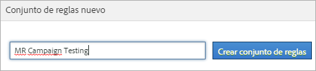
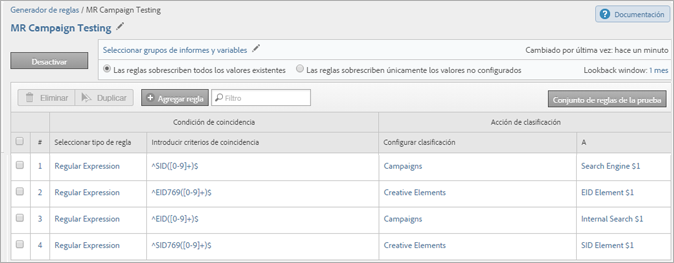

# Conjuntos de reglas de clasificación

Un conjunto de reglas es un grupo de reglas de clasificación para una variable específica. La variable se aplica al conjunto de reglas. Si se desea crear varios conjuntos de reglas para una variable, debe aplicarse cada uno de estos conjuntos a varios grupos de informes.

## Conjuntos de reglas de clasificación

Un conjunto de reglas es un grupo de reglas de clasificación para una variable específica. La variable se aplica al conjunto de reglas. Si se desea crear varios conjuntos de reglas para una variable, debe aplicarse cada uno de estos conjuntos a varios grupos de informes.

## Página Clasificación del Generador de reglas {#section_C60B0888C76D49C596EF19F11808B718}

**[!UICONTROL Analytics]** > **[!UICONTROL Administración]** > **[!UICONTROL Clasificación del Generador de reglas]**

Los campos y las opciones disponibles en el [!UICONTROL Clasificación del Generador de reglas] son los siguientes:

<table id="table_A5D92409969747E39E041216A5AA32CD"> 
 <thead> 
  <tr> 
   <th colname="col1" class="entry"> Elemento </th> 
   <th colname="col2" class="entry"> Descripción </th> 
  </tr> 
 </thead>
 <tbody> 
  <tr> 
   <td colname="col1"> 
<a href="/help/components/classifications/crb/classification-rule-set.md"  > Agregar conjunto de reglas</a> 
 </td> 
   <td colname="col2"> 
Crea un conjunto de reglas. 
 </td> 
  </tr> 
  <tr> 
   <td colname="col1"> 
Reglas 
 </td> 
   <td colname="col2"> Muestra el número de reglas que contiene el conjunto. </td> 
  </tr> 
  <tr> 
   <td colname="col1"> 
Estado 
 </td> 
   <td colname="col2"> Muestra el estado de actividad del conjunto de reglas (por ejemplo, Borrador o Activo). Las reglas activas se procesan a diario y los datos de clasificación suelen examinarse de forma mensual. Las reglas comprueban automáticamente la existencia de nuevos valores y cargan las clasificaciones. </td> 
  </tr> 
  <tr> 
   <td colname="col1"> 
Cambiado por última vez 
 </td> 
   <td colname="col2"> Indica cuándo se ha editado el conjunto de reglas. </td> 
  </tr> 
  <tr> 
   <td colname="col1"> 
Duplicar 
 </td> 
   <td colname="col2"> Duplica (copia) un conjunto de reglas para aplicarlo a otra variable o a la misma en otro grupo de informes. </td> 
  </tr> 
 </tbody> 
</table>

## Crear un conjunto de reglas de clasificación {#create-classification-rule-set}

Nombre el conjunto de reglas de clasificación, aplique la variable y especifique la configuración de sobrescritura.

1. (Requisito previo) Defina la estructura de clasificación en **[!UICONTROL Administración]** > **[!UICONTROL Grupos de informes]**.

   (Consulte [Clasificaciones](https://docs.adobe.com/content/help/es-ES/analytics/components/classifications/c-classifications.html) en la ayuda de las herramientas de administración, donde se trata la adición de clasificaciones).

   Las variables se mostrarán en el panel [!UICONTROL Nuevo conjunto de reglas] solo después de haber definido como mínimo una clasificación para la variable.

   El usuario puede crear clasificaciones en variables desde **[!UICONTROL Administradores]** > **[!UICONTROL Grupos de informes]** > **[!UICONTROL Tráfico]** > **[!UICONTROL Clasificaciones de tráfico]** (o **[!UICONTROL Conversión]** > **[!UICONTROL Clasificaciones de las conversiones]**). A continuación, debe seleccionar la variable y hacer clic en **[!UICONTROL Agregar clasificación]**.

1. Para crear el conjunto de reglas, haga clic en **[!UICONTROL Administración]** > **[!UICONTROL Clasificación del Generador de reglas]** > **[!UICONTROL Agregar conjunto de reglas]**.

   

1. Especifique un nombre para el conjunto de reglas y haga clic en **[!UICONTROL Crear conjunto de reglas]**.
1. Seleccione el conjunto de reglas para editar.

   

1. Haga clic en **[!UICONTROL Seleccionar grupos de informes y variables]**.

   El grupo de informes y la lista de variables se rellenarán con todas las variables disponibles clasificadas en todos los grupos de informes de la empresa de inicio de sesión. Cada variable única de un grupo de informes solo puede pertenecer a un conjunto de reglas.

   Consulte *`Variable`* en las definiciones de la página [Generador de reglas de clasificación](/help/components/classifications/crb/classification-rule-definitions.md) para obtener más información.
1. Especifique los grupos de informes y las variables que se usarán y luego haga clic en **[!UICONTROL Guardar]**.
1. Después, [agregue las reglas de clasificación](/help/components/classifications/crb/classification-rule-set.md) al conjunto de reglas.
