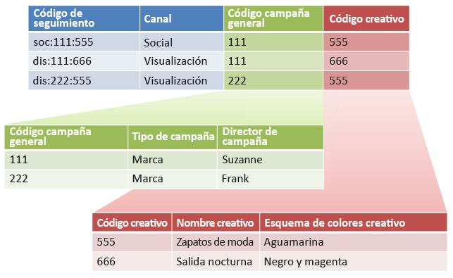

# Subclasificaciones y el generador de reglas (heredado)

{{classification-rulebuilder-deprecation}}

Puede combinar el Generador de reglas de clasificación con subclasificaciones si se asegura de que cada subclasificación tiene un valor principal.

Combinar el Generador de reglas de clasificaciones con subclasificaciones puede simplificar la administración de clasificaciones y reducir el número de reglas necesarias. Puede ser conveniente hacer esto si el código de seguimiento está formado por códigos que desea clasificar de forma independiente.

Consulte [Subclasificaciones](/help/components/classifications/importer/subclassifications.md) para obtener información conceptual sobre las subclasificaciones.

## Ejemplo

Supongamos que tenemos el siguiente código de seguimiento:

`channel:broad_campaign:creative`

Las jerarquías de clasificación permiten aplicar una clasificación a otra (llamada *`sub-classification`*). Es decir, puede usar el importador como si fuera una base de datos relacional con varias tablas. Una tabla asigna los códigos de seguimiento completos a claves y otra asigna esas claves a otras tablas.

Una vez preparada esta estructura, puede usar el [Generador de reglas de clasificaciones](/help/components/classifications/crb/classification-rule-builder.md) para cargar archivos pequeños que solo actualicen las tablas de búsqueda (las tablas verde y roja de la imagen anterior). A continuación, puede usar el Generador de reglas para mantener actualizada la tabla de la clasificación principal.

En la siguiente tarea, se describe cómo hacerlo.

## Configurar subclasificaciones mediante el Generador de reglas

Ejemplo paso por paso que describe cómo cargar subclasificaciones mediante el Generador de reglas.

1. Cree clasificaciones y subclasificaciones en el Administrador de clasificación.

   Ejemplo:

   

1. En el [Generador de reglas de clasificaciones](/help/components/classifications/crb/classification-rule-builder.md), clasifique la clave de subclasificación a partir del código de seguimiento original.

   Para hacerlo, se usa una expresión regular. En este ejemplo, la regla para rellenar *`Broad Campaign code`* utilizaría esta expresión regular:

   | `#` | Tipo de regla | Coincidencias | Configurar clasificación | Hasta |
   |---|---|---|---|---|
   |   | Expresión regular | `[^\:]:([^\:]):([^\:])` | código Campaña general | `$1` |
   |   | Expresión regular | `[^\:]:([^\:]):([^\:])` | código Creativo | `$2` |

   >[!NOTE]
   >
   >En este momento, no se rellenan las subclasificaciones *`Campaign Type`* ni *`Campaign Director`*.

1. Cargue un archivo de clasificación que incluya solamente las subclasificaciones especificadas.

   Consulte [Clasificaciones de varios niveles](/help/components/classifications/importer/subclassifications.md).

   Ejemplo:

   | Clave | Canal | código Campaña general | Campaña amplia, código&Hat;Tipo de campaña | Campaña amplia de código&Hat;Director de campaña | ... |
   |---|---|---|---|---|---|
   | &#42; |  | 111 | Marca | Suzanne |  |
   | &#42; |  | 222 | Marca | Frank |  |

1. Para realizar el mantenimiento de las tablas de búsqueda, cargue un archivo pequeño (como se muestra arriba).

   Por ejemplo, cargaría este archivo cuando se introdujera un nuevo *`Broad Campaign code`*. Este archivo se aplicaría a los valores clasificados previamente. Del mismo modo, si crea una nueva subclasificación (por ejemplo, *`Creative Theme`* como subclasificación de *`Creative code`*), solo cargará el archivo de subclasificación, en lugar de todo el archivo de clasificación.

   Por lo que respecta a los informes, estas subclasificaciones funcionan exactamente igual que las clasificaciones de nivel superior. De este modo, se reduce la carga administrativa necesaria para usarlas.
