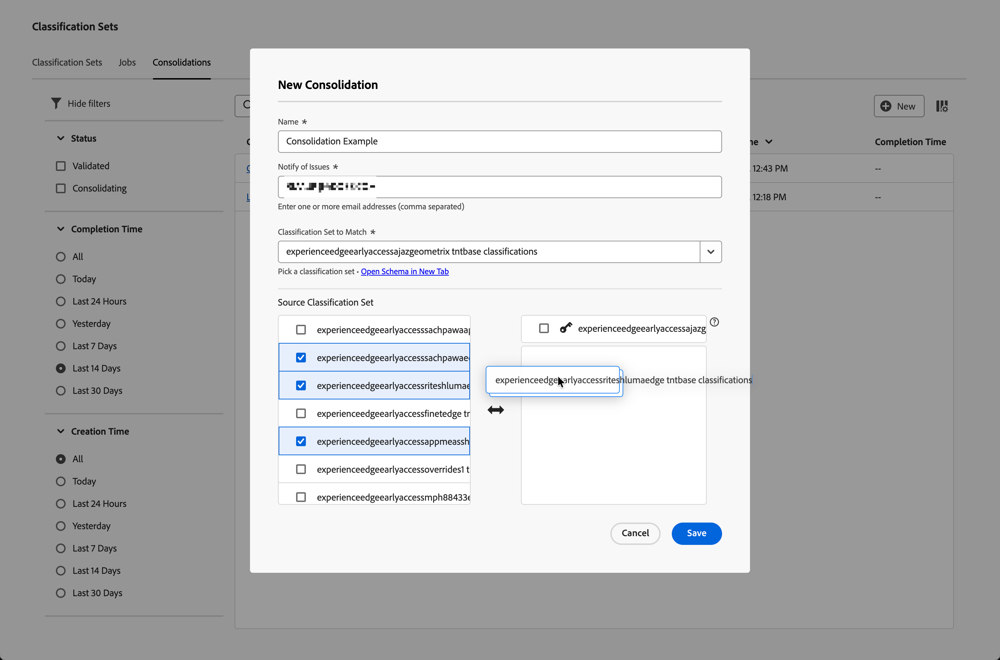

# Crear y editar consolidaciones de clasificación

La consolidación de conjuntos de clasificaciones permite tomar clasificaciones de varios conjuntos y combinarlas en uno solo. Utilice esta interfaz para crear una consolidación de juego de clasificaciones de principio a fin. Esta interfaz es muy valiosa para las organizaciones que pasan de clasificaciones heredadas a conjuntos de clasificaciones. Las organizaciones que utilizan conjuntos de clasificaciones ya no necesitan utilizar este flujo de trabajo de consolidación.

## Creación de una consolidación {#create-a-consolidation}

>[!CONTEXTUALHELP]
>id="classificationsets_consolidation_setpriority"
>title="Prioridad del conjunto de clasificaciones"
>abstract="La clave  *conjunto de clasificación* es el conjunto de clasificación base y define el esquema general y tiene prioridad en cualquier conflicto de combinación. Los demás conjuntos de clasificaciones se aplican en orden de arriba a abajo."

Para crear una consolidación de clasificación, en la interfaz principal de Adobe Analytics:

1. Seleccione **[!UICONTROL Conjuntos de clasificaciones]** en el menú **[!UICONTROL Componentes]**.
1. En el administrador de **[!UICONTROL Conjuntos de clasificaciones]**, seleccione la pestaña **[!UICONTROL Consolidaciones]**.
1. En el administrador de **[!UICONTROL Conjuntos de clasificaciones - Consolidaciones]**, seleccione  **[!UICONTROL Nuevo]**.
1. En el cuadro de diálogo **[!UICONTROL Nueva consolidación]**,

   
   1. Escriba un **[!UICONTROL Nombre]**. Por ejemplo: `Consolidation Example`.
   1. Escriba una **[!UICONTROL descripción (opcional)]**. Por ejemplo, `Example classification set`.
   1. Escriba una o más direcciones de correo electrónico (separadas por comas) en **[!UICONTROL Notificar problemas]**. Se envían notificaciones por correo electrónico a estos usuarios sobre problemas.
   1. Seleccione un conjunto de clasificaciones en el menú desplegable **[!UICONTROL Conjunto de clasificaciones que coincida]**.

      La lista **[!UICONTROL Source Classification Set]** que queda se rellena con conjuntos de clasificaciones similares a la lista de clasificaciones seleccionada y disponibles para la consolidación. La lista derecha se rellena automáticamente con el conjunto de clasificaciones  seleccionado. Ese conjunto base definió el esquema general y siempre tiene prioridad en cualquier conflicto de combinación.

   1. Seleccione los conjuntos de clasificación que desee consolidar en la lista izquierda y suelte los conjuntos seleccionados en la lista derecha debajo del  base **[!UICONTROL _clave_]** seleccionado.

      Los conjuntos de clasificaciones adicionales se consolidan en orden ascendente al ejecutar la consolidación. Si una clave existe en varios conjuntos adicionales, se toma el valor de la clave del conjunto de clasificación de clasificación superior. Si existe una clave tanto en el conjunto base  como en cualquier conjunto adicional, se utilizará el valor del conjunto base.

      Para administrar los valores de las claves que se utilizan, arrastre y suelte los conjuntos de clasificaciones individuales y seleccionados en la lista. También puede reemplazar la  **[!UICONTROL _conjunto de clasificación_]** con un conjunto de clasificación seleccionado arrastrando y soltando.

   1. Seleccione **[!UICONTROL Guardar]** para guardar la consolidación de clasificación. Seleccione **[!UICONTROL Cancelar]** para cancelar.

Una vez guardada, se valida automáticamente una consolidación de clasificación para la consolidación. Esta validación garantiza que cada conjunto de clasificaciones individual sea válido para esta consolidación. Una vez realizada la acción correctamente, la entrada en la lista de consolidación de clasificaciones muestra el estado **[!UICONTROL Validado]**.

Después de crear una consolidación, los pasos siguientes son:

* [Vuelva a validar](#re-validate) la consolidación de clasificación cuando haya realizado cambios en la configuración inicial.
* [Ejecutar](#run) la consolidación de clasificación.
* [Aprobar](#approve) la consolidación de clasificación.

<!--
         
  

**[!UICONTROL Components]** > **[!UICONTROL Classification sets]** > **[!UICONTROL Consolidations]** > **[!UICONTROL Add]**

The following fields are available when creating a consolidation:

* **[!UICONTROL Name]**: The name of the consolidation.
* **[!UICONTROL Notify of issues]**: A comma-delimited list of email addresses that are notified of issues with this consolidation.
* **[!UICONTROL Dataset to match]**: A drop-down list of all classification sets.

Once you select a classification set, a table with two columns appears:

* The right column contains all classification sets that you want to consolidate. It starts with the classification set selected using the above drop-down list.
* The left column contains all classification sets eligible to be merged with the originally selected dataset. **Schemas must exactly match to be eligible for consolidation**. If schemas do not match the selected classification set, they do not appear in this left column.

Drag the desired classification sets from the available column on the left to the consolidation column on the right. Once the consolidation is given a name and two or more classification sets are in the right column, click **[!UICONTROL Save & Continue]**.

-->

## Edición de una consolidación

Para editar una consolidación de clasificación, en la interfaz principal de Adobe Analytics:

1. Seleccione **[!UICONTROL Conjuntos de clasificaciones]** en el menú **[!UICONTROL Componentes]**.
1. En el administrador de **[!UICONTROL Conjuntos de clasificaciones]**, seleccione la pestaña **[!UICONTROL Consolidaciones]**.
1. En el administrador de **[!UICONTROL consolidaciones de conjuntos de clasificaciones]**:
   1. Seleccione el nombre de la consolidación de clasificación. Aparecerá el cuadro de diálogo **[!UICONTROL Consolidación: _nombre de consolidación de clasificación_]**. El aspecto y las acciones disponibles dependen del estado actual de la consolidación y de si todavía tiene la opción de modificar la consolidación de clasificación.

      | Acciones disponibles | Descripción |
      |---|---|
      |  **[!UICONTROL Cancelar]** | [Cancelar la consolidación](#cancel). |
      |  **[!UICONTROL Volver A Validar]** | [Volver a validar la consolidación](#re-validate). |
      |  **[!UICONTROL Ejecutar]** | [Ejecute la consolidación](#run). |
      |  **[!UICONTROL Aprobar]** | [Aprobar la consolidación](#approve). |

### Volver a validar

Puede volver a validar una consolidación de clasificación en el cuadro de diálogo Consolidación: consolidación de clasificación. Una  puede proporcionar información adicional sobre los problemas con la consolidación que requieran volver a configurar la consolidación.

Para volver a validar la consolidación de clasificación:

1. Vuelva a configurar la consolidación con la misma interfaz de arrastrar y soltar que utilizó para crearla.
1. Seleccione  **[!UICONTROL Volver A Validar]**. La validación garantiza que cada conjunto de clasificaciones individual sea válido para esta consolidación. Si se realiza correctamente, se muestra un mensaje de notificación:  **[!UICONTROL La consolidación se envió correctamente para su validación.]**
1. Seleccione  para cerrar el cuadro de diálogo. O bien, selecciona  **[!UICONTROL Ejecutar]** para ejecutar la consolidación o  **[!UICONTROL Cancelar]** para cancelar la clasificación.

<!--
Once you have created a consolidation, a list of source datasets appears on the right. The **[!UICONTROL Validate]** button makes sure that each individual classification set is valid for this consolidation. You can reorder the classification steps here to determine priority in cases of mismatched classification values. **The highest classification set in the list overwrites any mismatched values in other classification sets.**

-->

### Ejecutar

Una vez validada correctamente una consolidación de clasificación, puede ejecutarla.

Para ejecutar una consolidación de clasificación:

1. Seleccione  **[!UICONTROL Ejecutar]**. Un mensaje de notificación emergente muestra  **[!UICONTROL La consolidación se envió correctamente para su procesamiento.]**
1. Seleccione  para cerrar el cuadro de diálogo.

### Aprobar {#approve}

>[!CONTEXTUALHELP]
>id="classificationsets_consolidations_mismatch"
>title="Desajuste"
>abstract="El porcentaje de clave no coincide cuando el valor del conjunto de clasificación consolidado no coincide con el conjunto de clasificación de origen."

>[!CONTEXTUALHELP]
>id="classificationsets_consolidations_absent"
>title="Ausente"
>abstract="Porcentaje de claves en el conjunto de clasificaciones consolidado, pero no en el conjunto de clasificaciones de origen."

Una vez que se ha ejecutado correctamente una consolidación de clasificación, el estado de la consolidación es  **[!UICONTROL Esperando aprobación]**. La aprobación de una consolidación de clasificación reemplaza los conjuntos de clasificaciones individuales por el conjunto de clasificaciones consolidado y se eliminan los conjuntos de clasificaciones individuales.

Para aprobar una consolidación de juego de clasificaciones:

1. Use el informe **[!UICONTROL Informes de similitud]** para revisar la consolidación. Este informe muestra una tabla con las siguientes columnas:

   * **[!UICONTROL Nombre del conjunto de clasificaciones]**: El nombre del conjunto de clasificaciones.
   * **[!UICONTROL Discordancia]**: Porcentaje de filas donde los valores clave no coinciden con el conjunto de clasificación de origen. Si el porcentaje de discrepancia es alto, la discrepancia puede ser una indicación de que los datos de clasificación son demasiado diferentes. Compruebe y asegúrese de que los conjuntos de clasificaciones seleccionados tienen datos de clasificación similares.
   * **[!UICONTROL Ausente]**: Porcentaje de filas donde los valores clave están en el conjunto de clasificación  pero no en el conjunto de clasificación de origen. Todas las filas ausentes se añaden al conjunto de clasificaciones consolidadas.

1. Si la consolidación de clasificación está lista para su aprobación, seleccione  **[!UICONTROL Aprobar]**. ¿Desea Aprobar La Consolidación De **[!UICONTROL ?El cuadro de diálogo]** solicita confirmación. Seleccione **[!UICONTROL Aprobar]** para aprobar la consolidación. Seleccione **[!UICONTROL Cancelar]** para cancelar.

Una vez aprobado, se crea el conjunto de clasificaciones consolidado. El estado se ha establecido en **[!UICONTROL Completo]**.

### Cancelar

Puede cancelar una consolidación de clasificación antes de la aprobación.

Para cancelar una consolidación de clasificación:

1. Seleccione **[!UICONTROL Cancelar]**.

   Una vez cancelada la consolidación, no podrá reanudarla.
1. Seleccione **[!UICONTROL Cancelar consolidación]** para cancelar la consolidación. Seleccione **[!UICONTROL Volver]** para revertir la cancelación.
