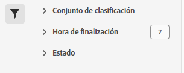

# Administrador de trabajos de conjuntos de clasificación

El Administrador de trabajos de conjuntos de clasificaciones permite ver los trabajos de clasificación actuales y completados que se generaron a partir de conjuntos de clasificaciones. También puede utilizar esta interfaz para descargar datos de clasificación o plantillas para un trabajo en particular, o cargar datos adicionales en un trabajo.

**[!UICONTROL Componentes]** > **[!UICONTROL Conjuntos de clasificaciones]** > **[!UICONTROL Trabajos]**

No puede crear trabajos desde esta interfaz. Cree trabajos cargando datos en un conjunto de clasificaciones (manualmente o a través de una ubicación externa configurada), solicitando un archivo de descarga o solicitando un archivo de plantilla.

## Filtrar conjuntos de clasificaciones

La parte izquierda del Administrador de trabajos de conjuntos de clasificaciones proporciona una configuración de filtro para localizar el trabajo deseado. Al hacer clic en el icono de filtro, se alterna la visibilidad de la configuración del filtro. Puede filtrar los conjuntos de clasificaciones por **[!UICONTROL Conjunto de clasificaciones]**, **[!UICONTROL Hora de finalización]**, **[!UICONTROL Estado]**, **[!UICONTROL Tipo de trabajo]** o **[!UICONTROL Source]**.

Hay opciones de filtro adicionales disponibles encima de las columnas del administrador de trabajos del conjunto de clasificaciones:

* **[!UICONTROL Buscar por título]**: buscar trabajos por nombre de archivo.
* **[!UICONTROL Cargar más]**: el administrador de trabajos del conjunto de clasificaciones muestra inicialmente hasta 1000 trabajos. Si hay más trabajos, haga clic en este botón para cargar 1000 trabajos más.
* **Mostrar/ocultar columnas**: alternar visibilidad para cualquier columna aparte de [!UICONTROL Nombre de archivo] y [!UICONTROL Hora de finalización].

## Columnas del administrador de trabajos del conjunto de clasificaciones

Las siguientes columnas están disponibles en el administrador de trabajos del conjunto de clasificaciones:

* **[!UICONTROL Nombre de archivo]**: Nombre del archivo de carga o descarga.
* **[!UICONTROL Conjunto de clasificaciones]**: El nombre del conjunto de clasificaciones al que se aplica el archivo. Puede hacer clic en el nombre del conjunto de clasificaciones para llegar a [Configuración](manage/settings.md) del conjunto de clasificaciones.
* **[!UICONTROL Tamaño]**: El tamaño del archivo.
* **[!UICONTROL Estado]**: estado del trabajo que procesa el archivo.
   * **[!UICONTROL Creado]**: se envió el trabajo.
   * **[!UICONTROL En cola]**: el archivo está listo para procesarse y está esperando a que un servidor de clasificación procese el archivo.
   * **[!UICONTROL Validado]**: el archivo es válido y está a la espera de ser procesado.
   * **[!UICONTROL Error de validación]**: el formato del archivo es incorrecto o no es válido. El archivo no se procesa.
   * **[!UICONTROL Procesamiento]**: Adobe está procesando activamente el archivo.
   * **[!UICONTROL Error de procesamiento]**: error en el procesamiento del archivo.
   * **[!UICONTROL Completar]**: el procesamiento ha finalizado. Los datos de clasificación se pueden ver en los informes.
   * **[!UICONTROL Error]**: error genérico no relacionado con la validación o el procesamiento.
* **[!UICONTROL Tipo de trabajo]**: El tipo de trabajo.
* **[!UICONTROL Source]**: El origen del trabajo.
* **[!UICONTROL Descarga de archivos]**: solo se aplica a los trabajos de descarga, como descargar datos de clasificación o descargar plantillas. Cuando una descarga está lista, esta columna proporciona un vínculo de descarga.
* **[!UICONTROL Líneas modificadas]**: El número de líneas modificadas.
* **[!UICONTROL Líneas completadas]**: El número de líneas completadas.
* **[!UICONTROL Hora de finalización]**: la fecha y hora en que se completó el trabajo (o falló).
