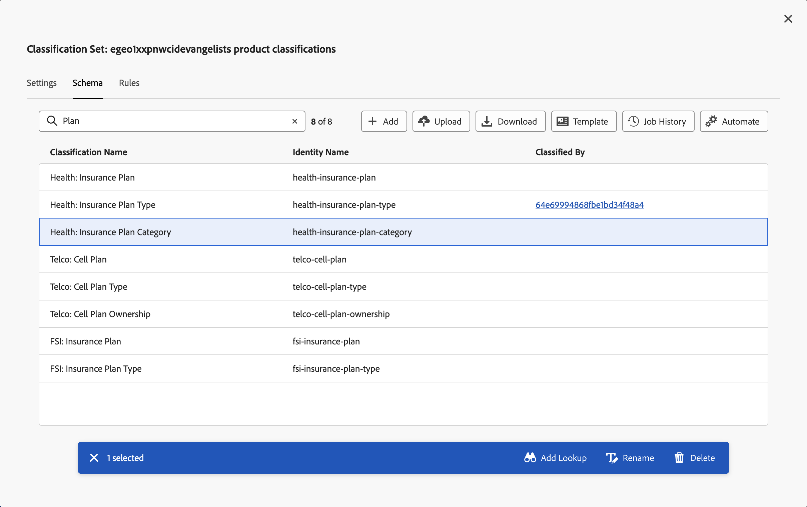
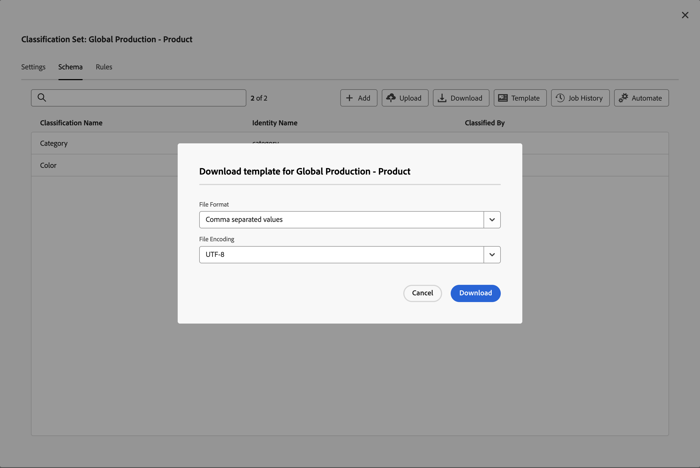
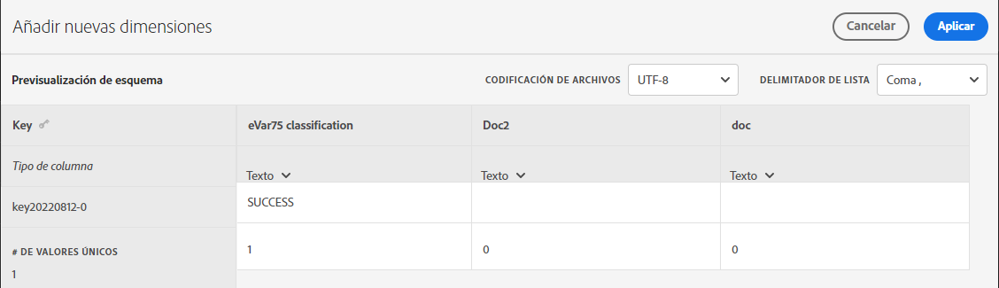
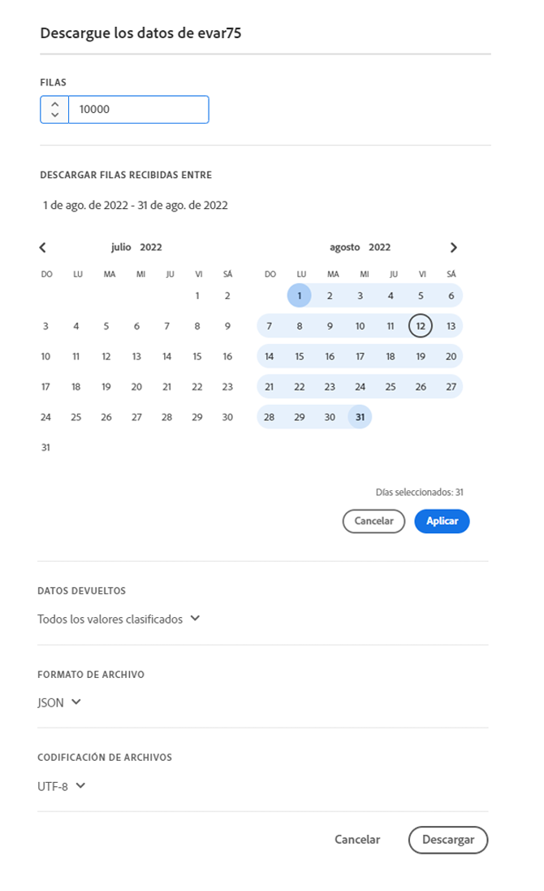
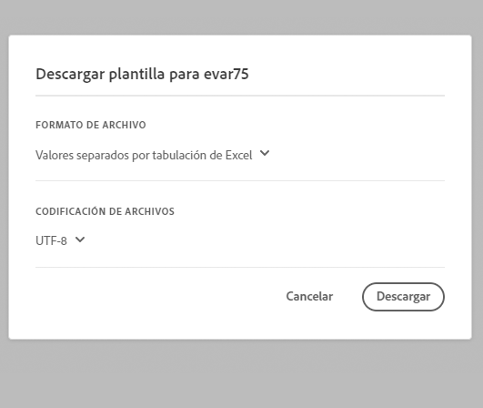

# Esquema del conjunto de clasificación

El esquema es la lista de clasificaciones que desea aplicar a las dimensiones clave definidas para el conjunto de clasificaciones. Por ejemplo, si ha definido el producto como la dimensión clave y este campo contiene un SKU de producto, utilice el esquema para agregar clasificaciones como el nombre del producto, el color del producto, el tamaño del producto, etc.

Para editar el esquema de un conjunto de clasificaciones:

1. Seleccione **[!UICONTROL Componentes]** en la barra de menús superior de Adobe Analytics y, a continuación, seleccione **[!UICONTROL Conjuntos de clasificaciones]**.
1. En **[!UICONTROL Conjuntos de clasificaciones]**, seleccione la pestaña **[!UICONTROL Conjuntos de clasificaciones]**.
1. En el administrador **[!UICONTROL Conjuntos de clasificaciones]**, seleccione el conjunto de clasificaciones para el que desea editar el esquema.
1. En el cuadro de diálogo **[!UICONTROL Conjunto de clasificaciones: _nombre del conjunto de clasificaciones_]**, seleccione la pestaña **[!UICONTROL Esquema]**. Esa pestaña consta de los siguientes elementos de interfaz:

   

   * [Lista de clasificación](#classification-list)
   * [Buscar](#search)
   * [Acciones](#actions)
   * [Barra de acciones](#action-bar)

## Lista de clasificación

La lista de clasificaciones contiene las siguientes columnas:

| Columna | Descripción |
|---|---|
| **[!UICONTROL Nombre de clasificación]** | El nombre proporcionado para la clasificación. |
| **[!UICONTROL Nombre de identidad]** | El nombre derivado por el sistema para la clasificación. Es un valor de solo lectura y puede utilizar el nombre de identidad |
| **[!UICONTROL Clasificado Por]** | Si se utiliza, un vínculo al conjunto de clasificaciones de búsqueda que se utiliza para clasificar esta clasificación. |

## Buscar

Puede buscar rápidamente  una o más clasificaciones. Use  para borrar la búsqueda.

## Acciones

Las siguientes acciones están disponibles como botones en la parte superior de la lista de clasificaciones:

| Icono | Acción | Descripción |
|---|---|---|
|  | **[!UICONTROL Agregue]** | [Agregar una clasificación](#add) a la lista. |
|  | **[!UICONTROL Cargar]** | [Cargar un archivo JSON, CSV, TSV o TAB](#upload). |
|  | **[!UICONTROL Descargar]** | [Descargar datos de clasificación](#download). |
|  | **[!UICONTROL Plantilla]** | [Descargar una plantilla](#template) para los datos de clasificación. |
|  | **[!UICONTROL Historial de trabajos]** | Mostrar el [administrador de trabajos del conjunto de clasificaciones](/help/components/classifications/sets/job-manager.md), filtrado para el conjunto de clasificaciones seleccionado. |
|  | **[!UICONTROL Automatizar]** | [Automatice la ingesta de datos de clasificación](#automate) mediante el uso de una ubicación en la nube. |

### Agregar

Para agregar una nueva clasificación, seleccione  **[!UICONTROL Agregar]**.

En el cuadro de diálogo **[!UICONTROL Agregar una nueva clasificación para _nombre del conjunto de clasificaciones_]**, escriba el **[!UICONTROL Nombre de clasificación]**&#x200B;y seleccione **[!UICONTROL Agregar]**. La clasificación se añade a la lista.

### Cargar

Para importar datos de clasificación en el esquema para una clasificación, seleccione  **[!UICONTROL Upload]**.

1. En el diálogo **[!UICONTROL Agregar nuevas clasificaciones]**:

   * Arrastre un archivo que contenga datos de clasificación y suéltelo en **[!UICONTROL Arrastre y suelte aquí]**.
   * Seleccione **[!UICONTROL Examinar]** y elija un archivo de su equipo o red.

   Verá una **[!UICONTROL vista previa de esquema]** del contenido del archivo. La vista previa muestra las columnas de datos del archivo. Para cambiar el tamaño de una columna, seleccione  y seleccione **[!UICONTROL Cambiar tamaño de columna]**. Aparece un controlador que le permite cambiar el tamaño de la columna.

   Cuando no se define ninguna clasificación en el conjunto de clasificaciones de una columna, se muestra una alerta . La alerta explica que una clasificación no está presente en el conjunto de esquemas de clasificación existente y se creará en la importación.

1. ¿Desea seleccionar **[!UICONTROL Sobrescribir datos en caso de conflicto?]** si desea sobrescribir los datos de clasificación actuales con los nuevos datos importados. Por ejemplo:

   | | Clave | Color del producto actual | Importar archivo | Nuevo color de producto |
   |---|---|---|---|---|
   |  **[!UICONTROL Sobrescribir datos en caso de conflicto?]** | 1234 | verde | azul | azul |
   |  **[!UICONTROL Sobrescribir datos en caso de conflicto?]** | 1234 | verde | azul | verde |

1. Seleccione **[!UICONTROL Aplicar]**. Se muestra una alerta si las columnas no están presentes como clasificaciones en el conjunto de esquemas existente. Estas columnas se añaden como nuevas clasificaciones al confirmar la carga.

   

   Seleccione **[!UICONTROL Confirmar carga]** para confirmar la carga. Seleccione **[!UICONTROL Cancelar carga]** para cancelar la carga.

### Descargar

Para descargar los datos de clasificación, selecciona  **[!UICONTROL Descargar]**.

En el cuadro de diálogo **[!UICONTROL Descargar datos para _nombre del conjunto de clasificaciones_]**:

1. Escriba el número de **[!UICONTROL filas]** que desea descargar. Por ejemplo: `10000`.
1. Para seleccionar el período para el que desea descargar filas de datos de clasificación, escriba los datos de inicio y fin de **[!UICONTROL Descargar filas recibidas entre]**. O use  para usar una ventana emergente de calendario y seleccionar el período.
1. Para seleccionar los datos que se van a devolver, seleccione una opción de **[!UICONTROL Datos devueltos]**.

   * **[!UICONTROL Todos los valores]** devuelve todos los valores de los datos de clasificación actuales.
   * **[!UICONTROL Cualquier columna vacía]** devuelve una columna con valores clave para los datos de clasificación existentes. Y columnas sin valor para datos de clasificación para las que no existen valores.
   * **[!UICONTROL Todas las columnas vacías]** devuelve una columna clave con valores para los datos de clasificación existentes. Y columnas sin valor para los datos de clasificación.
1. Para seleccionar el [formato de archivo](/help/components/classifications/sets/data-files.md#general-file-requirements) de los datos de clasificación descargados, seleccione una opción en el menú desplegable **[!UICONTROL Formato de archivo]**. Las opciones son:

   * **[!UICONTROL JSON]**.
   * **[!UICONTROL Valores separados por comas]** (CSV).
   * **[!UICONTROL Valores separados por tabulaciones de Excel]** (TSV o TAB).

1. Para seleccionar la [codificación de archivo](/help/components/classifications/sets/data-files.md#general-file-requirements) para cuando se descargue el archivo, seleccione una opción en el menú desplegable Codificación de archivo. Las opciones son:

   * **[!UICONTROL UTF-8]**.
   * **[!UICONTROL Latin-1]**.

1. Seleccione **[!UICONTROL Descargar]** para descargar los datos de clasificación. Puede encontrar el archivo descargado en el directorio de descarga predeterminado del explorador, con el título <code><i>Conjunto de clasificaciones</i>.<i>json</i>|<i>csv</i>|<i>tsv</i></code>. Si el archivo ya existe, un número de secuencia <code>(<i>x</i>)</code> se agrega al nombre de archivo. Si ha especificado opciones que no devuelven ningún dato, verá un cuadro de diálogo **[!UICONTROL Aviso]** para informarle de que debe cambiar las opciones de intervalo de fechas y de los datos devueltos.

### Plantilla

Para descargar una plantilla para datos de clasificación, seleccione  **[!UICONTROL Template]**.

En el cuadro de diálogo **[!UICONTROL Descargar plantilla para _nombre del conjunto de clasificaciones_]**:

1. Para seleccionar el [formato de archivo](/help/components/classifications/sets/data-files.md#general-file-requirements) de los datos de clasificación descargados, seleccione una opción en el menú desplegable **[!UICONTROL Formato de archivo]**. Las opciones son:

   * **[!UICONTROL Valores separados por comas]**.
   * **[!UICONTROL Valores separados por tabulaciones de Excel]**.

1. Para seleccionar la [codificación de archivo](/help/components/classifications/sets/data-files.md#general-file-requirements) para cuando se descargue el archivo, seleccione una opción en el menú desplegable Codificación de archivo. Las opciones son:

   * **[!UICONTROL UTF-8]**.
   * **[!UICONTROL Latin-1]**.

1. Seleccione **[!UICONTROL Descargar]** para descargar la plantilla de datos de clasificación. Puede encontrar el archivo descargado en el directorio de descarga predeterminado del explorador y se titula <code><i>Conjunto de clasificaciones</i>.<i>csv</i>|<i>tsv</i></code>. Si el archivo ya existe, un número de secuencia <code>(<i>x</i>)</code> se agrega al nombre de archivo.

### Automatizar {#automate}

>[!CONTEXTUALHELP]
>id="classificationsets_schema_automate_locationaccount"
>title="Cuenta de ubicación"
>abstract="Lista de cuentas de ubicación de tipos de cuenta que admiten la importación de datos de clasificación. Seleccione **[!UICONTROL Nueva cuenta]** para crear una nueva cuenta de ubicación."
>additional-url="https://experienceleague.adobe.com/docs/analytics/components/locations/configure-import-accounts.html?lang=en" text="Configuración de cuentas de importación y exportación de nube"

>[!CONTEXTUALHELP]
>id="classificationsets_schema_automate_location"
>title="Ubicación"
>abstract="Lista de ubicaciones en la cuenta de ubicación seleccionada que admiten la importación de datos de clasificación. Seleccione **[!UICONTROL Nueva ubicación]** para crear una nueva ubicación."
>additional-url="https://experienceleague.adobe.com/docs/analytics/components/locations/configure-import-locations.html?lang=en" text="Configurar ubicaciones de importación y exportación de la nube"

Para automatizar la ingesta de clasificación, seleccione  **[!UICONTROL Automatizar]**.

En el cuadro de diálogo **[!UICONTROL Asociar/actualizar ubicación de ingesta para _nombre del conjunto de clasificaciones_]**:

1. Para seleccionar una ubicación de nube, selecciona una opción de **[!UICONTROL Cuenta de ubicación]**. Solo se muestran [cuentas de ubicación de tipos de cuenta compatibles que permiten importar datos de clasificación](https://experienceleague.adobe.com/es/docs/analytics/components/locations/configure-import-accounts). Para crear una nueva cuenta, seleccione **[!UICONTROL Nueva cuenta]**.
1. Para seleccionar una ubicación, seleccione una opción de **[!UICONTROL Ubicación]**. Solo se muestran las ubicaciones de los tipos de cuenta seleccionados para la importación de datos de clasificación. Para crear una nueva ubicación, selecciona **[!UICONTROL Nueva ubicación]**.

   >[!IMPORTANT]
   >
   >La ubicación que crees o selecciones debe contener un **[!UICONTROL Prefijo]** (carpeta) dentro del **[!UICONTROL Bucket]** para hospedar los archivos de datos de clasificación. Por ejemplo, una carpeta denominada `files`. El alojamiento de archivos en la raíz de un bloque no funciona con la mayoría de las ubicaciones de la nube.
   >

1. Para seleccionar un delimitador, seleccione una opción en el menú desplegable **[!UICONTROL Delimitador de lista]**. Las opciones son:
   * **[!UICONTROL Coma,]**
   * **[!UICONTROL Punto y coma ;]**
   * **[!UICONTROL Dos puntos :]**
   * **[!UICONTROL Barra vertical |]**
   * **[!UICONTROL Espacio]**
   * **[!UICONTROL Ficha]**
1. Para seleccionar la [codificación de archivo](/help/components/classifications/sets/data-files.md#general-file-requirements) cuando se descargue el archivo, seleccione una opción en el menú desplegable **[!UICONTROL Codificación de archivo]**. Las opciones son:

   * **[!UICONTROL UTF-8]**.
   * **[!UICONTROL Latin-1]**.

1. Para notificar a los usuarios la finalización de los trabajos de ingesta, escriba las direcciones de correo electrónico, separadas por comas, de **[!UICONTROL Correo electrónico para notificar cuando se completen los trabajos de ingesta (separados por comas)]**.
1. Seleccione **[!UICONTROL Validar]**. Se valida la conexión con la ubicación de nube.
1. Si la validación se realiza correctamente, verá un mensaje de mensaje que muestra  **[!UICONTROL Validación de ubicación correcta. Conexión al almacenamiento en la nube verificada.]** Seleccione&#x200B;**[!UICONTROL &#x200B; Guardar &#x200B;]**&#x200B;si ha creado la conexión con la conexión en la nube. De lo contrario, seleccione&#x200B;**[!UICONTROL &#x200B; Actualizar &#x200B;]**. O bien, seleccione&#x200B;**[!UICONTROL &#x200B; Cancelar &#x200B;]**&#x200B;para cancelar la configuración de la ubicación de la nube.

Cuando carga archivos en la ubicación de la nube, en un plazo de 15 minutos, el archivo se detecta y se envía como un trabajo de importación. El resultado de ese trabajo de importación se recoge en el [Administrador de trabajos de clasificaciones](/help/components/classifications/sets/job-manager.md). Si se le agrega a la lista de usuarios a los que notificar la finalización de los trabajos de ingesta, también recibirá mensajes de correo electrónico.

Por ejemplo:

{width="400"}

## Barra de acciones

La barra de acciones muestra las acciones disponibles para la clasificación seleccionada. Entre las opciones disponibles se encuentran:

| Icono | Acción | Descripción |
|---|---|---|
|  | **[!UICONTROL Agregar búsqueda]** | Agregue un conjunto de clasificaciones como búsqueda (subclasificación). En la tabla **[!UICONTROL Adjuntar búsqueda]**: <ol><li>Seleccione una clasificación de búsqueda en el menú desplegable **[!UICONTROL Nombre de clasificación]**.</li><li>Seleccione **[!UICONTROL Añadir]**.</li></ol>La clasificación de búsqueda se agrega a la clasificación y se enumera en la columna **[!UICONTROL Clasificado por]** mediante el identificador interno. |
|  | **[!UICONTROL Quitar búsqueda]** | Elimine un conjunto de clasificaciones como una búsqueda. Para eliminar la búsqueda permanentemente de la clasificación, en el cuadro de diálogo de confirmación **[!UICONTROL Quitar _conjunto de clasificación_ de _clasificación_]**, seleccione **[!UICONTROL Eliminar]**. |
|  | **[!UICONTROL Cambiar el nombre]** | Cambie el nombre de **[!UICONTROL Nombre de clasificación]** de una clasificación. En el cuadro de diálogo **[!UICONTROL Cambiar nombre: _nombre de clasificación_]**, escriba un nombre nuevo y seleccione **[!UICONTROL Cambiar nombre]**. |
|  | **[!UICONTROL Eliminar]** | Eliminar una clasificación. Aparecerá el cuadro de diálogo **[!UICONTROL Eliminar _nombre de clasificación_]**. Seleccione **[!UICONTROL Eliminar]**&#x200B;para eliminar la clasificación. |

<!--

View currently configured classification dimensions for this classification set.

**[!UICONTROL Components]** > **[!UICONTROL Classification sets]** > **[!UICONTROL Sets]** > Click the desired classification set name > **[!UICONTROL Schema]**

The following buttons are available:

* **[!UICONTROL Upload]**: Manually upload classification data for a classification dimensions. `JSON`, `CSV`, `TSV`, and `TAB` files are supported. Uploading a valid file shows a table preview of data to classify.
  * **[!UICONTROL File encoding]**: Select the correct file encoding using this drop-down. Valid options include [!UICONTROL UTF-8] and [!UICONTROL Latin1].
  * **[!UICONTROL List delimiter]**: Select the correct list delimiter. If using a downloaded file or template file, make sure that the [!UICONTROL List delimiter] here matches the [!UICONTROL List delimiter] when the file was downloaded.
  * **[!UICONTROL Apply]**: Save the uploaded classification data to the classification set.

  

* **[!UICONTROL Download]**: Download key values and their classification columns.
  * **[!UICONTROL Rows]**: The maximum number of rows to include in the download file.
  * **[!UICONTROL Download rows received between]**: A calendar date picker that allows you to filter key values by when they appear in reporting. If a key value was not collected in this date range, it does not appear in the downloaded file.
  * **[!UICONTROL Data returned]**: A drop-down list that lets you filter key values included in the downloaded file based on their associated classification data.
    * **[!UICONTROL All classified values]**: Includes rows where classification data is included in at least one column.
    * **[!UICONTROL All unclassified values]**: Includes rows where classification data is missing in at least one column.
  * **[!UICONTROL File format]**: A drop-down list that determines the file format that the download file is in. Options include [!UICONTROL JSON], [!UICONTROL Comma separated values], and [!UICONTROL Excel tab separated values].
  * **[!UICONTROL File encoding]**: A drop-down list that determines the file encoding. Options include [!UICONTROL UTF-8] and [!UICONTROL Latin1]. UTF-8 is recommended.

  

* **[!UICONTROL Template]**: Download a template file. This file is similar to the [!UICONTROL Download] button, except it does not contain any classification data or key values.
  * **[!UICONTROL File format]**: A drop-down list that determines the file format that the template file is in. Options include [!UICONTROL Comma separated values], and [!UICONTROL Excel tab separated values].
  * **[!UICONTROL File encoding]**: A drop-down list that determines the file encoding. Options include [!UICONTROL UTF-8] and [!UICONTROL Latin1]. UTF-8 is recommended.
  * **[!UICONTROL List delimiters]**: A drop-down list that determines the list delimiter separating classification columns on each row.

  

* **[!UICONTROL Job history]**: A shortcut link that takes you to the [Job manager](../job-manager.md), showing jobs only for this classification set.
* **[!UICONTROL Automate]**: Automatically ingest data from external storage locations.
  * **[!UICONTROL Location account]**: A drop-down list showing existing location accounts that your organization has configured. If your organization hasn't already configured a location account, you can configure one by selecting [!UICONTROL **Create a new account**].
    
    For information about configuring the location account, see [Configure cloud import and export accounts](/help/components/locations/configure-import-accounts.md).

  * **[!UICONTROL Location]**: A drop-down list showing existing locations that your organization has configured. If your organization hasn't already configured a location, you can configure one by selecting [!UICONTROL **Create a new location**]. 

    For information about configuring a location, see [Configure cloud import and export locations](/help/components/locations/configure-import-locations.md). 

  * **[!UICONTROL Delimiter]**: The column delimiter for uploaded files. Options include [!UICONTROL Comma], [!UICONTROL Semicolon], [!UICONTROL Colon], [!UICONTROL Vertical bar], [!UICONTROL Space], [!UICONTROL Forward slash], [!UICONTROL Backward slash], [!UICONTROL Dash], or [!UICONTROL Underscore].

  * **[!UICONTROL Encoding]**: A drop-down list that determines the file encoding. Options include [!UICONTROL UTF-8] and [!UICONTROL Latin1]. UTF-8 is recommended.

The following actions are available only after selecting a classification.

* **Add lookup**: A lookup table is a classification of a classification. It is metadata about a classification value, rather than the variable itself. For example, the Product variable might have a classification of "color code". A lookup table of "color name" might be attached to "color code" to explain what the colors are.

  

* **Rename**: Lets you rename the classification.

* **Delete**: Lets you delete the classification.
-->