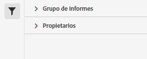

# Administrador de conjuntos de clasificación

El Administrador de conjuntos de clasificaciones permite crear, editar o eliminar conjuntos de clasificaciones.

**[!UICONTROL Componentes]** > **[!UICONTROL Conjuntos de clasificaciones]** > **[!UICONTROL Conjuntos]**

Los conjuntos de clasificaciones constan de **Suscripciones** (grupos de informes y combinaciones de dimensiones) y **Nombres de clasificación** (dimensiones que contienen datos de clasificación). Las suscripciones se configuran en [Settings](settings.md), mientras que los nombres de clasificación se configuran en [Schema](schema.md).

## Filtrar conjuntos de clasificaciones

La parte izquierda del Administrador de conjuntos de clasificaciones proporciona una configuración de filtro para localizar el conjunto de clasificaciones deseado. Al hacer clic en el icono de filtro, se alterna la visibilidad de la configuración del filtro. Puede filtrar conjuntos de clasificaciones por **[!UICONTROL Etiquetas]** o **[!UICONTROL Grupo de informes]**.

Tenga en cuenta que se precargan 1000 conjuntos de clasificaciones a la vez. Los filtros que se muestran en el carril izquierdo reflejan las opciones de los conjuntos precargados.

## Columnas del Administrador de conjuntos de clasificaciones

Las siguientes columnas están disponibles en el Administrador de conjuntos de clasificaciones:

* **[!UICONTROL Conjunto de clasificaciones]**: El nombre del conjunto de clasificaciones. Al hacer clic en el nombre de un conjunto de clasificaciones, se edita su [configuración](settings.md).
* **[!UICONTROL Suscripciones]**: El número de suscripciones a las que se aplica este conjunto de clasificación.
* **[!UICONTROL Clasificaciones]**: El número de dimensiones de clasificación que contiene el conjunto de clasificaciones.
* **[!UICONTROL Automatizado]**: Determina si el conjunto de clasificaciones está configurado para importar datos automáticamente desde una ubicación de la nube. La automatización se puede configurar en el [esquema](schema.md) del conjunto de clasificaciones.
* **[!UICONTROL Última modificación]**: La fecha y la hora de la última modificación del conjunto de clasificaciones.

## Crear o editar opciones

Los siguientes botones están disponibles en el Administrador de conjuntos de clasificaciones:

* **[!UICONTROL Agregar]**: [Crear](create.md) un conjunto de clasificaciones.
* **[!UICONTROL Buscar por título]**: busque conjuntos de clasificaciones por nombre.
* **[!UICONTROL Cargar más]**: el administrador de conjuntos de clasificaciones muestra inicialmente hasta 1000 conjuntos de clasificaciones. Este botón carga 1000 conjuntos de clasificaciones más.
* **Mostrar/ocultar columnas**: alternar visibilidad para cualquier columna aparte de [!UICONTROL Conjunto de clasificaciones].

Para seleccionar uno o varios conjuntos de clasificaciones, haga clic en la casilla que hay junto al conjunto de clasificaciones deseado. Al seleccionar un conjunto de clasificaciones, se muestran las siguientes opciones:

* **[!UICONTROL Etiqueta]**: agregue una o más etiquetas a los conjuntos de clasificaciones seleccionados, lo que le permite organizar o agrupar conjuntos de clasificaciones para que sean más fáciles de localizar en el futuro.
* **[!UICONTROL Eliminar]**: elimina el conjunto de clasificaciones. Las dimensiones de clasificación basadas en este conjunto de clasificaciones ya no están disponibles. Los proyectos programados que utilicen el conjunto de clasificaciones eliminado seguirán utilizando dimensiones dependientes hasta que vuelva a guardar el proyecto programado.
* **[!UICONTROL Consolidar]**: Inicie una nueva [consolidación](../consolidations/process.md).
* **[!UICONTROL Cambiar nombre]**: cambie el nombre del conjunto de clasificaciones seleccionado.
