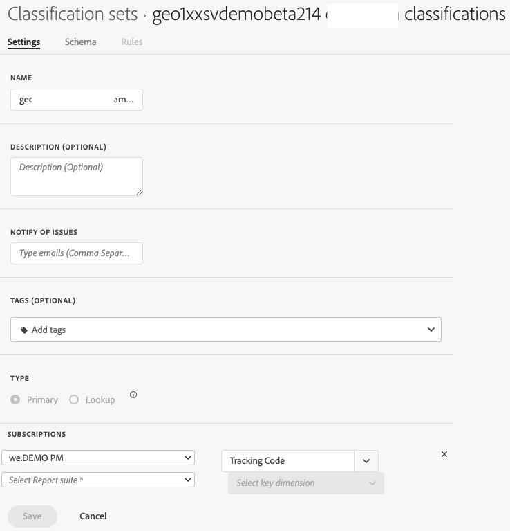

# Configuración del conjunto de clasificación

Puede editar la configuración inicial de un conjunto de clasificaciones.

Para editar la configuración de un conjunto de clasificaciones:

1. Seleccione **[!UICONTROL Componentes]** en la barra de menús superior de Adobe Analytics y, a continuación, seleccione **[!UICONTROL Conjuntos de clasificaciones]**.
1. En **[!UICONTROL Conjuntos de clasificaciones]**, seleccione la pestaña **[!UICONTROL Conjuntos de clasificaciones]**.
1. En el administrador **[!UICONTROL Conjuntos de clasificaciones]**, seleccione el conjunto de clasificaciones para el que desea editar el esquema.
1. En el cuadro de diálogo **[!UICONTROL Conjunto de clasificaciones: _conjunto de clasificaciones_]**, seleccione la pestaña **[!UICONTROL Configuración]**.

1. En el cuadro de diálogo **[!UICONTROL Conjunto de clasificaciones: _conjunto de clasificaciones_]**, donde corresponda:

   

   1. Edite **[!UICONTROL Name]**.
   1. Editar una **[!UICONTROL descripción (opcional)]**.
   1. Editar la lista de direcciones de correo electrónico (separadas por comas) en **[!UICONTROL Notificar problemas]**. Estos usuarios reciben un correo electrónico cuando se producen uno o más problemas.
   1. Agregue una o más **[!UICONTROL etiquetas (opcionales)]** al conjunto de clasificaciones. Seleccione una etiqueta existente del menú desplegable **[!UICONTROL Etiquetas]** o escriba una etiqueta nueva. Use  para quitar una etiqueta.
   1. Editar las **[!UICONTROL suscripciones]**.
      * Puede definir varias combinaciones de **[!UICONTROL Grupo de informes]** y **[!UICONTROL Dimension]** en un conjunto de clasificaciones.
      * Seleccione  para eliminar una combinación de **[!UICONTROL Grupo de informes]** y **[!UICONTROL Dimension clave]**.

      Consulte [Crear un conjunto de clasificaciones](create.md) para obtener más información.

   1. Seleccione **[!UICONTROL Guardar]** para guardar la configuración. Seleccione **[!UICONTROL Cancelar]** para cancelar.

<!--

Configure a classification set's settings.

**[!UICONTROL Components]** > **[!UICONTROL Classification sets]** > **[!UICONTROL Sets]** > Click the desired classification set name > **[!UICONTROL Settings]**

The following fields are available in this tab:

* **[!UICONTROL Name]**: The classification set name.
* **[!UICONTROL Description]**: The description for the classification set.
* **[!UICONTROL Notify of issues]**: A comma-delimited list of email addresses that are notified of issues with this classification set.
* **[!UICONTROL Tags]**: Add one or more tags to the selected classification set. Tags allow you to organize or group classification sets so that it is easier to locate them in the future.
* **[!UICONTROL Type]**: The type of classification between [!UICONTROL Primary] and [!UICONTROL Lookup]. Primary classifications are typically used. You cannot alter a classification set's type after it is created.
* **[!UICONTROL Subscriptions]**: The report suite and dimension combinations that the classification set applies to.

-->