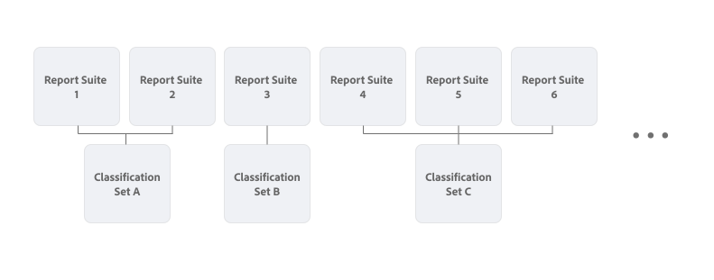

# Información general sobre los conjuntos de clasificación

Los conjuntos de clasificaciones proporcionan una interfaz única para administrar las clasificaciones y las reglas. Este flujo de trabajo combina la creación de clasificaciones en la configuración del grupo de informes con [Importador de clasificaciones](/help/components/classifications/sets/manage/set-manager.md). El resultado es una interfaz única e intuitiva para crear y administrar datos de clasificación.


## Conjuntos de clasificaciones en comparación con clasificaciones heredadas

La principal diferencia entre los conjuntos de clasificaciones y las clasificaciones heredadas es la relación de las clasificaciones con un grupo de informes.

En las clasificaciones heredadas, cada clasificación está directamente vinculada a un grupo de informes. Las clasificaciones muy similares (por ejemplo, para un catálogo de productos) se replican cuando se utilizan en varios grupos de informes.


En los conjuntos de clasificaciones, puede definir suscripciones de grupos de informes y combinaciones de dimensiones clave. Por ejemplo, una clasificación de catálogo de productos que sea aplicable a varios grupos de informes y que esté basada en una dimensión de producto (SKU), solo deberá definirla una vez como conjunto de clasificación. Y dentro de ese conjunto de clasificaciones, puede configurar varios grupos de informes y combinaciones de dimensiones clave para suscribirse a ese conjunto de clasificaciones.




Para obtener acceso a **[!UICONTROL Conjuntos de clasificaciones]** desde el menú de **[!UICONTROL Componentes]** de la interfaz de Adobe Analytics, debe ser administrador de productos o pertenecer a un perfil de productos que contenga el elemento de permisos [!UICONTROL Herramientas de grupos de informes] > [!UICONTROL Clasificaciones] . Tenga en cuenta que las interfaces de administración de clasificaciones heredadas están disponibles en el menú **[!UICONTROL Administrador]**.

Los conjuntos de clasificaciones constan de tres áreas funcionales:

* [**[!UICONTROL Conjuntos de clasificaciones]**](manage/set-manager.md): cree, edite y elimine conjuntos de clasificaciones.
* [**[!UICONTROL Trabajos]**](job-manager.md): vea el estado de los trabajos de conjuntos de clasificaciones.
* [**[!UICONTROL Consolidaciones]**](consolidations/manage.md): Combine varios conjuntos de clasificaciones en uno solo.


## Flujo de trabajo

El flujo de trabajo para los conjuntos de clasificaciones suele incluir los siguientes pasos:

1. Piense en las combinaciones de grupo de informes y dimensión para las que desea crear un conjunto de clasificaciones. Un ejemplo es definir un conjunto de clasificación de productos que cree para cualquier grupo de informes en el que desee clasificar productos con más detalles. Por ejemplo, detalles como categoría y color.
1. [Cree un conjunto de clasificaciones](/help/components/classifications/sets/manage/create.md) con suscripciones para uno o más grupos de informes y combinaciones de dimensiones clave que identifiquen productos. Por ejemplo:

   | Grupo de informes | Dimensión clave |
   |---|---|
   | Grupo de informes 1 | ID del producto |
   | Grupo de informes 2 | SKU de producto |

1. [Agregue las clasificaciones](/help/components/classifications/sets/manage/schema.md#add) que identificó al esquema del conjunto de clasificaciones. Por ejemplo:

   | Nombre de clasificación | Nombre de identidad |
   |---|---|
   | Categoría | Categoría |
   | Color | color |

1. Cree manualmente un archivo que contenga datos de clasificación. [Use una plantilla](/help/components/classifications/sets/manage/schema.md#template) para asegurarse de usar el [formato de archivo compatible](data-files.md#classification-set-file-formats) y las columnas para el archivo. A continuación, añada los datos al archivo de plantilla.

   También puede exportar datos directamente desde su catálogo de productos en los [formatos de archivo compatibles](data-files.md#classification-set-file-formats) con columnas que se ajusten a la plantilla. Por ejemplo, un archivo CSV, como:

   ```
   Key,Category,Color
   Adobe Nike Tech Fleece Full-Zip Hoodie - Men's,Men,Black
   Adobe Nike Tech Fleece Full-Zip Hoodie - Women's,Women,Black
   Men's North Face Adobe Jacket,Men,Black
   Nike Air Hybrid 2 Golf Bag,Equipment,Blue
   STITCH&reg; Ultimate Garment Bag,Equipment,Brown
   Adobe Analytics Training Tee - Navy,Men,Navy
   AirPods Pro 2,Electronics,White
   Adobe Analytics Training Tee - Green,Men,Green
   Women's North Face Adobe Jacket,Women,Blue
   Adobe Analytics Training Tee - Grey,Men,Gray
   Adobe Analytics One Million Views - Grey,Equipment,Grey
   Adobe and MGM Tee - White,Women,White
   Adobe and MGM Tee - Charcoal,Women,Charcoal
   ```

   En el archivo de datos de clasificación, hace referencia a la dimensión clave de cada grupo de informes (por ejemplo: **[!UICONTROL ID del producto]** y **[!UICONTROL SKU del producto]**) con `Key`. Y hace referencia a cada clasificación con el **[!UICONTROL Nombre de clasificación]** (por ejemplo `Category` o `Color`).

1. [Cargue](/help/components/classifications/sets/manage/schema.md#upload) el archivo que contiene los datos de clasificación en el esquema del conjunto de clasificaciones.

1. [Automatice](/help/components/classifications/sets/manage/schema.md#automate) el proceso de actualizaciones de su catálogo de productos que desea ver reflejado en los datos de clasificación mediante el uso de una ubicación en la nube.

1. [Descargue](/help/components/classifications/sets/manage/schema.md#download) los datos de clasificación para validar el contenido.

1. [Inspeccione el historial de trabajos](/help/components/classifications/sets/job-manager.md) para ver los resultados de sus acciones (carga, descarga, plantilla y mucho más) en las clasificaciones.
1. Si tiene varios conjuntos de clasificaciones similares como resultado de una migración desde la funcionalidad de clasificación heredada, [consolide](consolidations/manage.md) estos conjuntos de clasificaciones.


## Mejoras

La arquitectura back-end lanzada con conjuntos de clasificaciones contiene varias mejoras:

* Reducción del tiempo de procesamiento (de 72 a 24 horas).
* Una interfaz de usuario rediseñada para administrar clasificaciones.
* Opción para usar datos de clasificación en Adobe Experience Platform a través del [conector de origen de Adobe Analytics para los datos de clasificación](https://experienceleague.adobe.com/en/docs/experience-platform/sources/connectors/adobe-applications/classifications).

La arquitectura back-end lanzada con conjuntos de clasificaciones también contiene varios cambios:

* Al usar el explorador o la importación automatizada, **[!UICONTROL Sobrescribir en caso de conflicto]** siempre está habilitado.
* Al usar el explorador o la importación automatizada, ya no se admite la opción de exportar inmediatamente después de la importación. Las exportaciones deben iniciarse por separado.
* El extremo de la API Analytics 2.0 `GetDimensions` ahora devuelve identificadores de cadena para clasificaciones en lugar de identificadores numéricos. Los identificadores numéricos se pueden seguir utilizando, pero se recomienda utilizar los nuevos identificadores de cadena siempre que sea posible. Los identificadores numéricos se pueden recuperar utilizando el parámetro de cadena de consulta `?expansion=hidden`.

>[!IMPORTANT]
>
>El rendimiento de los conjuntos de clasificaciones depende principalmente del número de valores de clave única que contienen datos. Tenga cuidado cuando tenga variables que contengan una gran cantidad de valores únicos. Especialmente cuando se combinan variables de varios grupos de informes y dimensiones en un único conjunto de clasificaciones.

## Limitaciones

* Los conjuntos de clasificaciones aún no admiten reglas. La funcionalidad de reglas se agrega a la interfaz de conjuntos de clasificaciones antes de que la funcionalidad de [generador de reglas heredadas](/help/components/classifications/crb/classification-rule-builder.md) deje de estar disponible.
* No se realizan migraciones de reglas y configuraciones de clasificación heredadas a conjuntos de clasificación. Se agrega una utilidad de migración a la interfaz de conjuntos de clasificaciones antes de que la funcionalidad de clasificación heredada deje de estar disponible.
