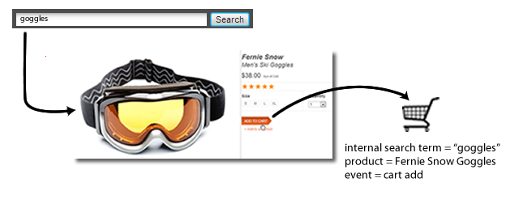

# eVar (comercialización)

>[!BEGINSHADEBOX]

*Esta página de ayuda describe cómo funcionan las eVars de comercialización como una [dimensión](overview.md). Para obtener información sobre cómo implementar eVars de comercialización, consulte [eVar (variable de comercialización)](/help/implement/vars/page-vars/evar-merchandising.md) en la Guía del usuario de implementación.*

>[!ENDSHADEBOX]

Una eVar de comercialización funciona como una eVar estándar, excepto que cada producto tiene su propia copia de ella. La persistencia, la asignación y la caducidad funcionan del mismo modo, pero por separado para cada producto. Una eVar estándar mantiene un valor persistente por visitante que recibe crédito por cada evento de éxito. Una eVar de comercialización mantiene un valor persistente por producto y ese valor recibe crédito por los eventos de éxito de ese producto:

* Producto A → `eVar1` = `value A`
* Producto B → `eVar1` = `value B`

El valor de cada producto solo se puede establecer o cambiar en las visitas que incluyan ese producto. Una vez configurado, el valor persiste hasta que caduca y recibe crédito solo por los eventos de éxito de ese producto. Cambiar el valor del producto A no afecta al producto B.

Las eVars de comercialización solo funcionan con la variable [`products`](/help/implement/vars/page-vars/products.md). Un valor de eVar de comercialización que no está enlazado a un producto no recibe crédito. Los eventos de éxito en las visitas sin productos se atribuyen a `"None"` para cada eVar de comercialización.

>[!TIP]
>
>Para enlazar valores persistentes a una dimensión que no sea productos, considere la posibilidad de usar [[!UICONTROL dimensiones de enlace]](https://experienceleague.adobe.com/en/docs/analytics-platform/using/cja-dataviews/component-settings/persistence#binding-dimension) en Customer Journey Analytics.

## Razones para utilizar eVars de comercialización

Mantener un valor separado para cada producto es importante cuando un solo valor no debería recibir crédito por todo lo que compra un visitante. Una eVar estándar funciona bien para campañas externas o términos de búsqueda externos, donde un valor debe recibir crédito por cualquier evento de éxito que se produzca. Por ejemplo, si un cliente hace clic en un vínculo de una campaña de correo electrónico para visitar su sitio web, todas las compras realizadas como resultado deben acreditarse a esa campaña.

La búsqueda interna y la exploración de categorías son diferentes, ya que un visitante a menudo las utiliza para encontrar varios productos, cada uno de una manera diferente. Por ejemplo, un cliente busca `"goggles"` en un sitio y agrega un par al carro de compras:



Antes de cerrar la compra, el cliente busca `"winter coat"` y agrega una chaqueta de plumón al carro de compras:


Cuando el visitante completa esta compra, el término de búsqueda interna `"winter coat"` recibe crédito por todo el pedido, incluidas las gafas protectoras, porque es el valor más reciente de eVar (la asignación predeterminada de [!UICONTROL Más reciente (último)]). El término de búsqueda `"goggles"` no recibe crédito, a pesar de que condujo a parte de la compra:

| Término de búsqueda interna | Ingresos |
| --- | --- |
| abrigo de invierno | $157 |

## Solución de este problema con las eVars de comercialización

Si la comercialización está habilitada para eVar en el ejemplo anterior, el término de búsqueda `"goggles"` está enlazado a gafas protectoras para la nieve y el término de búsqueda `"winter coat"` está enlazado a la chaqueta de plumón. Las eVars de comercialización asignan los ingresos en el nivel de producto, por lo que cada término recibe crédito por la cantidad de ingresos del producto al que está vinculado:

| Término de búsqueda interna | Ingresos |
| --- | --- |
| abrigo de invierno | $119 |
| gafas | $38 |

## Funcionamiento de los enlaces y la asignación

Las eVars de comercialización se basan en tres conceptos:

* **Enlace**: una asociación entre un producto y un valor de eVar. Cada producto mantiene su propio enlace para cada eVar de comercialización. Al igual que un valor de eVar estándar, un enlace persiste en visitas posteriores hasta que caduca. Por ejemplo, un valor enlazado a un producto en una página de producto sigue recibiendo crédito cuando ese producto se compra en una página posterior, sin volver a establecer el valor. El modo en que un valor llega al producto depende de la sintaxis de eVar, que se describe a continuación.
* **Asignación**: la configuración de [!UICONTROL Asignación] determina qué sucede cuando un nuevo valor intenta enlazarse a un producto que ya está **enlazado**. La asignación se evalúa de forma independiente para cada producto, por lo que los valores de eVar de comercialización enlazados a diferentes productos nunca compiten entre sí.
  * **[!UICONTROL Valor original (primero)]**: se conserva el enlace existente. El nuevo valor se ignora para ese producto hasta que caduque el enlace.
  * **[!UICONTROL Más reciente (último)]**: El producto se vuelve a enlazar con el nuevo valor.
* **Caducidad**: La configuración [!UICONTROL Caduca después de] determina cuándo finalizan los enlaces. El enlace de cada producto tiene su propia caducidad, contada desde el momento en que se enlazó ese producto. Por ejemplo, con una caducidad de [!UICONTROL Semana], si el producto A está enlazado el lunes y el producto B está enlazado el miércoles, el enlace del producto A caducará el lunes siguiente y el enlace del producto B caducará el miércoles siguiente. Cuando caduca un enlace, el producto ya no tiene un valor para ese eVar, del mismo modo que un eVar estándar no tiene valor después de que caduque. Los eventos de éxito para ese producto se atribuyen a `"None"` hasta que el producto vuelva a estar enlazado.

Cada eVar de comercialización utiliza una de las dos sintaxis, establecida en la configuración de [!UICONTROL Comercialización] en [configuración del grupo de informes](/help/admin/tools/manage-rs/edit-settings/conversion-var-admin/conversion-var-admin.md). La sintaxis determina cómo un valor llega a un producto:

* **[Sintaxis del producto](#product-syntax)**: El valor se establece directamente en cada producto de la variable `products` y se enlaza a ese producto en esa visita.
* **[Sintaxis de la variable de conversión](#conversion-variable-syntax)**: El valor se establece en el propio eVar y persiste como un valor estándar de eVar. Se enlaza a los productos en la misma visita o en una visita posterior que contenga un evento de enlace.

Ambas sintaxis utilizan el mismo comportamiento de enlace, asignación y caducidad descrito anteriormente. Se diferencian en los siguientes aspectos:

| | Sintaxis del producto | Sintaxis de variables de conversión |
| --- | --- | --- |
| Donde se establece el valor | En cada producto, en la variable [`products`](/help/implement/vars/page-vars/products.md) | En el propio [`eVar`](/help/implement/vars/page-vars/evar-merchandising.md), del mismo modo que un eVar estándar |
| Cuando se produce el enlace | En cualquier visita individual donde el valor esté establecido en el producto | En visitas que contienen productos y un evento de enlace configurado |
| Valores por visita | Cada producto puede tener un valor diferente | Todos los productos de la visita de enlace reciben el mismo valor |
| Esfuerzo de implementación | Superior | Lower |

## Sintaxis del producto

Con la sintaxis del producto, el valor eVar se establece en cada producto de la variable `products`. En la cadena `products`, el valor después del último punto y coma de un producto es su eVar de comercialización. Consulte [Implementar mediante sintaxis de producto](/help/implement/vars/page-vars/evar-merchandising.md#implement-using-product-syntax) para obtener la sintaxis completa.

El valor se enlaza directamente a ese producto en esa visita. No se utilizan eventos de enlace. Las visitas posteriores que incluyen el producto, como una compra o adición al carro de compras, no necesitan repetir el valor. Dado que cada producto tiene su propio valor, la sintaxis del producto es la única opción cuando los productos de **la misma visita** necesitan **valores diferentes**.

+++Ejemplo: el mismo producto recibe dos valores

| Hit | `products` | `events` |
| --- | --- | --- |
| 1 | `;12345;;;;eVar1=internal keyword search` | |
| 2 | `;12345;;;;eVar1=internal campaign` | |
| 3 | `;12345;1;50` | `purchase` |

* **[!UICONTROL Valor original (primero)]**: la visita 2 se omite para el producto `12345`. La compra se acreditó a `internal keyword search`.
* **[!UICONTROL Más reciente (último)]**: la visita 2 vuelve a enlazar el producto `12345`. La compra se acreditó a `internal campaign`.

+++

+++Ejemplo: dos productos reciben valores diferentes

| Hit | `products` | `events` |
| --- | --- | --- |
| 1 | `;productA;;;;eVar1=value A` | |
| 2 | `;productB;;;;eVar1=value B` | |
| 3 | `;productA;1;50,;productB;1;30` | `purchase` |

Cada producto mantiene su propio enlace, por lo que la configuración de asignación no tiene ningún efecto en este ejemplo. `value A` recibe crédito por los ingresos del producto A y `value B` recibe crédito por los ingresos del producto B. Ambos valores reciben un pedido, ya que el pedido contiene un producto enlazado a cada valor.

+++

+++Ejemplo: productos con el mismo ID y valores diferentes

Un visitante compra una camiseta azul mediana y una camiseta roja grande, ambas con el ID de producto principal `tshirt123`, y `eVar10` captura SKU secundarias:

```js
s.events = "purchase";
s.products = ";tshirt123;1;20;;eVar10=tshirt123-m-blue,;tshirt123;1;20;;eVar10=tshirt123-l-red";
```

Cada SKU secundario recibe crédito por su propia instancia de `tshirt123`.

+++

La compensación es que la sintaxis del producto requiere la cadena de valor completa en cada producto cada vez que se produzca un enlace. Para los métodos de búsqueda de productos, que suelen utilizar varias eVars a la vez, la cadena tiene este aspecto:

```js
s.products = ";sandal123;;;;eVar2=sandals|eVar1=internal keyword search|eVar3=non-internal campaign|eVar4=non-browse|eVar5=non-cross-sell";
```

Un método de localización solo debe recibir crédito después de que el visitante interactúe con un producto, por lo que esta cadena se establece generalmente en la página de detalles del producto o en una adición al carro de compras, no en la página de resultados de búsqueda. Para ello, los desarrolladores deben:

* Lleve los detalles del método de localización de la página de métodos de localización a la página de detalles del producto o haga que estén disponibles cuando se active una adición al carro de compras desde una página de resultados.
* Ensamble la cadena `products` completa sin errores de sintaxis.

La sintaxis de la variable de conversión evita ambos requisitos.

## Sintaxis de variables de conversión

Con la sintaxis de la variable de conversión, el valor se establece en el propio eVar:

```js
s.eVar1 = "internal keyword search";
```

EVar actúa como *área de ensayo*. Un valor establecido en eVar se mantiene allí hasta que un evento de enlace lo vincula a los productos en una visita. La unión se produce en dos etapas:

1. **Ensayo**: cuando se establece eVar, su valor persiste en los resultados subsiguientes hasta que caduca. Este valor persistente es la columna `post_evar` en [fuentes de datos](/help/export/analytics-data-feed/data-feed-overview.md). Para las eVars de comercialización que utilizan sintaxis de variable de conversión, el valor en prueba **siempre refleja el valor más reciente enviado**, independientemente de la configuración de [!UICONTROL Asignación]. Cada nuevo valor reemplaza al valor ensayado anteriormente.
1. **Enlace**: Cuando una visita contiene ambos productos y un [!UICONTROL Evento de enlace de comercialización] configurado, el valor de ensayo se enlaza a cada producto en esa visita. Si un producto ya está enlazado, [!UICONTROL Asignación] determina si el nuevo valor reemplaza al enlace existente. Los productos que ya están enlazados mantienen su valor con [!UICONTROL Valor original (primero)] o vuelven a enlazar con [!UICONTROL Más reciente (último)].

Si la eVar, la variable `products` y un evento de enlace se establecen en la misma visita, el ensayo y el enlace se producirán simultáneamente. El nuevo valor se enlaza inmediatamente a los productos de la visita.

Configurar eVar junto a un producto sin un evento de enlace no enlaza el valor a ese producto. Un valor ensayado no recibe crédito hasta que está enlazado a un producto.

### Qué hacen los eventos de enlace

Un evento de enlace es el déclencheur que indica a Adobe que enlace el valor ensayado a los productos de la visita.

* Los eventos de enlace pueden ser eventos de éxito estándar o personalizados, el código de seguimiento ([!UICONTROL Evento de campaña]) o eVars. Las props no afectan al enlace.
* Puede configurar varios eventos de enlace, como [!UICONTROL Evento de vista de producto], [!UICONTROL Evento de adición al carro de compras] y [!UICONTROL Evento de compra]. Si alguno de estos eventos está en una visita con productos, el valor almacenado en zona intermedia se enlaza a cada producto de esa visita.
* De manera predeterminada ([!UICONTROL Todos]), el enlace se produce siempre que cualquier otro evento o eVar esté en la misma visita que un producto. [!UICONTROL Todo] se usa si no se selecciona explícitamente ningún evento de enlace. Con [!UICONTROL Todos], establecer el eVar en una visita que incluye productos siempre genera un déclencheur de enlace en esa visita. Un valor ensayado en una visita anterior se enlaza a la siguiente visita, que incluye productos y cualquier otro evento o eVar.

+++Ejemplo: enlace con un evento de enlace

Tenga en cuenta las siguientes visitas:

```js
// Hit 1
s.eVar1 = "internal keyword search";
s.eVar2 = "sandals";

// Hit 2
s.products = ";sandal123";
s.events = "prodView";
```

Si `prodView` es un evento de enlace para ambas eVars, la visita 2 enlaza `internal keyword search` (`eVar1`) y `sandals` (`eVar2`) a `sandal123`. Si un eVar no incluye `prodView` como evento de enlace, no se produce ningún enlace para ese eVar.

+++

+++Ejemplo: la asignación se evalúa por producto

| Hit | `eVar1` | `products` | `events` |
| --- | --- | --- | --- |
| 1 | `value A` | | |
| 2 | | `;productA,;productB` | Evento de enlace |
| 3 | `value B` | | |
| 4 | | `;productA` | Evento de enlace |
| 5 | | `;productA;1;50,;productB;1;30` | `purchase` |

Después de la visita individual n.º 3, el valor de ensayo (`post_evar1`) es `value B` con cualquiera de las opciones de asignación.

* **[!UICONTROL Valor original (primero)]**: la visita individual 4 se omite para el producto A porque el producto A ya está enlazado. Ambos productos permanecen enlazados a `value A`, que recibe todo el crédito de compra.
* **[!UICONTROL Más reciente (último)]**: la visita individual 4 vuelve a enlazar el producto A con `value B`. El producto B no está en la visita 4, por lo que permanece enlazado a `value A`. El crédito de compra del producto A va a `value B` y el crédito de compra del producto B va a `value A`.

Con un solo intento de enlace, como las visitas individuales 1, 2 y 5, ambos ajustes producen el mismo resultado. La asignación solo importa cuando un producto que ya está enlazado recibe otro intento de enlace.

+++

## Práctica recomendada: métodos de búsqueda de productos

La mayoría de los sitios de minoristas se benefician del seguimiento de los siguientes métodos de búsqueda de productos, cada uno como eVar de comercialización:

* Palabras clave de búsqueda interna (por ejemplo, `eVar2`)
* Códigos de seguimiento de campaña internos (por ejemplo, `eVar3`)
* Categorías de comercialización o exploración (por ejemplo, `eVar4`)
* Vínculos de venta cruzada (por ejemplo, `eVar5`)
* EVar de método de localización de productos que compara todos los métodos, incluidos métodos como vínculos externos a páginas de productos (por ejemplo, `eVar1`)

Cuando un visitante utilice un método, debe establecer las otras eVars del método de localización en un valor &quot;no válido&quot;. De lo contrario, el valor anterior de un método no utilizado podría recibir crédito por un producto encontrado a través de otro método. Por ejemplo, en la página de resultados de una búsqueda interna de &quot;sandalias&quot;:

```js
s.eVar1 = "internal keyword search";
s.eVar2 = "sandals";
s.eVar3 = "non-internal campaign";
s.eVar4 = "non-browse";
s.eVar5 = "non-cross-sell";
```

Con la sintaxis de la variable de conversión, los desarrolladores pueden establecer solo valores simples, como un término de búsqueda en una propiedad y la lógica de la implementación puede rellenar las eVars de comercialización. No es necesario pasar nada entre páginas ni incorporarlo en la cadena `products`. La variable `products` sigue siendo necesaria en las visitas en las que se produce el enlace.

Adobe recomienda la siguiente configuración para las eVars del método de localización de productos:

| Configuración | Valor |
| --- | --- |
| [!UICONTROL Asignación] | [!UICONTROL Valor original (primero)] |
| [!UICONTROL Caduca después de] | El tiempo que los productos permanecen en el carro de compras antes de su eliminación automática, por ejemplo, 14 o 30 días con [!UICONTROL Personalizado]. Si el carro de compras no tiene límite, usa [!UICONTROL Comprar]. |
| [!UICONTROL Tipo] | [!UICONTROL Cadena de texto] |
| [!UICONTROL Habilitar comercialización] | [!UICONTROL Habilitado] |
| [!UICONTROL Comercialización] | [!UICONTROL Sintaxis de la variable de conversión] |
| [!UICONTROL Evento de enlace de comercialización] | [!UICONTROL Evento de vista de producto], [!UICONTROL Evento de adición al carro de compras] y [!UICONTROL Evento de compra] |

Consulte [Variables de conversión](/help/admin/tools/manage-rs/edit-settings/conversion-var-admin/conversion-var-admin.md) en la guía de administración para ver una descripción de cada configuración.

+++Por qué el valor original (primero) en lugar del más reciente (último)

Los visitantes a menudo vuelven a encontrar un producto que ya vieron o agregaron al carro de compras. Por ejemplo:

1. Un visitante busca &quot;sandalias&quot; y agrega `sandal123` al carro de compras desde la página de resultados. El producto se enlaza a `internal keyword search`.
1. Tres días después, el visitante navega a **Mujeres > Zapatos > Sandalias** (`eVar1` = `browse`), vuelve a ver `sandal123` y luego lo compra.

Con [!UICONTROL Más reciente (último)], la vista de producto del paso 2 vuelve a enlazar `sandal123` con `browse`, que entonces recibe el crédito de compra. El método que encontró originalmente el producto no recibe ninguno.

Con [!UICONTROL Valor original (primero)], se omite el intento de enlace del paso 2 y `internal keyword search` se queda con el crédito.

Si el visitante nunca compra el producto, la caducidad elimina el enlace, por lo que el siguiente método de localización que utilice el visitante puede enlazarse al producto. Por este motivo [!UICONTROL Caduca después de] debería coincidir con el tiempo que un producto permanece en el carro de compras.

+++

## Instancias en eVars de comercialización

No se recomienda usar la métrica predeterminada [Instancias](../metrics/instances.md) en variables de comercialización.

* Para las variables de comercialización que utilizan sintaxis de producto, las instancias no se incrementan en absoluto.
* Para las variables de comercialización que utilizan sintaxis de variable de conversión, las instancias se cuentan cada vez que se configura la eVar. Sin embargo, la instancia se atribuye al elemento de dimensión `"None"` a menos que suceda lo siguiente en la misma visita:
  * Que la eVar de comercialización se sobrescriba con un valor.
  * La variable `products` se define con un valor.
  * Se establece un evento de enlace.

Dado que la mayoría de los casos de uso de la sintaxis de variables de conversión requieren la variable eVar y products en diferentes visitas, la métrica predeterminada Instancias no es realista de usar.

Para contar instancias de cada valor enviado con sintaxis de variable de conversión, aplique el **Último contacto** [modelo de atribución](/help/analyze/analysis-workspace/attribution/overview.md) a la métrica Instancias. Los modelos de atribución utilizan los valores enviados en cada visita, no los valores clasificados ni los enlaces de productos. La ventana retrospectiva no importa, ya que Último toque acredita cada valor de la visita individual donde se envió, independientemente de la configuración de asignación de eVar.


