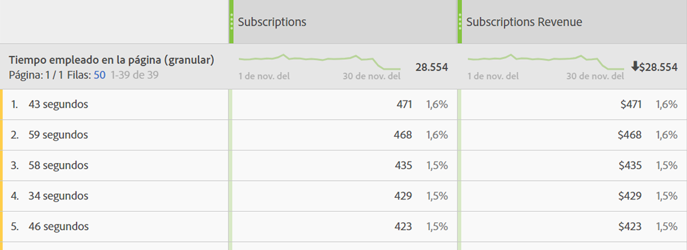

# Tiempo invertido en la página

La dimensión “Tiempo empleado en la página” registra la cantidad de tiempo que un visitante ha invertido en la página. Para medir el cálculo se utilizan los pasos siguientes:

1. Para una visita determinada, observe la marca de tiempo.
2. Compare esta visita individual con la marca de tiempo de la siguiente en la visita general. Tanto las visitas individuales de seguimiento de vista de página como las de seguimiento de vínculos cuentan.
3. La cantidad de tiempo que transcurrió entre estas dos visitas individuales contribuye al tiempo invertido.

Esta dimensión es valiosa cuando desea comprender cuánto tiempo interactúan los visitantes con una métrica determinada del sitio.

>[!TIP]
>
>El tiempo empleado no se mide durante la última visita individual de la visita general, ya que no hay ninguna solicitud de imagen posterior para medir el tiempo transcurrido. Este concepto también se aplica a las visitas que consisten en una sola visita (una devolución).

Esta dimensión se basa en visitas individuales, lo que significa que el valor es diferente para cada visita. Compare esta dimensión con el [Tiempo empleado por visita](time-spent-per-visit.md), que es una dimensión basada en visitas. Un tiempo invertido mayor significa que un visitante permaneció más tiempo en una página (visita individual).

## Rellene esta dimensión con datos

Esta dimensión funciona de forma predeterminada para todas las implementaciones. Si un grupo de informes contiene datos, esta dimensión funciona.

## Elementos de dimensión

Hay varias dimensiones para el tiempo invertido en la página:

* **Tiempo empleado en la página - agrupado**: La cantidad de tiempo se agrupa. Los elementos de dimensión varían de `"Less than 15 seconds"` a `"More than 30 minutes"`. El tiempo entre vistas de página no suele superar los 30 minutos; sin embargo, el tiempo entre vistas de página puede superar los 30 minutos si se utilizan visitas con marca de hora o fuentes de datos.
* **Tiempo empleado en la página - granular**: Cada número de segundos es un elemento de dimensión único.

Consulte [Información general sobre el tiempo empleado](../metrics/time-spent.md) para saber más detalles sobre el tiempo invertido.
