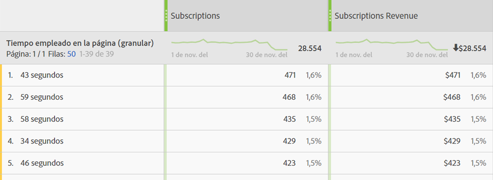

# Tiempo invertido en la página

La [dimensión](overview.md) &quot;Tiempo empleado en la página&quot; registra la cantidad de tiempo que un visitante ha invertido en la página. Para medir el cálculo se utilizan los pasos siguientes:

1. Para un hit determinado, observe la marca de tiempo.
2. Compare este hit con la marca de tiempo del siguiente hit de la visita. Tanto los hits de seguimiento de vista de página como los de seguimiento de vínculos cuentan.
3. La cantidad de tiempo que transcurrió entre estos dos hits contribuye al tiempo invertido.

Esta dimensión es valiosa cuando desea comprender cuánto tiempo interactúan los visitantes con una métrica determinada del sitio.

>[!TIP]
>
>El tiempo empleado no se mide durante el último hit de la visita, ya que no hay ninguna solicitud de imagen posterior para medir el tiempo transcurrido. Este concepto también se aplica a las visitas que consisten en un solo hit (una devolución).

Esta dimensión se basa en hits, lo que significa que el valor es diferente para cada hit. Compare esta dimensión con el [Tiempo empleado por visita](time-spent-per-visit.md), que es una dimensión basada en visitas. Un tiempo invertido mayor significa que un visitante permaneció más tiempo en una página (hit).

## Rellene esta dimensión con datos

Adobe calcula esta dimensión del lado del servidor a partir del tiempo transcurrido entre cada visita individual y la siguiente en la visita general. No hay ninguna variable que establecer; funciona de forma predeterminada para todas las implementaciones.

| Propiedad | Valor |
| --- | --- |
| **variable de AppMeasurement** | Ninguno (calculado por Adobe) |
| **Campo Web SDK / XDM** | Ninguno (calculado por Adobe) |
| **Parámetro de consulta** | n/a |
| **etiqueta XML** | n/a |
| **Límite de bytes** | n/a |
| **Persistencia** | Hit |

## Elementos de dimensión

Hay varias dimensiones para el tiempo invertido en la página:

* **Tiempo empleado en la página - agrupado**: La cantidad de tiempo se agrupa. Los elementos de dimensión varían de `"Less than 15 seconds"` a `"More than 30 minutes"`. El tiempo entre visitas no suele superar los 30 minutos; sin embargo, el tiempo entre visitas puede superar los 30 minutos si se utilizan visitas con marca de tiempo o fuentes de datos.
* **Tiempo empleado en la página - granular**: Cada número de segundos es un elemento de dimensión único.

Consulte [Información general sobre el tiempo empleado](../metrics/time-spent.md) para saber más detalles sobre el tiempo invertido.
