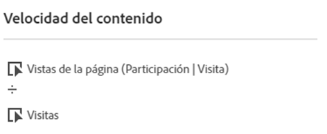
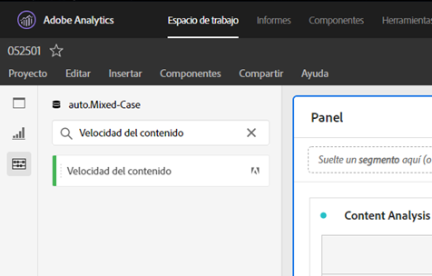
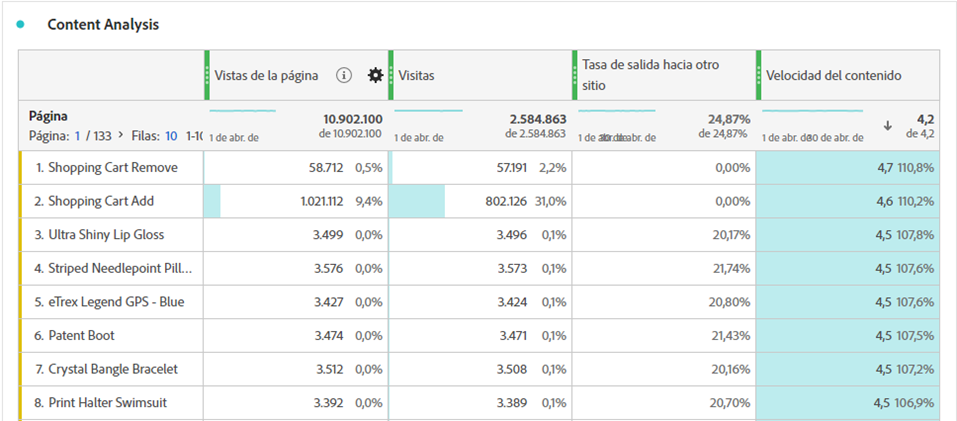

# [!UICONTROL Velocidad del contenido]

[!UICONTROL Velocidad del contenido] es una plantilla de métrica estándar de Adobe Analytics. La [!UICONTROL velocidad del contenido] se define como [[!UICONTROL Vistas de página] | [!UICONTROL Participación de visitas]] / [[!UICONTROL Visitas]] y ayuda a medir el impacto de un elemento de contenido en particular (página, sección del sitio, etc.) sobre el contenido descendente. Puede ayudarle a comprender qué contenido está reteniendo a los usuarios en el sitio web o la aplicación móvil y qué contenido no lo está haciendo.

La [!UICONTROL velocidad del contenido] se puede encontrar en Analysis Workspace filtrando el carril izquierdo, ya sea buscando o utilizando etiquetas (#Adobe Template).

La [!UICONTROL velocidad del contenido] se utiliza comúnmente en el análisis de contenido junto con otras métricas clave, tales como [!UICONTROL Vistas de página], [!UICONTROL Visitas] y [!UICONTROL Tasa de devoluciones].

