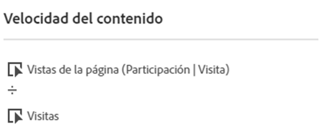
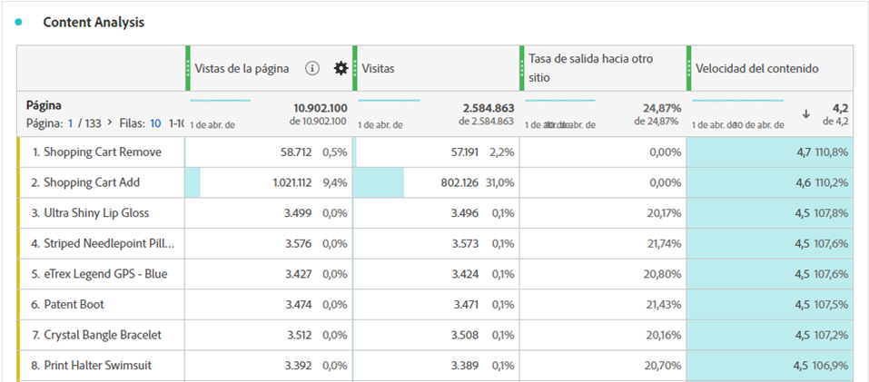

# Velocidad del contenido

La métrica calculada &quot;Velocidad del contenido&quot; le ayuda a medir cómo una dimensión (normalmente [[!UICONTROL Página]](/help/components/dimensions/page.md)) contribuye a que los usuarios pasen tiempo en el sitio web o la aplicación.

Esta métrica usa [atribución de participación](/help/analyze/analysis-workspace/attribution/models.md) en la métrica [Vistas de página](page-views.md) como parte de su cálculo. Con la participación de visitas, cada vez que se visita una página, todas las páginas que se visitaron anteriormente durante la misma visita también reciben crédito por la vista de página. Esta fórmula suele significar que, cuanto antes se visita una página durante una visita, más crédito recibe. (Ver [Vistas de página (participación) | Visita) o &#39;Participación de la visita&#39;](#page-views-participation--visit-or-visit-participation) para obtener más información).

## Cálculo

&#39;Velocidad del contenido&#39; es una [métrica](overview.md) calculada de forma predeterminada y utiliza la fórmula `Page views (Visit participation)` dividida entre `Visits`.

## Usos comunes

La [!UICONTROL velocidad del contenido] se utiliza comúnmente en el análisis de contenido junto con otras métricas clave, tales como [!UICONTROL Vistas de página], [!UICONTROL Visitas] y [!UICONTROL Tasa de devoluciones].

## Ejemplo

El siguiente ejemplo desglosa las 2 partes de Velocidad de contenido: &quot;Vistas de página (participación) | Visita)&#39; y &#39;Visitas&#39;.

### Vistas de página (participación) | Visita) o &quot;Participación en la visita&quot;

Considere el siguiente ejemplo de cómo la participación de la visita afecta a la atribución:

En un sitio web, un usuario visita las siguientes páginas en este orden:

* Página A
* Página B
* Página C
* Página D

En el ejemplo anterior, la página A recibiría crédito por 4 visitas, la página B por 3 visitas, la página C por 2 visitas y la página D por 1 visita.

El siguiente ejemplo ilustra el mismo principio, pero con algunas páginas visitadas más de una vez.

* Página A
* Página B
* Página C
* Página B
* Página D
* Página A

En el ejemplo anterior, la página A recibiría crédito por 7 visitas, la página B por 8 visitas, la página C por 4 visitas y la página D por 2 visitas.

### Visitas

Una vez calculada la participación de la visita, el resultado se divide por el número de visitas.
