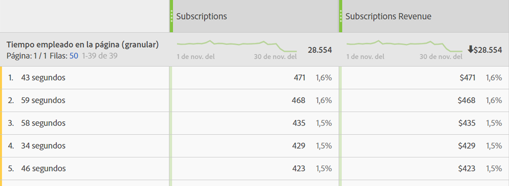

# Información general sobre el tiempo empleado

Los productos Adobe Analytics ofrecen varias [!UICONTROL &#39;tiempo empleado&#39;] [métricas](overview.md) y dimensiones. Esta página puede ayudar a desambiguar la dimensión o métrica que está buscando.

## Métricas de “tiempo empleado”

| Métrica | Definición | Disponible en |
|---|---|---|
| [[!UICONTROL Segundos totales empleados]](total-seconds-spent.md) | Representa el tiempo total durante el cual los visitantes interactúan con un elemento de dimensión específico. Incluye la instancia de un valor y persistencia en todas las visitas individuales posteriores. En el caso de las props, el tiempo empleado también se cuenta en los eventos de vínculo siguientes. | Analysis Workspace, Report Builder (denominado &quot;tiempo total empleado&quot;), Data Warehouse |
| [[!UICONTROL Tiempo empleado por visita] (segundos)](time-spent-per-visit.md) | Aproximadamente *Segundos totales empleados (devoluciones)*  Representa el tiempo promedio durante el cual los visitantes interactúan con un elemento de dimensión específico durante cada visita. **Nota**: esta métrica no se puede calcular de forma independiente porque el denominador de esta función es una métrica interna. | Analysis Workspace |
| [[!UICONTROL Tiempo empleado por visitante] (segundos)](time-spent-per-visitor.md) | Aproximadamente *Segundos totales empleados/visitante único*  Representa el tiempo promedio durante el cual los visitantes interactúan con un elemento de dimensión específico a lo largo de la duración de la visita (la duración de su cookie). **Nota**: esta métrica no se puede calcular de forma independiente porque el denominador de esta función es una métrica interna. | Analysis Workspace |
| [!UICONTROL Tiempo empleado/Usuario (estado)] | Aproximadamente *Segundos totales empleados por los visitantes únicos de aplicaciones móviles*  Representa el tiempo promedio durante el cual los visitantes de aplicaciones móviles interactúan con un elemento de dimensión específico a lo largo de la duración de la visita (la duración de su cookie). **Nota**: esta métrica no se puede calcular de forma independiente porque el denominador de esta función es una métrica interna. | Analysis Workspace |
| [[!UICONTROL Tiempo promedio empleado en el sitio] (segundos)](average-time-on-site.md) | Representa el tiempo total durante el cual los visitantes interactúan con un elemento de dimensión específico, por secuencia con un elemento de dimensión. No se limita solo a los promedios del &quot;sitio&quot;, como su nombre sugiere. Consulte la sección “Cómo se calcula el tiempo empleado” para obtener más información sobre las secuencias. **Nota:** Es muy probable que, en el nivel de elemento de dimensión, esta métrica difiera del “Tiempo empleado por visita” debido a diferencias en el denominador del cálculo. | Analysis Workspace, Report Builder (se muestra en minutos) |
| [[!UICONTROL Promedio de tiempo en el sitio]](average-time-on-site.md) | Es la misma métrica que *Tiempo promedio empleado en el sitio (segundos)*, excepto con el formato Tiempo (`hh:mm:ss`) | Analysis Workspace |
| [!UICONTROL Tiempo promedio empleado en la página] | Métrica obsoleta.  En su lugar, Adobe recomienda usar [[!UICONTROL Tiempo promedio empleado en el sitio]](average-time-on-site.md) si se necesita el tiempo promedio para un elemento de dimensión. | Report Builder (cuando hay una dimensión en la solicitud) |

## Dimensiones de “Tiempo empleado”

| Dimensión | Definición | Disponible en |
| --- | --- | --- |
| [[!UICONTROL Tiempo empleado por visita (pormenorizado)]](../dimensions/time-spent-per-visit.md) | El tiempo total empleado durante la visita, truncado al segundo más cercano y aplicado a todas las visitas individuales que formaron parte de la visita. Es una dimensión de nivel de visita. | Analysis Workspace |
| [[!UICONTROL Tiempo empleado por visita (agrupado)]](../dimensions/time-spent-per-visit.md) | La dimensión pormenorizada, agrupada en 9 intervalos distintos. Es una dimensión de nivel de visita. Los intervalos son:<ul><li>Menos de 1 minuto</li><li>1 a 5 minutos</li><li>5 a 10 minutos</li><li>10 a 30 minutos</li><li>30 a 60 minutos</li><li>1 a 2 horas</li><li>2 a 5 horas</li><li>5 a 10 horas</li><li>10 a 15 horas</li></ul>**Nota**: No puede haber bloques superiores a este, ya que las visitas caducan tras 12 horas de actividad. | Analysis Workspace, Report Builder |
| [[!UICONTROL Tiempo empleado en la página (pormenorizado)]](../dimensions/time-spent-on-page.md) | El tiempo total empleado en cada visita individual, truncado al segundo más cercano. Es una dimensión de nivel de visita e incluye tanto las vistas de página como los eventos de vínculo. A pesar de su nombre, no se limita a la dimensión &quot;página&quot;. | Analysis Workspace |
| [[!UICONTROL Tiempo empleado en la página (agrupado)]](../dimensions/time-spent-on-page.md) | La dimensión pormenorizada, agrupada en 10 intervalos distintos; sin embargo, la dimensión agrupada solo cuenta vistas de página (y excluye los eventos de vínculo). Es una dimensión de nivel de visita individual. Los intervalos son:<ul><li>menos de 15 segundos</li><li>de 15 a 29 segundos</li><li>de 30 a 59 segundos</li><li>de 1 a 3 minutos</li><li>de 3 a 5 minutos</li><li>de 5 a 10 minutos</li><li>de 10 a 15 minutos</li><li>de 15 a 20 minutos</li><li>de 20 a 30 minutos</li><li>más de 30 minutos</li></ul> | Analysis Workspace |

## Cálculo del “Tiempo empleado”

Adobe Analytics utiliza valores explícitos (incluidos eventos de vínculo y vistas de vídeo) para calcular el tiempo empleado.

>[!NOTE]
>
>Sin eventos de vínculo como las [!UICONTROL vistas de vídeo] o los [!UICONTROL vínculos de salida], no se puede saber el tiempo empleado en la última visita individual de una visita. Por motivos similares, las [!UICONTROL visitas de devolución] (las visitas con una sola visita individual) no tienen asociado un valor de “Tiempo empleado”.

El **numerador** en todos los cálculos de tiempo empleado es “Segundos totales empleados”.

El **denominador** no está disponible como una métrica separada en Adobe Analytics. Para métricas de “Tiempo empleado” de nivel de visita individual, el denominador son secuencias. Una secuencia es un conjunto consecutivo de visitas individuales en el que una variable dada contiene el mismo valor (por configuración, por propagarse hacia delante o por persistir). “Propagarse hacia delante” se refiere a la conservación de las props entre vistas de página (es decir, entre eventos de vínculo subsiguientes) con el propósito de calcular el tiempo empleado.

* Por ejemplo, en el caso de [!UICONTROL Nombre de página] u otras dimensiones de nivel de visitas individuales, el denominador es esencialmente [!UICONTROL “Instancias”] o [!UICONTROL “Vistas de página”], pero contando las recargas y los valores sin configurar (por ejemplo, eventos de vínculo) como una sola interacción (una secuencia).

* Las visitas individuales de Devolución y Salida también se eliminan del denominador porque no es posible saber el “Tiempo empleado”.

## Preguntas frecuentes

+++¿Pueden aplicarse todas las métricas de &quot;Tiempo empleado&quot; a cualquier dimensión?

Las métricas de &quot;Tiempo empleado&quot; que se pueden aplicar a cualquier dimensión son:

* [[!UICONTROL Segundos totales empleados]](total-seconds-spent.md)

* [[!UICONTROL Tiempo empleado por visita] (segundos)](time-spent-per-visit.md)

* [[!UICONTROL Tiempo empleado por visitante] (segundos)](time-spent-per-visitor.md)

* [[!UICONTROL Tiempo promedio empleado en el sitio] (segundos)](average-time-on-site.md)

+++

+++¿Qué dimensión de tiempo empleado es más apropiada para su desglose con otras dimensiones?

La dimensión [[!UICONTROL Tiempo empleado en la página - granular]](../dimensions/time-spent-on-page.md) es una dimensión de nivel de visita individual. Desglosarla mediante otra dimensión indicará los segundos que duró una visita individual en la que la dimensión de desglose también estaba presente.
En el ejemplo siguiente, el término de búsqueda &quot;classifieds&quot; se asocia a los tiempos de visita individual de 54 segundos, 59 segundos, etc., tal vez indicando que los visitantes pasan tiempo leyendo el contenido devuelto por el término de búsqueda.

+++

+++¿Qué métrica es apropiada para la dimensión de [!UICONTROL Tiempo invertido en la página - granular]?

Cualquiera. La dimensión muestra el tiempo empleado en la visita individual exacta en la que se produjo el evento. Un tiempo empleado mayor significa que un visitante pasó más tiempo en una página (visita individual) en la que se produjo el evento.

+++

+++¿En qué se diferencian [!UICONTROL Tiempo promedio invertido en el sitio] y [!UICONTROL Tiempo empleado por visita]?

La diferencia es el denominador de la métrica:

* [[!UICONTROL Tiempo promedio empleado en el sitio]](average-time-on-site.md) utiliza las secuencias que incluyen un elemento de dimensión.

* [[!UICONTROL Tiempo empleado por visita]](time-spent-per-visit.md) utiliza el recuento de visitas.

Como resultado, estas métricas pueden arrojar resultados similares en el nivel de visita, pero diferentes en el de visita individual.

+++

+++¿Por qué el desglose de totales con [!UICONTROL Tiempo promedio invertido en el sitio] no coincide con el elemento de línea principal?

Debido a que [!UICONTROL Tiempo promedio invertido en el sitio] depende de secuencias no interrumpidas de una dimensión y el informe interno no depende del informe externo al calcular estas ejecuciones.

Por ejemplo, usemos esta visita:

| Visita # | 1 | 2 | 3 |
|---|---|---|---|
| **Segundos empleados** | 30 | 100 | 10 |
| **Nombre de la página** | Página principal | Product | Página principal |
| **Fecha** | 1 de enero | 1 de enero | 1 de enero |

El cálculo del tiempo empleado en la página principal sería (30+10)/2 = 20, pero desglosar ese valor por día daría (30+10)/1 = 40, ya que el día tiene una única ejecución no interrumpida del 1 de enero.

Como resultado, estas métricas pueden arrojar resultados similares en el nivel de visita, pero diferentes en el de visita individual.

+++

## Ejemplos de cálculos de [!UICONTROL Tiempo empleado]

Supongamos que el siguiente conjunto de llamadas de servidor es para un único visitante dentro de una sola visita:

| N.º de visita individual de la visita | 1 | 2 | 3 | 4 | 5 | 6 | 7 |
|---|---|---|---|---|---|---|---|
| **Tiempo de visita transcurrido (en segundos)** | 0 | 30 | 80 | 180 | 190 | 230 | 290 |
| **Segundos empleados** | 30 | 50 | 100 | 10 | 40 | 60 | - |
| **Tipo de visita** | Página | Vínculo | Página | Página | Página | Página | Página |
| **Nombre de la página** | Página principal | - | Product | Página principal | Inicio (recarga) | Carro de compras | Confirmación del pedido |
|  |  |  |  |  |  |  |  |
| **prop1** | A (configurado) | A (propagarse hacia delante) | sin configurar | B (configurado) | B (configurado) | A(configurado) | C (configurado) |
| **Segundos empleados por prop1** | 30 | 50 | - | 10 | 40 | 60 | - |
|  |  |  |  |  |  |  |  |
| **eVar1** | Rojo (configurado) | Rojo (conservado) | (caducado) | Azul (configurado) | Azul (configurado) | Azul (conservado) | Rojo (configurado) |
| **Segundos empleados por eVar1** | 30 | 50 | - | 10 | 40 | 60 | - |

En función de la tabla anterior, la métrica de tiempo empleado se calcula del modo siguiente:

| prop1 | Segundos totales empleados | Tiempo empleado por visita | Tiempo empleado por visitante | Número de secuencias | Tiempo promedio empleado en el sitio |
|---|---|---|---|---|---|
| A | 30+50+60=140 | 140/1=140 | 140/1=140 | 2 | 140/2=70 |
| B | 10+40=50 | 50/1=50 | 50/1=50 | 1 | 50/1=50 |
| C | 0 | 0 | 0 | 0 | 0 |
| Tiempo no atribuido | 100 | - | - | - | - |

| eVar1 | Segundos totales empleados | Tiempo empleado por visita | Tiempo empleado por visitante | Número de secuencias | Tiempo promedio empleado en el sitio |
|---|---|---|---|---|---|
| Rojo | 30+50=80 | 80/1=80 | 80/1=80 | 1 | 80/1=80 |
| Azul | 10+40+60=110 | 110/1=110 | 110/1=110 | 1 | 110/1=110 |
| Tiempo no atribuido | 100 | - | - | - | - |

Tiempo empleado por visita (granular): 290
Tiempo empleado en la página (granular): 10, 30, 40, 50, 60, 100

Algunas notas adicionales para complementar el ejemplo:

* Todos los cálculos del tiempo empleado se basan en el tiempo transcurrido de visita, que comienza en cero en la primera visita individual de la visita.

* &quot;Segundos empleados&quot; es la diferencia entre la marca de tiempo de la visita individual actual y la de la visita individual siguiente. Como resultado, la última visita individual de la visita (y las devoluciones) carecen de tiempo empleado.

* Una &quot;secuencia&quot; es un conjunto consecutivo de visitas individuales en el que una variable dada contiene el mismo valor (por configuración, por propagarse hacia delante o por persistir). Por ejemplo, prop1 &quot;A&quot; tiene dos secuencias: las visitas individuales 1 y 2, y la visita individual 6. Los valores en la última visita individual de la visita no comienzan una nueva secuencia porque la última visita individual no tiene valor de tiempo empleado. El tiempo promedio empleado en un sitio utiliza secuencias en el denominador.

   * Solo para los propósitos de Tiempo empleado, las props se &quot;propagan hacia delante&quot; desde las visitas individuales de página a las visitas individuales de vínculo subsiguientes, como se muestra arriba para la visita individual n.º 2 de prop1. Esto permite que el valor configurado para prop1 en la visita individual n.º 1 (&quot;A&quot;) acumule el tiempo empleado en la visita individual n.º 2.

   * Las eVars acumulan tiempo empleado en cualquier visita individual en las que estén configuradas o persistan. La persistencia de una eVar se define en la configuración de eVar, en Analytics > Administración.
